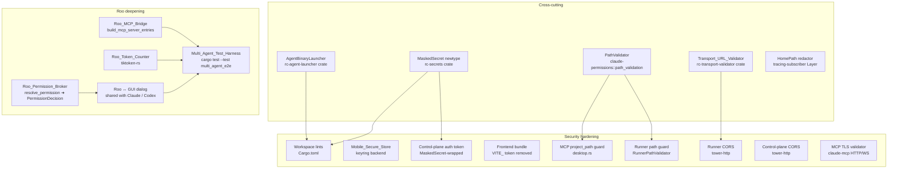
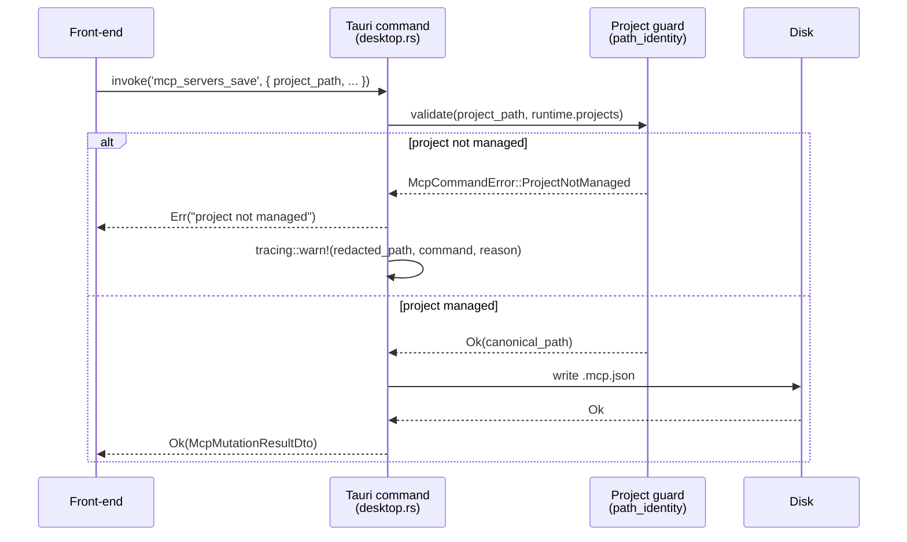
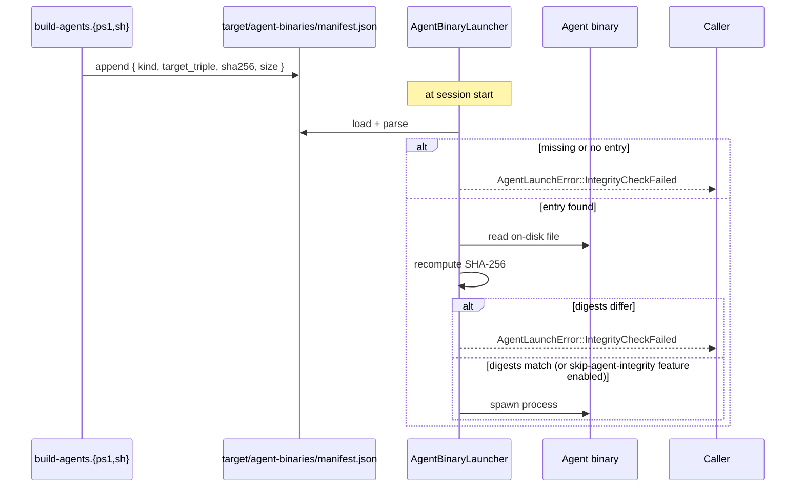

# Design Document

## Overview

This feature closes the last P0-priority gaps before `remote-code-rust` ships as a production-stable build. The work splits into two themes that share infrastructure:

1. **Security hardening** (Requirements 1–11) — promote `clippy::unwrap_used` to deny in audited crates, replace plaintext mobile secret storage with the OS keyring, mask secrets in tracing output, lock down the control-plane auth token and remove its front-end mirror, validate `project_path` in MCP Tauri commands, bound runner file operations by the configured workspace root, force TLS for non-loopback transport URLs, tighten CORS, verify agent-binary integrity before launch, and validate MCP server certificates by default.
2. **Roo agent deepening** (Requirements 12–16) — unify `PermissionDecision` across the Roo adapter, route Roo permission requests through the existing GUI broker, replace the `text.len() / 4` token-count approximation with `tiktoken-rs`, integrate MCP into the Roo adapter via `roo_mcp::McpHub`, and add a multi-agent end-to-end test harness that drives Claude, Codex, and Roo through identical scenarios.

A small number of cross-cutting building blocks support both themes: a `MaskedSecret` newtype, a single `Transport_URL_Validator`, a workspace-shared `PathValidator` (the existing `path_validation` module promoted to a public API the runner can consume), and a manifest-aware `AgentBinaryLauncher`. Non-functional requirements (17–25) are constraints applied across the whole feature: backward-compatible CLI / API surfaces, CI test counts at or above 14,000, clippy-clean at deny-warnings, rustfmt-clean, latency / memory budgets, no plaintext secrets in observables, and home-path redaction in tracing.

The design preserves every contract documented in `COMPATIBILITY.md`. New JSON fields are added only as optional additions; no existing field is renamed, removed, or retyped. Adapter behaviour is normalised by changing internal plumbing — the `UnifiedAgentEvent` enum and the `AgentAdapter` trait are not modified except for the Roo permission-broker constructor, which is purely additive.

## Architecture

### High-level component map



### Data flow — MCP Tauri command with project-path guard



### Data flow — Roo permission resolution through the GUI broker

```mermaid
sequenceDiagram
    participant Loop as Roo AgentLoop
    participant Broker as Roo_Permission_Broker
    participant Adapter as RooInProcessAdapter
    participant Gui as GuiRuntimePermissionBroker
    participant User as User

    Loop->>Broker: needs permission(tool_name, input)
    Broker->>Adapter: emit UnifiedAgentEvent::PermissionRequest
    Adapter->>Gui: route_request(PermissionResolutionRequest)
    Gui->>User: render dialog
    User-->>Gui: Allow / AllowAll / Deny / AskAgain
    Gui-->>Adapter: PermissionDecision
    Adapter->>Broker: resolve(request_id, decision)
    alt decision == Allow
        Broker->>Loop: allow this call only
    else decision == AllowAll
        Broker->>Broker: cache (tool_name, input_shape)
        Broker->>Loop: allow this call
    else decision == Deny
        Broker->>Loop: deny
    else decision == AskAgain
        Broker->>Broker: wait for state update<br/>(max 3 retries)
        Broker->>Adapter: re-emit PermissionRequest
    end
```

### Data flow — Agent binary launch with manifest verification



### Crate placement

| Concern | Crate | Rationale |
| --- | --- | --- |
| `MaskedSecret` newtype | `crates/shared/rc-secrets` (new) | Used by every adapter, runner, control plane, and GUI Tauri layer. |
| Transport URL validator | `crates/shared/rc-transport-validator` (new) | Consumed by GUI front-end (via Tauri command) and CLI `apps/remote-code/src/remote/`. |
| Agent binary launcher | `crates/shared/rc-agent-launcher` (new) | Used only by the GUI Tauri side, but kept in `shared/` so the manifest schema is colocated with the trait the launcher exposes. |
| Path validator | `claude-permissions::path_validation` (existing) | Already public; this feature only widens visibility and adds a runner-side wrapper. |
| Roo MCP bridge | `crates/adapters/rc-roo-adapter` (existing) | Roo MCP integration is internal to the adapter. |
| Roo token counter | `crates/adapters/rc-roo-adapter` (existing) | Same scope. |
| Multi-agent harness | `tests/multi_agent_e2e/` at workspace root (new) | Cross-crate integration tests live outside any single crate. |

### Backward-compatibility envelope

Every change in this feature is additive at the public surface:

- The `PermissionDecision` enum already has `Allow`, `Deny`, `AllowAll` variants. A new `AskAgain` variant is added with `#[serde(rename_all = "snake_case")]`, so existing `Allow|Deny|AllowAll` JSON values continue to deserialise. Adapter code paths that did not previously emit `AskAgain` are unaffected. (Requirement 17.6.)
- The `AgentAdapter` trait is unchanged. Roo's adapter constructor gains an optional `with_permission_broker(...)` builder method, mirroring Claude / Codex.
- New optional fields on `UnifiedAgentEvent::ContextUsage` are not introduced; the existing `used` / `total` fields are retained, and the Roo adapter populates them with the new tiktoken-rs counts.
- The `target/agent-binaries/manifest.json` file is new and only consulted by `AgentBinaryLauncher`. Older binaries that pre-date the manifest can be relaunched once the build script regenerates the manifest.

## Components and Interfaces

### 1. `MaskedSecret` newtype and tracing integration

A new shared crate `rc-secrets` exports a `MaskedSecret` type used wherever a struct holds a credential.

```rust
// crates/shared/rc-secrets/src/lib.rs
use std::fmt;
use serde::{Deserialize, Serialize};
use zeroize::{Zeroize, ZeroizeOnDrop};

/// A string-typed secret that masks itself in `Debug` and `Display`.
///
/// `Debug` and `Display` emit `***<last4>` when the underlying value has
/// at least 8 characters and `***` otherwise. `Serialize` round-trips the
/// raw value so secrets can still be persisted to disk via the secure
/// store, but the type is `#[serde(skip)]` for any payload that crosses
/// the tracing or telemetry boundary.
#[derive(Clone, Serialize, Deserialize, Zeroize, ZeroizeOnDrop)]
#[serde(transparent)]
pub struct MaskedSecret(String);

impl MaskedSecret {
    pub fn new(value: impl Into<String>) -> Self { Self(value.into()) }
    pub fn expose(&self) -> &str { &self.0 }
    pub fn last4(&self) -> &str {
        let bytes = self.0.as_bytes();
        if bytes.len() < 8 { "" } else {
            // Safe: ASCII or UTF-8; we operate on a char-aligned suffix.
            let start = self.0.len().saturating_sub(4);
            &self.0[start..]
        }
    }
}

impl fmt::Debug for MaskedSecret {
    fn fmt(&self, f: &mut fmt::Formatter<'_>) -> fmt::Result {
        if self.0.chars().count() < 8 {
            write!(f, "***")
        } else {
            write!(f, "***{}", self.last4())
        }
    }
}
impl fmt::Display for MaskedSecret {
    fn fmt(&self, f: &mut fmt::Formatter<'_>) -> fmt::Result { fmt::Debug::fmt(self, f) }
}
```

Application sites:

| Site | Type / field changed |
| --- | --- |
| `claude-provider::ProviderConfig::api_key` | `Option<String>` → `Option<MaskedSecret>` |
| `claude-control-plane::AuthConfig::token` | `String` → `MaskedSecret` |
| `apps/remote-code-runner` registration token | local `String` → `MaskedSecret` |
| Roo provider configs (anthropic/openai/openrouter/...): `api_key` | `String` → `MaskedSecret` |
| Codex provider config: `api_key` / `oauth_token` / `refresh_token` | `String` → `MaskedSecret` |

A `tracing-subscriber` layer (`HomePathRedactionLayer`) replaces `$HOME` prefixes in event field values that look like file paths. The layer is registered once in each binary entry-point (`apps/remote-code-runner/src/main.rs`, `apps/remote-code-control-plane/src/main.rs`, `apps/remote-code-gui/src-tauri/src/lib.rs`, `apps/remote-code/src/main.rs`).

### 2. Workspace lint upgrade

The root `Cargo.toml` keeps the workspace-wide `unwrap_used = "warn"` and adds per-crate overrides that lift the level to `deny` for audited crates:

```toml
# crates/adapters/rc-claude-adapter/Cargo.toml (and rc-codex-adapter, rc-roo-adapter)
[lints.clippy]
unwrap_used = "deny"

# apps/remote-code-runner/Cargo.toml
[lints.clippy]
unwrap_used = "deny"

# apps/remote-code-gui/src-tauri/Cargo.toml
[lints.clippy]
unwrap_used = "deny"
```

Codex vendor crates under `crates/codex/*` retain `warn` because they ship upstream code outside the scope of this feature. `AUDIT_CHECKLIST.md` is updated with a one-line justification for that exception.

### 3. Mobile secure store rebuilt on `keyring`

The current `mobile_secure_store_set` already routes through `keyring::Entry`. This feature formalises the contract and removes the legacy JSON fallback once migration completes. A platform abstraction trait sits behind the existing Tauri commands so the iOS / Android paths can plug in without changing the public API.

```rust
// apps/remote-code-gui/src-tauri/src/secure_store.rs
const SERVICE_NAMESPACE: &str = "remote-code-rust";

#[derive(Debug, thiserror::Error)]
pub enum SecureStoreError {
    #[error("keyring locked: {0}")]
    Locked(String),
    #[error("missing entitlement on this platform: {0}")]
    MissingEntitlement(String),
    #[error("unsupported platform: {0}")]
    Unsupported(String),
    #[error("backend error: {0}")]
    Backend(String),
}

pub trait SecureStoreBackend: Send + Sync {
    fn set(&self, key: &str, value: &str) -> Result<(), SecureStoreError>;
    fn get(&self, key: &str) -> Result<Option<String>, SecureStoreError>;
    fn remove(&self, key: &str) -> Result<(), SecureStoreError>;
}

pub struct KeyringBackend; // wraps `keyring::Entry::new(SERVICE_NAMESPACE, key)`
#[cfg(target_os = "ios")]   pub struct IosKeychainBackend;     // Phase 19 fills this in
#[cfg(target_os = "android")] pub struct AndroidKeystoreBackend; // Phase 19 fills this in
```

Every `Err(_)` path emits `tracing::warn!(operation = "set"|"get"|"remove", key = %key)` (no value) before returning. The legacy `secure_store.json` file is read once on first call (`get`) and migrated into the keyring; the JSON file is deleted when the migration succeeds.

### 4. Control-plane auth token lockdown

The control plane reads `REMOTE_CODE_CONTROL_PLANE_AUTH_TOKEN` once at startup into a `MaskedSecret`. The auth middleware (already in `claude-control-plane::auth`) is updated to:

- compare the inbound `Authorization: Bearer <token>` header value against `secret.expose()` using `constant_time_eq`;
- on mismatch, return `HTTP 401` with `{"error": "unauthorized"}` and emit no token-related log line;
- on match, log only a `debug!` `auth.ok` event with no token data.

The runner registration path is updated to send the token in the `Authorization` header only and never in the URL or request body. A new section "Control-plane authentication" is appended to `COMPATIBILITY.md` describing the env var, header format, and rotation procedure.

### 5. Front-end bundle scrub

`VITE_REMOTE_CONTROL_PLANE_TOKEN` is removed from the front-end source tree. Every call site that needed the token is replaced with a Tauri command (`control_plane_authenticated_request`) whose Rust side reads the token from the OS environment or the runtime config and adds the header before forwarding the request. CI runs `rg --no-heading 'VITE_REMOTE_CONTROL_PLANE_TOKEN' apps/remote-code-gui/src/` and fails on any hit. A note in `apps/remote-code-gui/README.md` states the rule: "no front-end environment variable may carry a server-trust credential".

### 6. MCP Tauri project-path guard

`desktop.rs::mcp_config_path_for_scope` already has the shape needed: it accepts `project_path: Option<&str>` and looks up the matching `ProjectEntry`. This feature:

- promotes the helper used in `create_session` (the `path_identity` membership check) into a typed function `validate_managed_project(project_path, runtime.projects) -> Result<&ProjectEntry, McpCommandError>`;
- calls it from every MCP command (`mcp_servers_list`, `mcp_servers_save`, `mcp_servers_delete`, `mcp_servers_toggle`, `mcp_servers_reset`) before any disk I/O;
- on rejection returns `McpCommandError::ProjectNotManaged { name }` (only the file-name component) and logs `tracing::warn!(command, redacted_path, reason = "project_not_managed")`.

```rust
#[derive(Debug, thiserror::Error)]
pub enum McpCommandError {
    #[error("project '{name}' is not managed by the GUI")]
    ProjectNotManaged { name: String },
    #[error("internal: {0}")]
    Internal(String),
}
```

### 7. Runner path validator

`claude-permissions::path_validation` exposes `PathValidation` and `validate_path`. This feature adds a runner-side wrapper:

```rust
// apps/remote-code-runner/src/path_guard.rs
use std::path::{Path, PathBuf};
use claude_permissions::path_validation::{PathValidation, validate_path};

#[derive(Debug, thiserror::Error)]
pub enum RunnerPathError {
    #[error("path is not inside the configured workspace root")]
    NotInWorkspace,
}

pub struct RunnerPathValidator { workspace_root: PathBuf }

impl RunnerPathValidator {
    pub fn new(workspace_root: PathBuf) -> Self { Self { workspace_root } }

    pub fn check<P: AsRef<Path>>(&self, target: P) -> Result<PathBuf, RunnerPathError> {
        let target = target.as_ref();
        let canonical = dunce::canonicalize(target).map_err(|_| RunnerPathError::NotInWorkspace)?;
        let root = dunce::canonicalize(&self.workspace_root)
            .map_err(|_| RunnerPathError::NotInWorkspace)?;
        if canonical.starts_with(&root) {
            Ok(canonical)
        } else {
            Err(RunnerPathError::NotInWorkspace)
        }
    }
}
```

Symlinks, `..` segments, and Windows UNC prefixes are all resolved by `dunce::canonicalize`. The validator is invoked from every runner-side file operation site (session create, artifact upload, file read, etc.). The existing `claude-permissions` rules continue to be applied for permission decisions; this validator is a coarse-grained workspace boundary, applied first.

### 8. Transport URL validator

```rust
// crates/shared/rc-transport-validator/src/lib.rs
use url::Url;

#[derive(Debug, thiserror::Error)]
pub enum TransportError {
    #[error("plaintext scheme '{scheme}' not allowed for non-loopback host '{host}'")]
    PlaintextNotAllowed { scheme: String, host: String },
    #[error("invalid URL: {0}")]
    InvalidUrl(String),
}

pub fn validate_transport_url(url: &str) -> Result<Url, TransportError> {
    let parsed = Url::parse(url).map_err(|e| TransportError::InvalidUrl(e.to_string()))?;
    let scheme = parsed.scheme();
    let host = parsed.host_str().unwrap_or_default();

    let is_loopback = match host {
        "localhost" | "::1" => true,
        h if h.parse::<std::net::Ipv4Addr>()
              .map(|ip| ip.is_loopback()).unwrap_or(false) => true,
        _ => false,
    };

    match (scheme, is_loopback) {
        ("wss" | "https", _) => Ok(parsed),
        ("ws" | "http", true) => Ok(parsed),
        ("ws" | "http", false) => Err(TransportError::PlaintextNotAllowed {
            scheme: scheme.to_string(),
            host: host.to_string(),
        }),
        (other, _) => Err(TransportError::InvalidUrl(format!("unsupported scheme '{}'", other))),
    }
}
```

The validator is invoked from every WebSocket / SSE construction site:

- `apps/remote-code-gui/src-tauri/src/desktop.rs` (Tauri command `connect_runner`)
- `apps/remote-code-gui/src/lib/transport.ts` (front-end transport, via a Tauri command)
- `apps/remote-code/src/remote/ws.rs` and `apps/remote-code/src/remote/sse.rs`

The GUI surfaces the typed error as a user-facing toast that names the host and tells the user to switch to `wss://` or `https://`.

### 9. CORS tightening

The existing helper in `claude-control-plane::auth` already builds a `CorsLayer` from a string list. This feature:

- removes the implicit `AllowOrigin::any()` fallback in release builds;
- when the configuration value is empty in a release build, returns a `CorsLayer` that emits no `Access-Control-Allow-Origin` header for cross-origin requests and emits one `tracing::warn!(component="cors", action="deny_all_cross_origin")` on startup;
- in debug builds (`cfg(debug_assertions)` or feature `dev-cors`), allows `http://localhost:*` and `http://127.0.0.1:*` patterns by default for developer ergonomics;
- runner-side replicates the same logic in `apps/remote-code-runner/src/cors.rs` (a small new module) keyed to `runner.cors.allowed_origins`.

```rust
// apps/remote-code-runner/src/cors.rs (sketch)
pub fn build_cors(origins: &[String]) -> CorsLayer {
    if cfg!(debug_assertions) || origins.iter().any(|o| o == "http://localhost:*") {
        // dev-friendly
    } else if origins.is_empty() {
        warn!(component = "cors", action = "deny_all_cross_origin");
        CorsLayer::new() // no allow_origin → cross-origin requests get no header
    } else {
        CorsLayer::new().allow_origin(parse_origins(origins)).allow_methods(...).allow_headers(...)
    }
}
```

### 10. Agent binary integrity verification

#### Manifest schema

```json
{
  "version": 1,
  "generated_at": "2026-05-04T12:34:56Z",
  "entries": [
    {
      "kind": "claude",
      "target_triple": "x86_64-pc-windows-msvc",
      "path": "target/agent-binaries/claude.exe",
      "sha256": "abcd…0123",
      "size_bytes": 12345678
    },
    { "kind": "codex", "target_triple": "x86_64-pc-windows-msvc", ... },
    { "kind": "roo",   "target_triple": "x86_64-pc-windows-msvc", ... }
  ]
}
```

#### Build script

`scripts/build-agents.ps1` and `scripts/build-agents.sh` are extended with an `Append-Manifest` step that runs after each successful `cargo build` of an agent binary. They compute the SHA-256 of the produced binary, extract the host triple from `rustc -vV`, and either create or update `target/agent-binaries/manifest.json` (read, mutate, write atomically). A new `--dry-run` mode emits the manifest entry without invoking `cargo build`, used by CI to validate the manifest emission code path.

#### Launcher

```rust
// crates/shared/rc-agent-launcher/src/lib.rs
#[derive(Debug, thiserror::Error)]
pub enum AgentLaunchError {
    #[error("integrity check failed for agent '{kind}' on target '{target}'")]
    IntegrityCheckFailed { kind: AgentKind, target: String },
    #[error("manifest missing or malformed at {path}")]
    ManifestMissing { path: PathBuf },
    #[error("io error: {0}")]
    Io(#[from] std::io::Error),
}

pub struct AgentBinaryLauncher {
    manifest_path: PathBuf,
    skip_check: bool, // gated by `feature = "skip-agent-integrity"`
}

impl AgentBinaryLauncher {
    pub fn launch(&self, kind: AgentKind, binary: &Path) -> Result<Child, AgentLaunchError> {
        let manifest = self.load_manifest()?;
        let target = host_target_triple();
        let entry = manifest.find(kind, &target).ok_or(AgentLaunchError::IntegrityCheckFailed {
            kind, target: target.clone(),
        })?;
        if !self.skip_check {
            let actual = sha256_of(binary)?;
            if actual != entry.sha256 {
                tracing::error!(?kind, ?target, "integrity check failed");
                return Err(AgentLaunchError::IntegrityCheckFailed { kind, target });
            }
        } else {
            tracing::warn!(?kind, "agent integrity check bypassed via feature");
        }
        Command::new(binary).spawn().map_err(AgentLaunchError::Io)
    }
}
```

The GUI `apps/remote-code-gui/src-tauri/src/desktop.rs` already has a code path for spawning agent binaries in subprocess mode. That path is replaced with `AgentBinaryLauncher::launch(...)`.

### 11. MCP TLS validation

`claude-mcp` builds its `reqwest::Client` and `tokio_tungstenite::connect_async` via shared helpers. This feature changes the helpers to:

- default to `rustls-tls-native-roots` validation (already the workspace `reqwest` feature);
- read a per-server `insecure: bool` flag from the MCP config (default `false`);
- when `insecure == true`, build a `dangerous_accept_invalid_certs(true)` client and emit `tracing::warn!(server, "tls verification disabled — connection is insecure")` on each connection attempt.

GUI side: the MCP servers list (`apps/remote-code-gui/src/components/McpServerList.tsx`) reads the `insecure` flag and renders a `<Badge variant="warning">TLS verification disabled</Badge>` next to the server name. The badge has `aria-label="TLS verification disabled"` and is non-dismissible. The stdio transport is unchanged.

### 12. Roo permission unification

The Roo adapter currently uses an internal `oneshot::Sender<bool>` between the agent loop and the adapter. This feature introduces a typed broker:

```rust
// crates/adapters/rc-roo-adapter/src/permission_broker.rs
pub struct RooPermissionBroker {
    /// session_id → request_id → resolver
    inflight: Arc<Mutex<HashMap<String, HashMap<String, oneshot::Sender<PermissionDecision>>>>>,
    /// session-level allow rules: tool_name → set of input-shape hashes
    session_rules: Arc<Mutex<HashMap<String, HashSet<u64>>>>,
}

impl RooPermissionBroker {
    pub async fn request(
        &self,
        session_id: &str,
        request: PermissionResolutionRequest,
    ) -> Result<PermissionDecision, RooPermissionError> {
        // Check session_rules first; if present, resolve immediately to Allow.
        // Otherwise, register a oneshot, emit UnifiedAgentEvent::PermissionRequest,
        // and await with up to 3 AskAgain retries.
    }
    pub async fn resolve(
        &self,
        session_id: &str,
        request_id: &str,
        decision: PermissionDecision,
    ) -> Result<(), RooPermissionError> { ... }
}
```

The `PermissionDecision` enum gains an `AskAgain` variant. The broker handles each variant per Requirement 12:

- `Allow` — resolve the current call only, do not modify session_rules.
- `AllowAll` — record `(tool_name, input_shape_hash)` into `session_rules` so equivalent future requests resolve immediately.
- `Deny` — fail the resolver future with `PermissionError::Denied`.
- `AskAgain` — drop the current resolver, wait for an external `state_updated` notification, then re-emit the same `PermissionResolutionRequest`. Maximum 3 retries; afterwards fail with `PermissionError::Exhausted`.

`RooInProcessAdapter::resolve_permission(...)` is rewritten to delegate to `RooPermissionBroker::resolve`. The four variants of `PermissionDecision` are covered by unit tests `resolve_permission_allow_*`, `resolve_permission_allow_all_*`, `resolve_permission_deny_*`, `resolve_permission_ask_again_*`.

### 13. GUI permission dialog wiring for Roo

`RooInProcessAdapter` gains:

```rust
impl RooInProcessAdapter {
    pub fn with_permission_broker<B: GuiRuntimePermissionBroker + 'static>(
        mut self,
        broker: Arc<B>,
    ) -> Self {
        self.permission_broker = Some(broker);
        self
    }
}
```

`GuiRuntimePermissionBroker` is the shared trait (already used by `rc-claude-adapter` and `rc-codex-adapter`); the trait object is passed through the same Tauri-side wiring. When the runtime is the GUI, `RooInProcessAdapter` routes every `PermissionResolutionRequest` through the broker, which emits a `gui://permission-request` event with `agent: "roo"`. The existing `PermissionDialog.tsx` is updated to render the agent identifier and accept the same four `PermissionDecision` outcomes.

If the GUI window closes without resolving the dialog, the broker's default 60-second timeout (configurable via `RC_PERMISSION_TIMEOUT_SECS`) fires `PermissionDecision::Deny` back to the adapter, which terminates the in-flight tool call. When the runtime is not the GUI (CLI / headless / automation), the adapter falls back to the same default broker policy used by Claude and Codex (auto-allow read tools per permission mode, prompt on stdin for interactive runtimes, deny otherwise).

### 14. Roo token counter via `tiktoken-rs`

```rust
// crates/adapters/rc-roo-adapter/src/token_counter.rs
use tiktoken_rs::{cl100k_base, o200k_base, CoreBPE};

pub struct RooTokenCounter {
    encoder: Arc<CoreBPE>,
}

impl RooTokenCounter {
    pub fn for_model(provider: &str, model: &str) -> Self {
        let encoder = match (provider, model) {
            // OpenAI-compatible: GPT-4o / GPT-4.1 family → o200k_base
            ("openai" | "openrouter" | "litellm" | "minimax", m)
                if m.contains("gpt-4o") || m.contains("gpt-4.1") => o200k_base().unwrap(),
            // OpenAI-compatible: GPT-3.5 / GPT-4 family → cl100k_base
            ("openai" | "openrouter" | "litellm" | "minimax", _) => cl100k_base().unwrap(),
            // Anthropic-compatible: documented approximation
            ("anthropic" | "bedrock" | "vertex", _) => {
                tracing::debug!(
                    provider, model,
                    "using cl100k_base as documented approximation for Anthropic family"
                );
                cl100k_base().unwrap()
            }
            // Default fallback
            _ => cl100k_base().unwrap(),
        };
        Self { encoder: Arc::new(encoder) }
    }

    pub fn count(&self, messages: &[ApiMessage]) -> usize {
        if messages.is_empty() { return 0; }
        messages.iter().map(|m| self.encoder.encode_with_special_tokens(&m.text()).len()).sum()
    }
}
```

The `RooInProcessAdapter` keeps a `Arc<RooTokenCounter>` initialised at session start from the active provider config. `UnifiedAgentEvent::ContextUsage::used` is set from `counter.count(&conversation_history)` on every emission.

A dependency mapping (`provider+model → encoding`) lives at `crates/adapters/rc-roo-adapter/src/token_counter/model_map.rs` and is kept in sync with `claude-provider`'s model registry by a shared constants file checked into both crates.

### 15. Roo MCP bridge

`build_mcp_server_entries()` in `apps/remote-code-gui/src-tauri/src/desktop.rs` is the existing helper that produces the `HashMap<String, serde_json::Value>` consumed by Claude and Codex. The GUI Tauri side already passes this via `RooInProcessAdapter::set_external_mcp_servers(...)`; what's missing is bridging the loaded `McpServerConnection` instances into the Roo `ToolDispatcher` so tool listings expose them under the `mcp::<server>::<tool>` prefix.

```rust
// crates/adapters/rc-roo-adapter/src/mcp_bridge.rs
pub struct RooMcpBridge {
    connections: Vec<McpServerConnection>,
}

impl RooMcpBridge {
    pub fn append_to_dispatcher(&self, dispatcher: &mut ToolDispatcher) {
        for conn in &self.connections {
            for tool in conn.tools() {
                let prefixed = format!("mcp::{}::{}", conn.server_name(), tool.name());
                dispatcher.register_remote_tool(prefixed, conn.clone(), tool.clone());
            }
        }
    }
}
```

When `AgentLoop` invokes a tool whose name starts with `mcp::`, the dispatcher routes through the matching connection. Server connection failures log `warn!` and the session continues with the remaining tools. The `McpSupport` capability advertised by `RooInProcessAdapter::info()` is now backed by the live bridge — the `info()` method reflects the same `McpSupport` flag both Claude and Codex use, but with `provider: "roo_mcp_bridge"` recorded in capability metadata.

### 16. Multi-agent E2E test harness

A new `tests/multi_agent_e2e/` directory at the workspace root contains:

```
tests/multi_agent_e2e/
├── Cargo.toml             # standalone test binary
├── src/
│   ├── lib.rs             # harness types
│   ├── scenarios.rs       # the four shared scenarios
│   ├── mock_provider.rs   # hermetic provider mock
│   └── assertions.rs      # event-sequence comparator with diff
├── tests/
│   └── multi_agent_e2e.rs # the entry point: cargo test --test multi_agent_e2e
└── README.md
```

```rust
// tests/multi_agent_e2e/src/scenarios.rs
pub enum Scenario { SimplePrompt, ToolCallWithPermission, McpToolCall, Cancellation }

pub struct ScenarioSpec {
    pub name: &'static str,
    pub expected_kinds: Vec<UnifiedAgentEventKind>, // ordered, payload-agnostic
    pub agent_specific_exemptions: HashMap<AgentKind, Vec<UnifiedAgentEventKind>>,
}

pub fn run<A: AgentAdapter>(adapter: &mut A, scenario: Scenario, mock: &MockProvider)
    -> Vec<UnifiedAgentEvent>;
```

The harness:

- runs each of the four scenarios against each of three adapters (`ClaudeInProcessAdapter`, `CodexInProcessAdapter`, `RooInProcessAdapter`);
- collects the ordered `UnifiedAgentEvent` sequence;
- compares against a per-scenario `ScenarioSpec` with provider-specific payload differences explicitly tolerated;
- on failure prints a unified diff including agent identifier and scenario name;
- defaults to the hermetic mock provider; opts into a real provider when `RC_E2E_REAL_PROVIDER=1`;
- targets a 60-second wall-clock budget on CI (mock-provider mode);
- runs via `cargo test --workspace --test multi_agent_e2e`.

A new "Event parity matrix" table is appended to `ARCHITECTURE.md` enumerating the variants covered by parity and the documented exemptions (`ContextCompacted` for Claude, `CodexAppServerNotification` for Codex).

## Data Models

### `MaskedSecret` (already shown above)

```rust
pub struct MaskedSecret(String);
// Debug / Display ⇒ "***<last4>" (or "***" if len < 8)
// Serialize ⇒ raw value (transparent)
// Drop ⇒ zeroize via ZeroizeOnDrop
```

### `AgentBinaryManifest`

```rust
#[derive(Debug, Clone, Serialize, Deserialize)]
pub struct AgentBinaryManifest {
    pub version: u32,
    pub generated_at: chrono::DateTime<chrono::Utc>,
    pub entries: Vec<AgentBinaryEntry>,
}

#[derive(Debug, Clone, Serialize, Deserialize, PartialEq, Eq)]
pub struct AgentBinaryEntry {
    pub kind: AgentKind,            // "claude" | "codex" | "roo"
    pub target_triple: String,
    pub path: PathBuf,              // workspace-relative
    pub sha256: String,             // lowercase hex
    pub size_bytes: u64,
}

#[derive(Debug, Clone, Copy, Serialize, Deserialize, PartialEq, Eq, Hash)]
#[serde(rename_all = "snake_case")]
pub enum AgentKind { Claude, Codex, Roo }
```

### `PermissionDecision` (extended)

```rust
#[derive(Debug, Clone, Copy, PartialEq, Eq, Hash, Serialize, Deserialize)]
#[serde(rename_all = "snake_case")]
pub enum PermissionDecision {
    Allow,
    Deny,
    AllowAll,
    /// New: re-emit the request after the runtime updates state. Capped at 3 retries
    /// per request inside the broker; once exhausted, the request fails with
    /// `PermissionError::Exhausted`.
    AskAgain,
}
```

### `PermissionResolutionRequest`

```rust
#[derive(Debug, Clone, Serialize, Deserialize)]
pub struct PermissionResolutionRequest {
    pub request_id: String,
    pub session_id: String,
    pub agent_kind: AgentKind,      // "claude" | "codex" | "roo"
    pub tool_name: String,
    pub tool_input: serde_json::Value,
    pub call_origin: CallOrigin,    // existing enum
}
```

The Claude and Codex adapters already produce values of this shape; this feature ensures the Roo adapter constructs an identical struct.

### `McpServerEntry` insecure flag

Existing `McpServerEntry` JSON already has `command`, `args`, `env`, `transport` fields. This feature adds:

```jsonc
{
  "name": "example",
  "transport": "http",
  "url": "https://mcp.example.com/v1",
  "insecure": false   // optional, default false
}
```

When omitted the field is treated as `false`. The GUI front-end already round-trips unknown fields, so existing configs continue to load without modification.

## Correctness Properties

*A property is a characteristic or behavior that should hold true across all valid executions of a system — essentially, a formal statement about what the system should do. Properties serve as the bridge between human-readable specifications and machine-verifiable correctness guarantees.*

The properties below were derived from the prework analysis stored in context. Several closely related acceptance criteria were consolidated to remove redundancy: the secure-store contract (Requirements 2.1–2.5) is one property, masking length-cases (3.1, 3.2, 3.5) are one property, the auth-token confinement criteria (4.1–4.3) are one property, the project-path guard (6.1, 6.2, 6.5) is one property, the transport-URL rules (8.1–8.3) are one property, the CORS configuration rules (9.1–9.3) are one property, and the TLS validation + warn! observability (11.1, 11.2) are one property. Permission-decision variants (12.3–12.6) are kept as four distinct properties because each captures different semantics. Performance budgets (NFR-5, NFR-6), CI gates, and pure documentation requirements are deliberately not encoded as properties; they are addressed in the Testing Strategy section.

### Property 1: Secure-store round-trip and confidentiality

*For any* sequence of `set(key, value)` and `get(key)` operations against `Mobile_Secure_Store`:

- after `set(k, v)` returns `Ok(())`, `get(k)` returns `Ok(Some(v))`;
- for any key `k` never previously set on this device, `get(k)` returns `Ok(None)`;
- no plaintext file under the application data directory contains the literal bytes of any `value` passed to `set`;
- when the backend returns an error, the resulting `tracing::warn!` event contains the operation name and the key but never the secret value;
- the backing entry is namespaced under `"remote-code-rust"`.

**Validates: Requirements 2.1, 2.2, 2.3, 2.5**

### Property 2: `MaskedSecret` masking

*For any* string `s`:

- if `s.chars().count() >= 8`, then `format!("{:?}", MaskedSecret::new(s)) == format!("***{}", &s[s.char_indices().nth_back(3).unwrap().0..])` (the last four characters);
- if `s.chars().count() < 8`, then `format!("{:?}", MaskedSecret::new(s)) == "***"`;
- for any struct that wraps a credential field as `MaskedSecret`, `format!("{:?}", config)` does not contain `s` as a substring whenever `s.len() >= 8`.

**Validates: Requirements 3.1, 3.2, 3.5**

### Property 3: Control-plane auth-token confinement

*For any* control-plane auth-token value `t` (`t.len() >= 16`):

- no `tracing` event emitted at any level during runner registration, control-plane request handling, or the rejection path contains `t` as a substring;
- when the runner registers, every outbound HTTP request carries `t` only in the `Authorization: Bearer <t>` header (URL, query string, body, and tracing span fields contain no occurrence of `t`);
- when the control plane rejects an inbound request, the response body equals the constant JSON `{"error":"unauthorized"}` and contains no occurrence of the supplied token value.

**Validates: Requirements 4.1, 4.2, 4.3, 23.1**

### Property 4: New JSON fields are optional

*For any* JSON payload of an existing `COMPATIBILITY.md`-documented shape (CLI flag set, env var output, stream-json message, `/v1` REST request/response, NDJSON transcript record), removing every field added by this feature still produces a payload that the receiving deserialiser accepts and that yields the documented default for each missing field.

**Validates: Requirements 17.6**

### Property 5: MCP project-path guard

*For any* MCP Tauri command (`mcp_servers_list`, `mcp_servers_save`, `mcp_servers_delete`, `mcp_servers_toggle`, `mcp_servers_reset`, `mcp_config_path_for_scope`) and any `project_path` argument:

- if the path canonicalises to a project that is currently registered in the GUI's managed-projects list, the command proceeds;
- otherwise the command returns `McpCommandError::ProjectNotManaged { name }` where `name` equals only the file-name component of the requested path, no disk read or write occurs, and exactly one `tracing::warn!` event is emitted whose `path` field is redacted to that same file-name component.

**Validates: Requirements 6.1, 6.2, 6.5**

### Property 6: Runner workspace-path containment

*For any* file-system path `p` and any configured workspace root `r`:

- `RunnerPathValidator::check(p)` returns `Ok(canonical)` iff `dunce::canonicalize(p)` succeeds and the result is a descendant (or equal to) `dunce::canonicalize(r)`;
- otherwise it returns `Err(RunnerPathError::NotInWorkspace)`, irrespective of whether `p` contains `..` segments, symlinks pointing outside `r`, Windows UNC prefixes, or refers to a non-existent file.

**Validates: Requirements 7.1, 7.2, 7.3**

### Property 7: Transport-URL validation

*For any* URL string `u`:

- `validate_transport_url(u)` returns `Ok(parsed)` iff `parsed.scheme()` is `wss`/`https`, or `parsed.scheme()` is `ws`/`http` and `parsed.host_str()` resolves to a loopback address (`localhost`, any address in `127.0.0.0/8`, or `::1`);
- otherwise it returns `Err(TransportError::PlaintextNotAllowed { scheme, host })` where `scheme` and `host` equal the parsed scheme and host of `u`.

**Validates: Requirements 8.1, 8.2, 8.3**

### Property 8: CORS allowed-origin configuration

*For any* `runner.cors.allowed_origins` (or `control_plane.cors.allowed_origins`) configuration value `origins`:

- the resulting `CorsLayer` allows exactly the origins in `origins` (with optional debug-only `localhost`/`127.0.0.1` wildcards under `cfg(debug_assertions)` or feature `dev-cors`) and never `"*"` by default;
- if `origins` is empty in a release build, the layer emits no `Access-Control-Allow-Origin` header on cross-origin responses, and exactly one `warn!(component = "cors", action = "deny_all_cross_origin")` event is emitted at startup.

**Validates: Requirements 9.1, 9.2, 9.3**

### Property 9: Agent-binary integrity

*For any* on-disk agent binary `b` and any manifest entry `e` whose `(kind, target_triple)` matches the requested launch:

- `AgentBinaryLauncher::launch` spawns `b` iff `sha256(b) == e.sha256` (or the `skip-agent-integrity` feature is enabled);
- otherwise it returns `AgentLaunchError::IntegrityCheckFailed { kind, target }` and emits a `tracing::error!` event naming the kind and target;
- if the manifest is missing, malformed, or has no entry for the requested `(kind, target_triple)`, the launcher returns `AgentLaunchError::IntegrityCheckFailed`/`ManifestMissing` and does not spawn the binary.

**Validates: Requirements 10.3, 10.4, 10.5**

### Property 10: MCP TLS validation

*For any* MCP HTTP/WS connection attempt to a server with TLS configuration `(cert, insecure)`:

- if `insecure == false`, the connection succeeds iff `cert` validates against the system trust store (and against the standard hostname check); validation failure produces a connection error and no protocol traffic;
- if `insecure == true`, the connection succeeds regardless of `cert` validity, and exactly one `tracing::warn!(server, "tls verification disabled — connection is insecure")` event is emitted per attempt;
- when the `insecure` field is absent from the configuration, deserialisation produces `insecure == false`.

**Validates: Requirements 11.1, 11.2, 11.4**

### Property 11: `PermissionDecision::Allow` allows exactly one call

*For any* tool name `t`, any input `i`, and any number `n >= 1` of equivalent calls issued in sequence:

- if the broker receives `PermissionDecision::Allow` for the first call, exactly `n` `PermissionResolutionRequest` events are emitted (one per call) and the first call resolves to allowed; the broker's session-rules cache is unchanged.

**Validates: Requirements 12.3**

### Property 12: `PermissionDecision::AllowAll` records a session rule

*For any* tool name `t`, any input shape `i`, and any number `n >= 1` of equivalent subsequent calls:

- if the broker receives `PermissionDecision::AllowAll` for the first call, exactly one `PermissionResolutionRequest` event is emitted in total; subsequent equivalent calls (same `tool_name`, same `input` shape hash) resolve immediately as allowed without re-prompting.

**Validates: Requirements 12.4**

### Property 13: `PermissionDecision::Deny` blocks the call without altering rules

*For any* tool name `t`, any input `i`, and any number `n >= 1` of equivalent subsequent calls:

- if the broker receives `PermissionDecision::Deny` for the first call, the first call resolves with `PermissionError::Denied`; each of the `n - 1` subsequent equivalent calls re-emits a fresh `PermissionResolutionRequest`; the broker's session-rules cache is unchanged.

**Validates: Requirements 12.5**

### Property 14: `PermissionDecision::AskAgain` retries up to three times

*For any* sequence of `m` consecutive `PermissionDecision::AskAgain` responses to the same request followed by a terminal decision `d`:

- if `m <= 3`, the request resolves with `d`;
- if `m > 3`, the request fails with `PermissionError::Exhausted` and no further re-emissions occur for that request.

**Validates: Requirements 12.6**

### Property 15: Roo MCP-tool naming and routing

*For any* MCP server `s` with a tool named `tool_name`, configured for the active Roo session:

- `ToolDispatcher::list_tools()` includes a tool whose name is exactly `format!("mcp::{}::{}", s, tool_name)`;
- when `AgentLoop` invokes that prefixed tool with input `i`, the matching `McpServerConnection` receives a request with name `tool_name` (unprefixed) and input `i`, and any structured result or error produced by the connection is propagated to `AgentLoop` byte-for-byte unchanged.

**Validates: Requirements 15.2, 15.3**

### Property 16: Roo token counting matches `tiktoken-rs`

*For any* sequence of `ApiMessage` values `messages` and any `(provider, model)` pair selecting encoding `enc`:

- `RooTokenCounter::for_model(provider, model).count(&messages)` equals the sum over `m in messages` of `enc.encode_with_special_tokens(&m.text()).len()`;
- when `messages.is_empty()`, the count is exactly `0`;
- when the Roo adapter emits `UnifiedAgentEvent::ContextWindowUpdate`, the `tokens_used` field equals the same `count(&messages)` for the conversation history at that moment.

**Validates: Requirements 14.1, 14.2, 14.4, 14.6**

### Property 17: Three-agent event parity for shared scenarios

*For any* scenario `s` ∈ {`simple_prompt`, `tool_call_with_permission`, `mcp_tool_call`, `cancellation`} and *for any* adapter `a` ∈ {Claude, Codex, Roo}:

- the ordered sequence of `UnifiedAgentEvent` variant kinds emitted by `a` while running `s` is equal to a per-scenario reference sequence, modulo the documented agent-specific exemptions (`ContextCompacted` for Claude, `CodexAppServerNotification` for Codex);
- every `ToolCallStarted` event emitted by any adapter contains the fields `tool_name`, `tool_input`, `call_id`, and `agent_kind` with their documented types.

**Validates: Requirements 16.2, 25.1, 25.3**

### Property 18: Home-path redaction in tracing

*For any* file-system path `p` and a determinable home directory `h`:

- if `p` starts with `h`, the redacted form `redact(p)` equals `"~"` followed by the substring `&p[h.len()..]`, so the trailing path components are preserved exactly;
- otherwise `redact(p) == p`;
- when `h` cannot be determined, no path is rewritten and exactly one `tracing::warn!` event is emitted per process explaining why redaction was skipped.

**Validates: Requirements 24.1, 24.2**

## Error Handling

### Error taxonomy

| Error type | Crate | Variants | Surfaced as |
| --- | --- | --- | --- |
| `SecureStoreError` | `rc-secure-store` (within Tauri side) | `Locked`, `MissingEntitlement`, `Unsupported`, `Backend(String)` | Typed return from `mobile_secure_store_get`/`set`; `tracing::warn!` per error path |
| `McpCommandError` | `apps/remote-code-gui/src-tauri` | `ProjectNotManaged { name }`, `Internal(String)` | Tauri error JSON; `tracing::warn!` |
| `RunnerPathError` | `apps/remote-code-runner` | `NotInWorkspace` | HTTP 400 with typed body; `tracing::warn!` with redacted path |
| `TransportError` | `rc-transport-validator` | `PlaintextNotAllowed { scheme, host }`, `InvalidUrl(String)` | GUI toast naming the host and recommending `wss`/`https`; CLI exit code 64 |
| `AgentLaunchError` | `rc-agent-launcher` | `IntegrityCheckFailed { kind, target }`, `ManifestMissing { path }`, `Io(io::Error)` | Tauri error JSON; `tracing::error!` |
| `RooPermissionError` | `rc-roo-adapter` | `Denied`, `Exhausted`, `Cancelled`, `Internal(String)` | Returned to `AgentLoop`, surfaces as `UnifiedAgentEvent::ToolCallEnded` with failure status |
| `PermissionError` | `rc-agent-protocol` | `Denied`, `TimedOut`, `Cancelled` | Carried in `UnifiedAgentEvent::PermissionResolved` |

### Cross-cutting rules

- **No silent fallbacks.** Every error path returns a typed variant. The mobile secure store never falls back to plaintext storage; the agent launcher never spawns when integrity verification fails (without the explicit feature flag); the transport validator never opens a plaintext connection to a non-loopback host; the path validator never accepts an unresolvable path.
- **Observability without leakage.** Every error path emits a `tracing::warn!` (or `error!` for launcher integrity failures) that includes the operation name, an identifier (key, command, request id, host), and a redaction of any sensitive value. Secret values, full home-rooted paths, and full project paths are never echoed.
- **Caller-visible diagnostics.** Errors that reach the GUI render through the existing toast component and include a one-line operator-friendly explanation (host name for transport errors, project file-name for MCP errors, agent kind for launcher errors). Errors that reach the CLI map to the existing exit-code matrix (60 for permission, 64 for usage/configuration, 70 for internal).
- **Backward compatibility.** New error types are additive in the JSON Tauri layer (the existing `error: string` envelope still applies); no error code is renamed.

### Panic discipline

- **Promotion to `deny`.** `clippy::unwrap_used` becomes `deny` for `crates/adapters/*`, `apps/remote-code-runner`, and `apps/remote-code-gui/src-tauri`, removing every existing site or replacing it with `?` / `expect("invariant: …")`.
- **Codex vendor exception.** `crates/codex/*` keeps `warn` because the vendored upstream code is out of scope for this feature; the exception is documented in `AUDIT_CHECKLIST.md`.
- **CI gating.** `cargo clippy --workspace --all-targets -- -D warnings` is the gate; the lint upgrade is only landed when the workspace is fully clean under `deny`.

### Edge cases explicitly covered

- Missing or malformed agent-binary manifest, including `version` mismatch.
- `dunce::canonicalize` failure in `RunnerPathValidator` (path does not exist, unreadable parent, EACCES on Windows).
- Symlinks that re-enter the workspace root after escaping; `..` segments that re-enter; UNC (`\\?\C:\...`) prefixes on Windows.
- Locked / unentitled keychain on iOS, locked Login Keychain on macOS, missing `D-Bus` secret service on Linux.
- MCP servers configured with `insecure: true` against a server that *does* present a valid certificate (must still emit the warn each connection).
- `PermissionDecision::AskAgain` issued when no state-update signal ever arrives (broker times out at the per-request limit and resolves with `PermissionError::Exhausted`).
- GUI window closed mid-prompt: the GUI broker resolves with `Deny` after `RC_PERMISSION_TIMEOUT_SECS` (default 60 s) and the adapter terminates the in-flight tool call.
- Empty `messages` slice passed to `RooTokenCounter` (returns `0`).
- Provider/model strings the token counter does not recognise (falls back to `cl100k_base` and emits a `tracing::debug!`).

## Testing Strategy

### Approach

The feature is appropriate for property-based testing. The testable surfaces — `MaskedSecret`, `RunnerPathValidator`, `validate_transport_url`, `RooTokenCounter`, `RooPermissionBroker`, `AgentBinaryLauncher`, the secure-store contract, the agent-parity event harness, and the home-path redactor — are pure functions or have well-defined input/output contracts amenable to "for all inputs" assertions. Configuration / IaC-flavoured items (workspace lints, CORS startup defaults in release builds, manifest schema validity, CI grep gates, performance benchmarks, documentation grep) are covered by example or smoke tests because they are deterministic, do not vary meaningfully with input, and have low return on running 100+ iterations.

### Property-based testing

- **Library**: `proptest = "1"` (added to `[workspace.dev-dependencies]`). Already present transitively via several upstream crates; we declare it as a workspace dev-dependency for direct use.
- **Iterations**: every property test configures `ProptestConfig { cases: 256, .. }` (256 is comfortably above the required 100 minimum and runs in well under a second per property on CI).
- **Tagging**: every property test carries a doc comment of the form `// Feature: p0-security-and-roo-completion, Property N: <property text>` so the design-document property is recoverable from grep.
- **Single-test-per-property**: each Property 1 through 18 has exactly one property test in the codebase; example-based tests live alongside but are clearly named (`example_*`).
- **Generators**: `Arbitrary` impls live in `tests/support/generators/` for `MaskedSecret`, `PermissionResolutionRequest`, `ApiMessage`, `McpServerEntry`, paths under a synthesized workspace root, and `UnifiedAgentEvent` variant kinds.

### Property-to-test mapping

| Property | Crate / location | Test name |
| --- | --- | --- |
| 1 — Secure-store contract | `apps/remote-code-gui/src-tauri/src/secure_store/tests.rs` | `prop_secure_store_round_trip_and_no_plaintext` |
| 2 — `MaskedSecret` masking | `crates/shared/rc-secrets/src/lib.rs` | `prop_masked_secret_debug_never_reveals_full` |
| 3 — Auth-token confinement | `apps/remote-code-control-plane/tests/auth_confinement.rs` | `prop_auth_token_never_observable_outside_authorization_header` |
| 4 — Optional new JSON fields | `tests/compatibility/optional_fields.rs` | `prop_new_optional_fields_deserialise_when_absent` |
| 5 — MCP project-path guard | `apps/remote-code-gui/src-tauri/src/mcp/tests.rs` | `prop_mcp_project_path_guard_rejects_unmanaged` |
| 6 — Runner workspace-path containment | `apps/remote-code-runner/src/path_guard.rs` (`#[cfg(test)]`) | `prop_runner_path_validator_descendancy` |
| 7 — Transport URL validation | `crates/shared/rc-transport-validator/src/lib.rs` | `prop_transport_url_loopback_or_tls_only` |
| 8 — CORS allowed-origin | `apps/remote-code-runner/src/cors.rs` (`#[cfg(test)]`) | `prop_cors_layer_matches_config` |
| 9 — Agent-binary integrity | `crates/shared/rc-agent-launcher/tests/integrity.rs` | `prop_launcher_accepts_iff_digest_matches` |
| 10 — MCP TLS validation | `crates/claude/claude-mcp/tests/tls.rs` | `prop_mcp_tls_validation_and_warn` |
| 11 — `Allow` allows one call | `crates/adapters/rc-roo-adapter/src/permission_broker.rs` | `prop_allow_allows_exactly_one_call` |
| 12 — `AllowAll` records rule | same | `prop_allow_all_records_session_rule` |
| 13 — `Deny` blocks without rule mutation | same | `prop_deny_blocks_and_does_not_mutate_rules` |
| 14 — `AskAgain` retries up to three | same | `prop_ask_again_bounded_retries` |
| 15 — Roo MCP-tool naming & routing | `crates/adapters/rc-roo-adapter/src/mcp_bridge.rs` | `prop_mcp_bridge_naming_and_routing` |
| 16 — Roo token counting | `crates/adapters/rc-roo-adapter/src/token_counter.rs` | `prop_roo_token_counter_matches_tiktoken` |
| 17 — Three-agent event parity | `tests/multi_agent_e2e/tests/multi_agent_e2e.rs` | `prop_event_kind_sequence_matches_per_scenario_spec` |
| 18 — Home-path redaction | `crates/shared/rc-tracing-redact/src/home_path.rs` | `prop_home_path_redaction_preserves_tail` |

### Example-based unit tests

Where the prework identified `EXAMPLE` or `EDGE_CASE` items, the design adds targeted unit tests alongside the property tests:

- **Permission decision variants**: one example per variant in the Roo broker (deterministic, reads documentation).
- **MCP TLS**: one self-signed-rejected, one self-signed-accepted-with-warn, one valid-chain-accepted (Requirement 11.6).
- **CORS**: one attacker-origin-rejected and one allowed-origin-accepted release-profile integration test (Requirement 9.5).
- **Path validator**: explicit fixtures for inside / outside / `..` re-entry / symlink-escape / non-existent (Requirement 7.5).
- **Token counter**: hand-computed counts for one OpenAI, one Anthropic, one MiniMax model (Requirement 14.5).
- **Home-path redaction**: hand-coded Linux and Windows samples (Requirement 24.3).
- **Front-end bundle scrub**: post-build `rg` over `dist/` for the literal env-var name and known token values (Requirement 5.1, 5.4).
- **Tauri command exhaustiveness**: one accepted and one rejected call per MCP command (Requirement 6.4).
- **Multi-agent harness**: hand-authored expected event-kind sequences per scenario, against which Property 17 is asserted.

### Integration tests

- **Multi-agent harness** (`tests/multi_agent_e2e/`) — runs the four shared scenarios across Claude, Codex, and Roo against a hermetic mock provider; opt-in to a real provider with `RC_E2E_REAL_PROVIDER=1`. Targets a 60-second wall-clock budget on CI. Invokable via `cargo test --workspace --test multi_agent_e2e` (Requirements 16, 25).
- **Roo + GUI broker** — drives `RooInProcessAdapter` against a fake `GuiRuntimePermissionBroker` and asserts (a) one dialog rendered per tool call, (b) `AllowAll` suppresses subsequent dialogs, (c) window-close path resolves to `Deny` after the configured timeout (Requirements 13.1–13.6).
- **Roo + MCP** — under `cargo test --features mcp-stub`, spawns the in-tree `mcp-server-stub` and asserts a Roo session can list tools, invoke one, and receive the structured result; if `mcp-server-everything` is available, an additional integration flavour runs against it (Requirement 15.6).
- **Control-plane auth confinement** — boots a stub control plane against the runner registration path, captures all `INFO`-level events for the duration, and asserts the configured token sentinel is absent from every event (Requirement 4.4).
- **Front-end bundle scrub** — CI step `rg --no-heading 'VITE_REMOTE_CONTROL_PLANE_TOKEN' apps/remote-code-gui/src/` and a post-build scan over `dist/` for the substring and any provided value (Requirement 5.4).
- **Manifest dry-run** — CI step that runs `scripts/build-agents.sh --dry-run` (and the PowerShell equivalent on Windows runners) and validates the emitted JSON against the schema (Requirement 10.6).
- **Workspace test gate** — `cargo test --workspace` zero failures, count >= 14,000 (Requirements 18.1, 18.3).
- **Workspace lint and format gates** — `cargo clippy --workspace --all-targets -- -D warnings` and `cargo fmt --check` zero diagnostics (Requirements 19.1, 20.1).

### Performance and resource budgets

- **Claude in-process startup** — Criterion bench `crates/adapters/rc-claude-adapter/benches/startup.rs` measures `RemoteClaudeAdapter::new` → first `UnifiedAgentEvent::Ready`. CI fails if the median exceeds 100 ms or regresses by >10 % vs the recorded baseline (Requirement 21).
- **GUI idle RSS** — a small script (`scripts/measure-gui-rss.{ps1,sh}`) launches the GUI, idles for 10 s, samples RSS via `ps`/`Get-Process`, and asserts < 60 MB and ≤ 10 % regression (Requirement 22).
- **Path validator latency** — Criterion bench `apps/remote-code-runner/benches/path_guard.rs` asserts the median per-call wall-clock is well under 1 ms (Requirement 7.6).
- **Multi-agent E2E suite** — wall-clock asserted in CI to stay under 60 s for the mock-provider mode (Requirement 16.6).

### Configuration of property tests

```rust
// crates/adapters/rc-roo-adapter/src/permission_broker.rs (sketch)
proptest! {
    #![proptest_config(ProptestConfig {
        cases: 256,
        max_shrink_iters: 4096,
        .. ProptestConfig::default()
    })]

    /// Feature: p0-security-and-roo-completion, Property 12:
    /// AllowAll records a session-level allow rule for the matching
    /// (tool_name, input shape) pair.
    #[test]
    fn prop_allow_all_records_session_rule(
        tool in arb_tool_name(),
        input in arb_tool_input(),
        n in 1usize..16,
    ) {
        // ... test body ...
    }
}
```

### Why some criteria are not property-tested

- **Workspace lint configuration (1.1–1.5, 19)**: deterministic, file-state checks. Smoke tests parsing `Cargo.toml` are sufficient.
- **Documentation requirements (1.5, 4.5, 5.5, 23.2, 25.2)**: smoke tests grep for the documented section header.
- **CI-only gates (1.3, 5.4, 18.1, 18.3, 20.1)**: covered by `.github/workflows/ci.yml`; property tests would not add value.
- **Performance budgets (7.6, 16.6, 21, 22)**: benchmark harnesses with budget assertions; running 100+ iterations of a benchmark is its native mode but we measure with Criterion's statistical model rather than `proptest`.
- **UI rendering (11.3, 13.2)**: snapshot / component tests via the existing front-end testing harness.
- **Build-script / manifest schema (10.1, 10.2, 10.6)**: schema validation example tests rather than property tests because the manifest emission code path produces a single deterministic document per dry-run invocation.

### Test count and CI envelope

The feature adds approximately:
- 18 property tests (one per Property 1–18) ≈ 18 × 256 cases = 4,608 case executions, but Rust counts them as 18 named tests.
- ≈ 35 example-/edge-/integration-level tests across the components above.
- 2 Criterion benches (startup latency, path validator).
- 1 multi-agent harness binary spanning 12 scenario-agent combinations.

Net delta to the workspace test inventory: roughly +60 tests, comfortably preserving the ≥ 14,000-test floor required by Requirement 18.3 and well within the 60-second mock-provider budget for the multi-agent harness.
