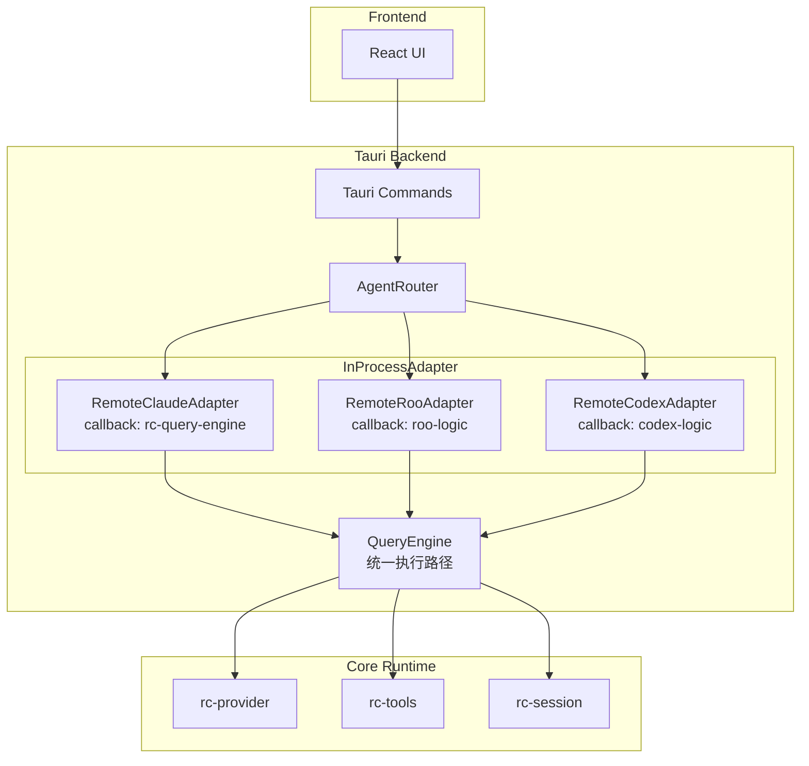
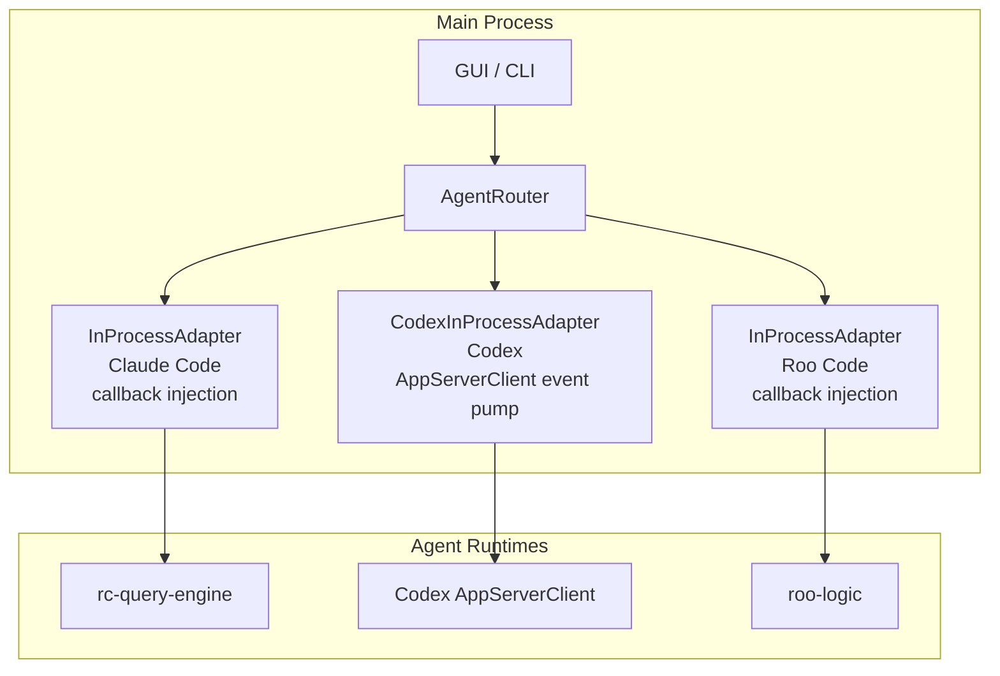
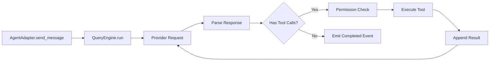

# Architecture

This document defines the architecture for `remote-code-rust`.

Each subsystem has one owner crate, one state model, and one boundary for integration.

## Top-Level Structure

The workspace is split into agent engines under `agents/`, application binaries under `apps/`, and libraries under `crates/`.

### Agent Sources

The `agents/` directory contains the AI agent engines:

- `agents/claudecode/`: **Claude Code Agent** — the Rust rewrite of Claude Code (formerly `apps/remote-code/`). This is the primary agent engine with CLI, TUI, headless, and interactive modes. It is a full workspace member.
- `agents/codex/`: OpenAI Codex source (`codex-rs/app-server`) — independent Git repository.
- `agents/roo-code/`: Roo Code source (`crates/roo-server`) — independent Git repository.

The codex and roo-code directories are excluded from the main repo via `.gitignore`. Build scripts in `scripts/` compile external agent binaries to `target/agent-binaries/`.

### Applications

- `agents/claudecode`: Claude Code Agent (Rust rewrite) — CLI, headless runtime, interactive shell, TUI, conversation loop
- `apps/remote-code-runner`: remote runner process that connects workspaces to the control plane
- `apps/remote-code-control-plane`: HTTP and WebSocket backend for sessions, approvals, artifacts, and runner coordination
- `apps/remote-code-migrate`: explicit migration and import tool

### Library Crates

- `rc-core`: shared runtime types, errors, conversation model, session states, hook types, tool types
- `rc-config`: CLI parsing, env loading, config precedence, profile resolution, provider config, legacy import
- `rc-protocol`: typed runtime events plus compatibility serializers for `stream-json`
- `rc-provider`: provider normalization, request shaping, transport, retries, streaming (SSE), failover, cost tracking, context management
- `rc-session`: session persistence (SQLite + NDJSON), indexes, exports, transcript appenders, resume loading, replay, memory system
- `rc-tools`: typed tool registry, 65+ built-in tools, tool execution with permission checks, BM25 search engine, lazy loading, sandbox execution
- `rc-permissions`: permission policies (5 modes), approval requests, tool classification, rule engine with wildcard matching, audit records
- `rc-mcp`: MCP client/server lifecycle, stdio/HTTP/WebSocket JSON-RPC transport, config discovery, tool projection
- `rc-skills`: `SKILL.md` discovery, TOML frontmatter parsing, indexing, lock file support
- `rc-plugins`: isolated plugin manifests, JSON-RPC process runtime, capability negotiation, bundled skills
- `rc-agents`: scheduler, mailbox, ownership, task lifecycle, tool budgets, team coordination, parallel execution
- `rc-tui`: `ratatui` screens, keyboard model (Vim mode), viewport state, and rendering
- `rc-runner`: runner protocol, HTTP API, workspace registration, heartbeat, session/approval management
- `rc-control-plane`: API models, runner registry, realtime fan-out (WebSocket), approvals, artifact routes, timeline events
- `rc-telemetry`: tracing setup, structured logging, JSON output, cost telemetry
- `rc-agent-protocol`: multi-agent protocol abstraction layer — `InProcessAdapter` for Claude/Roo (callback injection), `CodexInProcessAdapter` for Codex (native AppServerClient event pump), `SubprocessAdapter` fallback, `UnifiedAgentEvent` enum, `AgentRouter` for routing messages to different agent backends
- `rc-query-engine`: unified query loop, state machine, streaming executor, token budget — shared execution path for all three agents

## Process Model

### Local Runtime

The `remote-code` (claudecode agent) process owns:

- CLI parsing
- session bootstrap
- provider connection setup
- local tool execution
- permission prompting
- TUI rendering
- headless protocol I/O
- interactive shell with Vim mode
- runtime hook execution
- MCP server discovery and invocation
- plugin discovery and runtime communication
- multi-agent task planning and parallel execution
- context window management and auto-compaction
- memory system (RC.md persistent memory, global/project scoped)
- cost tracking and telemetry

It does not directly embed plugin code from arbitrary JavaScript sources. External plugins are projected through child processes with a negotiated JSON-RPC protocol.

### Runner

The runner owns:

- workspace registration with the control plane
- launching local backend sessions
- streaming runtime events to the control plane
- forwarding approvals, messages, and shutdown requests
- periodic heartbeat with exponential backoff reconnect

### Control Plane

The control plane owns:

- authenticated REST API and WebSocket surfaces
- runner registration with lease-based health tracking
- session creation and viewer subscriptions
- approval workflows (create, list, show, respond)
- artifact metadata, upload (base64), and download
- timeline event fan-out over WebSocket

## Data Flow

### Local Session

1. `remote-code` resolves config from CLI, env, and profile files.
2. `rc-session` opens or creates a session and appends a bootstrap event.
3. `rc-provider` normalizes the configured backend protocol and builds a provider client.
4. `rc-tools`, `rc-mcp`, `rc-skills`, and `rc-plugins` register available capabilities.
5. `rc-permissions` decides whether a tool call is auto-allowed, denied, or needs approval.
6. `rc-protocol` emits typed events which are rendered either in the TUI, interactive shell, or serialized as `stream-json`.
7. `rc-session` persists all externally meaningful events as append-only NDJSON.

### Conversation Loop

The full conversation loop operates as follows:

1. User input → provider request (with context window management)
2. Provider response → parse tool calls
3. Tool calls → permission check → execute → collect results
4. Tool results → append to conversation → back to provider
5. Repeat until provider emits a text-only response (no tool calls)
6. Streaming callbacks fire at each stage for real-time UI updates

### Remote Session

1. A client asks the control plane to create or resume a session.
2. The control plane selects a runner that owns the requested workspace.
3. The runner launches a `remote-code` backend session with the correct profile and workspace mapping.
4. Runtime events flow from the backend to the runner, then to the control plane, then to subscribed clients.
5. Approval responses and follow-up prompts flow back through the same chain in reverse.

## Session Storage

### SQLite (`state.db`)

- session indexes
- profile metadata
- permission decisions that are safe to cache
- artifact metadata
- migration bookkeeping
- cost tracking records

### NDJSON Transcripts (`sessions/*.ndjson`)

Each session has a transcript file. The transcript is the source of truth for:

- user messages
- assistant messages
- tool requests and results
- permission prompts and decisions
- status transitions
- session context snapshots
- hook execution records
- remote control events that must survive restarts

## Protocol Boundaries

Internally, protocol data is strongly typed Rust.

Externally, the compatibility layer re-exposes:

- `system` messages (init, session state changes, status)
- `assistant` messages
- `result` messages (success/error, usage, duration)
- `control_request` and `control_cancel_request` (permission prompts, interrupts)
- `tool_progress`

The compatibility serializer is the only place where loosely structured legacy shapes are produced.

### Multi-Agent Protocol Boundary

Agents communicate via in-process adapters — no subprocess spawning or IPC overhead:

- **Claude Code & Roo Code**: `InProcessAdapter` receives injected callback functions at construction time
- **Codex**: `CodexInProcessAdapter` wraps the Codex `AppServerClient` with a background event pump for real-time streaming
- Events flow through `mpsc::Receiver<UnifiedAgentEvent>` channels
- No external process spawning, no IPC overhead, no subprocess lifecycle management

## Provider Architecture

`rc-provider` standardizes provider access around a common request model:

- normalized base URL
- protocol family: `anthropic`, `openai`, `glm`, `bedrock`, `vertex`
- model identifier
- auth material (Bearer token + x-api-key)
- timeout policy
- header overrides
- retry and backoff policy (exponential with jitter, `Retry-After` support)

### Supported Providers

| Provider | Protocol | Streaming | Notes |
|----------|----------|-----------|-------|
| OpenAI | `openai` | ✅ SSE | GPT-4, GPT-4o, etc. |
| Anthropic | `anthropic` | ✅ SSE | Claude 3.5 Sonnet, Opus, etc. |
| GLM/ZhipuAI | `openai` | ✅ SSE | GLM-4, ChatGLM |
| AWS Bedrock | `anthropic` | ✅ SSE | Claude on AWS |
| Google Vertex AI | `anthropic` | ✅ SSE | Claude on GCP |

### Failover Architecture

Multi-provider failover with automatic health tracking:

- Health status tracking per provider endpoint (Healthy / Degraded / Unhealthy)
- Automatic round-robin fallback on failure
- Circuit-breaker logic with configurable thresholds
- Configurable retry with exponential backoff and jitter
- `Retry-After` header support

### Streaming Callbacks

The streaming subsystem provides real-time callbacks:

- `on_token` — per-token text delta
- `on_tool_call` — tool call parsed from stream
- `on_tool_result` — tool execution completed
- `on_usage` — token usage statistics
- `on_error` — error during streaming

### Anthropic API Cache Optimization

- Prompt caching with `cache_control` breakpoints
- Automatic cache breakpoint insertion for system prompts and large tool definitions
- Cache hit/miss tracking in cost telemetry

## Tool System Architecture

`rc-tools` defines typed capability interfaces with 65+ built-in tools.

### Tool Categories

| Category | Tools | Permission Class |
|----------|-------|-----------------|
| File Operations | `read_file`, `write_file`, `edit_file`, `replace_in_file`, `list_directory` | Read / Edit |
| Search | `search_text`, `glob`, `grep`, `lsp` | Read |
| Execution | `bash_command` | Command |
| Web | `web_search`, `web_fetch`, `web_browser` | Read / Command |
| Agent System | `agent`, `send_message`, `team_create`, `team_status` | System |
| Task Management | `task_create`, `task_get`, `task_list`, `task_stop`, `task_update`, `todo_write` | System |
| Memory | `memory_read`, `memory_write` | Read / Edit |
| Other | `ask_user`, `config_read`, `sleep`, `snip`, `skill_discover`, `tool_search`, `verify_plan`, `terminal_capture`, `notebook_edit`, `enter_plan_mode`, `exit_plan_mode` | Various |

### BM25 Tool Search Engine

Tools are indexed with a BM25 search engine for intelligent discovery:

- Tool name, description, and category are indexed
- Fuzzy matching supports partial names and synonyms
- `tool_search` tool exposes the search API to the provider
- Reduces context window pressure by only loading relevant tool descriptions

### Lazy Tool Loading

Tools are split into eager and lazy categories:

- **Eager tools** (core): always loaded into context (file ops, search, bash)
- **Lazy tools** (extended): loaded on demand via `tool_search` or explicit request
- Reduces token usage by ~60% for typical conversations
- Provider can discover lazy tools through the `tool_search` tool

### Sandbox Execution

`bash_command` supports cross-platform sandboxed execution:

- Working directory restriction
- Environment variable filtering
- Timeout enforcement
- Output size limits
- Command allowlist/denylist (configurable)

## Permission System Architecture

`rc-permissions` owns the decision logic and audit log. No other crate can silently bypass it.

### Permission Modes

| Mode | Read | Edit | Command | Notes |
|------|------|------|---------|-------|
| `default` | ✅ auto | ❌ ask | ❌ ask | Safe default |
| `acceptEdits` | ✅ auto | ✅ auto | ❌ ask | CI-friendly |
| `bypassPermissions` | ✅ auto | ✅ auto | ✅ auto | Full automation |
| `dontAsk` | ✅ auto | ❌ deny | ❌ deny | Read-only |
| `plan` | ✅ auto | ❌ deny | ❌ deny | Planning mode |

### Rule Engine

Fine-grained permission rules with wildcard matching:

- Path-based rules: `src/**/*.rs` → allow read
- Command-based rules: `cargo *` → allow execution
- Tool-specific rules: per-tool allow/deny patterns
- Priority ordering: specific rules override general patterns
- Audit trail for all permission decisions

## Context Management Architecture

`rc-provider` includes intelligent context window management:

### Token Estimation

- Automatic token counting per message using provider-specific tokenizers
- Running total tracking against model context window limit
- Warning thresholds at 80% and 95% capacity

### Auto-Compaction

When context approaches the window limit:

1. Summarize older conversation turns
2. Retain recent turns verbatim
3. Preserve all tool call/result pairs for active tasks
4. Emit compaction event to session transcript
5. Continue conversation with compressed context

### Context Strategy

- System prompt always retained (never compacted)
- Recent N turns kept verbatim (configurable)
- Tool results compacted to summaries
- User messages preserved with higher priority

## Cost Tracking Architecture

`rc-provider` tracks token usage and costs across all models:

- Per-request token counting (input, output, cache read, cache write)
- Per-model cost accumulation
- Session-level cost aggregation
- Provider-level cost breakdown
- Cost reporting via telemetry

## Memory System Architecture

`rc-session` implements RC.md persistent memory:

- `memory_read` — load memories from the memory store
- `memory_write` — persist observations and facts
- Memories scoped per project (workspace-relative)
- Automatic memory loading on session start
- Memory compaction when store grows large

## Multi-Agent System Architecture

### Internal Swarm (`rc-agents`)

`rc-agents` is the single owner of multi-agent state:

- agent identities with labels and ownership paths
- task scheduling with state machine (Pending → Assigned → Running → Completed/Failed)
- ownership and mailbox routing
- parallel task execution with capacity-aware scheduling
- shutdown and cleanup
- token, tool, and context budgets per task
- team lifecycle with lead agent and objective tracking
- lifecycle event recording
- inter-agent messaging via mailbox system

### Agent Tools

- `agent` — spawn a new agent for a subtask
- `send_message` — send a message to another agent's mailbox
- `team_create` — create a team of agents with a shared objective
- `team_status` — query the status of a team and its agents

### Multi-Agent Adapter Architecture

The GUI supports multiple AI agent backends through a unified in-process adapter pattern. See [plans/multi-agent-architecture.md](plans/multi-agent-architecture.md) for the full design.

**Unified InProcessAdapter Architecture:**

All three agents share the same `InProcessAdapter` implementation, differing only in the callback functions injected at construction time:



**Supported Agents:**

| Agent | Transport | Protocol | Implementation |
|-------|-----------|----------|----------------|
| Remote Code | In-process callback | Direct Rust calls | `InProcessAdapter` + rc-query-engine callbacks |
| Roo Code | In-process callback | Callback injection | `InProcessAdapter` + roo-specific callbacks |
| OpenAI Codex | In-process event pump | Codex AppServerClient | `CodexInProcessAdapter` + event_mapper |

**Core Abstractions:**

- `InProcessAdapter` — unified adapter with builder-pattern callback injection (`with_send_message()`, `with_cancel()`, `with_resolve_permission()`) for Claude and Roo
- `CodexInProcessAdapter` — native Codex adapter wrapping `AppServerClient` with background event pump and `event_mapper` for real-time streaming
- `SubprocessAdapter` — legacy fallback using bridge binaries (JSON-RPC over stdio)
- `AgentAdapter` trait — async interface: `start()`, `send_message()`, `cancel()`, `resolve_permission()`, `stop()`, `is_alive()`
- `AgentRouter` — routes sessions to the correct adapter based on `agent_type`
- `UnifiedAgentEvent` — normalized event model for all agent protocols
- `rc-agent-protocol` — shared types, adapter trait, event definitions, type aliases
- `rc-codex-adapter` — Codex-specific adapter with event_mapper (AppServerEvent → UnifiedAgentEvent)

**Key Design Decisions:**

1. All agents run in-process — no subprocess spawning, no IPC overhead
2. Callback injection differentiates agent behavior — same struct, different closures
3. Sessions are bound to a single agent type at creation time
4. Permission requests from all agents are routed through the same GUI approval flow
5. QueryEngine provides a unified execution path shared by all three agents

## Three-Agent Independent Binary Architecture

### 概览

三个 Agent 各自编译为独立的可执行文件，通过统一的 `AgentAdapter` trait 与主进程通信：

| Agent | Binary Name | 通信方式 | 源码位置 |
|-------|-------------|---------|---------|
| Claude Code | `remote-code` | 进程内（InProcessAdapter + 回调注入） | `agents/claudecode/` |
| Codex | `codex` | 进程内（CodexInProcessAdapter + 事件泵） | `agents/codex/codex-rs/` |
| Roo-code | `roo` | 进程内（InProcessAdapter + 回调注入） | `agents/roo-code/` |

### In-Process Adapters

所有三个 Agent 都通过进程内适配器与主进程通信，无需子进程桥接：



### CodexInProcessAdapter Architecture

`CodexInProcessAdapter` 直接包装 Codex 的 `AppServerClient`，通过后台事件泵实现实时流式传输：

```text
┌──────────────────────────────────────────────┐
│  CodexInProcessAdapter                       │
│  ┌──────────────┐  ┌───────────────────────┐ │
│  │ request_handle│  │ event_pump (bg task)  │ │
│  │ (Clone)       │  │ owns AppServerClient  │ │
│  │               │  │ loops next_event()    │ │
│  │ - request()   │  │ maps via event_mapper │ │
│  │ - resolve()   │  │ forwards to event_tx  │ │
│  │ - reject()    │  └───────────┬───────────┘ │
│  └──────┬───────┘              │             │
│         │          ┌───────────▼───────────┐ │
│         │          │ Arc<Mutex<Option<tx>>> │ │
│         │          │ (shared event router)  │ │
│         │          └───────────┬───────────┘ │
│  send_message() installs new rx│             │
│  cancel() sends TurnInterrupt  │             │
│  resolve_permission() resolves │             │
└──────────────────────────────────────────────┘
```

### Legacy SubprocessAdapter (Fallback)

SubprocessAdapter 仍可作为 Roo-code 的备用方案，通过 Bridge Binary 以 JSON-RPC over stdio 通信：

1. 主进程启动 Bridge Binary（`remote-code-roo-bridge`）
2. Bridge Binary 通过 JSON-RPC over stdio 与主进程通信
3. Bridge Binary 启动实际的 Roo-code 二进制并翻译 I/O

### Bridge Protocol

定义在 `crates/claude/rc-agent-protocol/src/bridge_proto.rs`：

- 请求方法：`initialize`, `send_message`, `cancel`, `shutdown`, `resolve_permission`
- 通知方法：`started`, `ready`, `message_delta`, `tool_call_started`, `done`, `error` 等

### Bridge Binary

| Binary | Crate | 职责 |
|--------|-------|------|
| `remote-code-roo-bridge` | `apps/remote-code-roo-bridge/` | 启动 Roo-code 二进制，翻译 JSON-RPC ↔ Roo-code I/O |

### 构建系统

- `Makefile` — GNU Make 统一构建入口
- `scripts/build-agents.ps1` — PowerShell 构建脚本（Windows）
- `scripts/build-agents.sh` — Bash 构建脚本（Linux/macOS）

## QueryEngine Unified Execution Path

`rc-query-engine` provides a single execution path for all agent types, eliminating the previous dual-path architecture:



**Key properties:**

- Single state machine for all agent types
- Streaming event emission via `mpsc::Receiver<UnifiedAgentEvent>`
- Token budget tracking and context window management
- Observer pattern for checkpoint and recovery
- Shared tool execution loop with permission broker

## MCP, Skills, and Plugins

### MCP

MCP is a first-class transport and tool source. `rc-mcp` handles:

- stdio JSON-RPC clients with configurable timeouts
- HTTP transport for remote MCP servers
- WebSocket transport for persistent connections
- lifecycle management (initialize, tools/list, tools/call)
- capability projection into the runtime tool registry
- config discovery from `mcp.toml` files

### Skills

Skills remain file-based and human-editable. `rc-skills` handles:

- `SKILL.md` discovery with recursive directory walk
- TOML frontmatter parsing (`+++` delimited)
- heading and summary extraction
- trigger keyword extraction
- reference, script, and asset path discovery
- lock file support for installed skills
- `skill_discover` tool for runtime skill search

### Plugins

Plugins are isolated processes. `rc-plugins` handles:

- plugin manifest loading (`plugin.json`)
- capability negotiation
- stdio JSON-RPC runtime adapter
- crash isolation
- bundled skill discovery
- MCP config inheritance

## TUI Architecture

`rc-tui` is a client over the same typed session events used by headless mode.

Current UI responsibilities:

- rendering session timeline (recent sessions list)
- displaying current status and provider identity
- showing session metadata and profile info
- Vim mode key bindings (Normal/Insert mode)
- Slash command handling
- Real-time streaming output display

The TUI does not own business logic. It consumes services and event streams from the other crates.

## Dependency Direction

The intended dependency flow is inward and acyclic:

```
apps/* → rc-* crates
UI-facing crates → core crates (not the reverse)
remote crates → protocol, config, session, telemetry
compatibility code → internal typed models (not the reverse)
rc-agent-protocol → rc-core (shared types only)
```

Examples of allowed direction:

- `rc-tui → rc-core, rc-config, rc-session`
- `rc-control-plane → rc-runner, rc-config`
- `rc-provider → rc-core, rc-config, rc-tools`
- `rc-plugins → rc-mcp, rc-skills`
- `rc-agent-protocol → rc-core` (shared types, events)
- `rc-query-engine → rc-provider, rc-tools, rc-session` (unified execution)

Examples of disallowed direction:

- `rc-core → rc-tui`
- `rc-permissions → apps/remote-code`
- `rc-session → rc-control-plane`
- `rc-core → rc-agent-protocol`

## CI Expectations

CI enforces on every push and PR:

- workspace builds cleanly (Linux + Windows)
- `cargo fmt --all -- --check` passes
- `cargo clippy --workspace --all-targets -- -D warnings` passes
- `cargo test --workspace` passes
- platform-specific path and process tests do not regress

Release builds are triggered by tags and produce binaries for 5 platforms.

## Known Limitations

| Limitation | Description |
|------------|-------------|
| TTS Mock | `rc-voice::tts` returns placeholder responses, not connected to a real TTS service |
| Roo Code Callbacks | Roo Code callbacks currently return stub responses, awaiting real implementation |
| Alpha Dependencies | `rama-*` crates pinned to `0.3.0-alpha.4` — pre-release quality, will need migration when stable releases |
