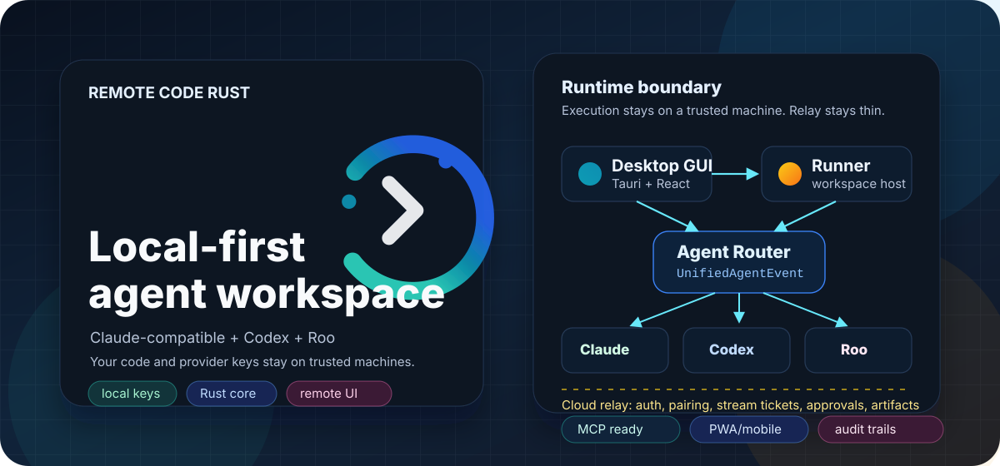
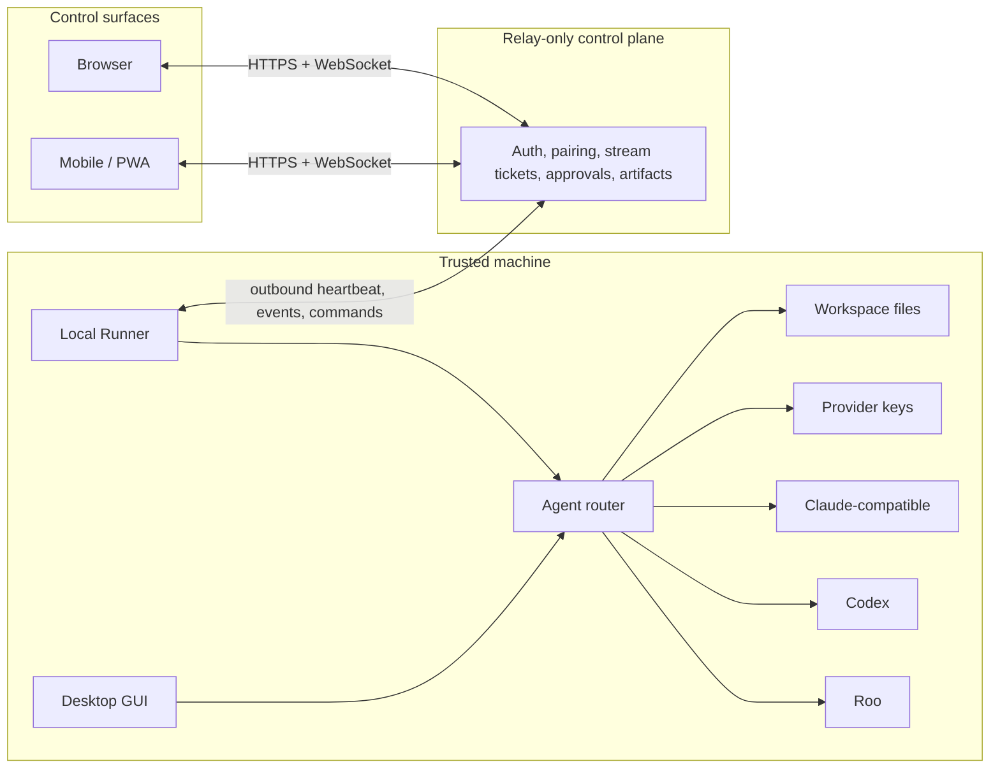

<p align="center">
  
</p>

<h1 align="center">Remote Code Rust</h1>

<p align="center">
  <strong>A local-first AI coding workspace for Claude-compatible, Codex, and Roo agents.</strong><br />
  Run agents where your code lives. Control them from terminal, desktop, browser, or mobile.
</p>

<p align="center">
  <a href="https://github.com/yanzhi0922/remote-code-rust/actions/workflows/ci.yml"></a>
  <a href="https://github.com/yanzhi0922/remote-code-rust/actions/workflows/release.yml"></a>
  
  
  
  
</p>

<p align="center">
  <strong>Translations:</strong>
  <a href="README.zh-CN.md">简体中文</a> |
  <a href="README.ja.md">日本語</a>
</p>

> Status: public preview. This repository is visible for development, audit, and controlled dogfooding, but it is not production-ready yet. Treat [docs/requirements.md](docs/requirements.md) as the release gate, not a successful build alone.

## Why Developers Should Care

Most AI coding setups make you choose between a powerful local tool, a polished desktop UI, or remote control from another device. Remote Code Rust is built around a stricter idea:

**the agent runtime, workspace files, tool execution, and provider keys stay on a trusted machine, while every UI surface speaks to the same typed Rust runtime.**

That gives the project a clear lane:

| What stands out | Why it matters |
| --- | --- |
| Three agent families | Claude-compatible, OpenAI Codex, and Roo paths are unified behind one protocol. |
| Local-first security | The relay coordinates sessions, approvals, and artifacts without owning your code or provider keys. |
| One Rust workspace | CLI, TUI, runner, control plane, adapters, protocol crates, and GUI backend evolve together. |
| Desktop plus remote control | Tauri desktop, Web/PWA, and mobile targets share the same remote-control model. |
| Auditable automation | Permissions, transcripts, checkpoints, events, artifacts, and release evidence are first-class concepts. |

## What You Can Build With It

| Workflow | Entry point | Current shape |
| --- | --- | --- |
| Local agent session | `remote-code` CLI, TUI, or headless `stream-json` | Provider routing, tool execution, permissions, MCP, Skills, Plugins, memory, transcripts. |
| Native desktop coding | `apps/remote-code-gui` | Tauri v2 plus React 19 UI with projects, sessions, providers, approvals, tools, diff, Git, and remote settings. |
| Remote approvals | Web/PWA or mobile shell | Pair a trusted desktop runner, watch session events, respond to approvals, and download artifacts. |
| Agent interoperability | `rc-agent-protocol` and adapters | Route Claude-compatible, Codex, and Roo engines through one event model. |
| Relay deployment | `remote-code-control-plane` | Auth, pairing, runner leases, session fan-out, stream tickets, approvals, and artifacts. |

## Architecture In One Minute



The control plane is intentionally narrow. It must not run coding agents, provider SDK loops, Cargo, workspace tooling, or `remote-code-runner`. Direct runner access is opt-in and uses a separate runner token.

## Quick Start

Prerequisites:

- Rust `1.93.1` with `clippy` and `rustfmt`
- Node.js `20` for the GUI
- Provider credentials configured outside Git-tracked files

Run the core checks:

```powershell
cargo fmt --all -- --check
python scripts/cargo_workspace_slice.py check claude
python scripts/cargo_workspace_slice.py check codex
python scripts/cargo_workspace_slice.py check roo
python scripts/cargo_workspace_slice.py check apps-shared
```

Try the CLI/runtime shell:

```powershell
cargo run -p remote-code -- doctor
cargo run -p remote-code -- tui
cargo run -p remote-code -- -p "Summarize this repository architecture"
```

Run the desktop GUI:

```powershell
cd apps\remote-code-gui
npm ci
npm test
npm run desktop:dev
```

Start the remote pieces for a controlled local test:

```powershell
cargo run -p remote-code-control-plane -- --bind 127.0.0.1:8787 serve
cargo run -p remote-code-runner -- --control-plane-url http://127.0.0.1:8787 serve
```

## Feature Map

| Area | Highlights |
| --- | --- |
| Runtime | CLI, TUI, headless mode, `stream-json`, resume, export, replay, provider failover, context management. |
| Tools | Built-in tools, BM25 tool discovery, lazy loading, sandbox execution, MCP, Skills, Plugins, hooks. |
| Agents | Claude-compatible query engine, Codex in-process app-server adapter, Roo in-process adapter, unified events. |
| State | SQLite session indexes, NDJSON transcripts, checkpoint/review flows, artifacts, cost and telemetry records. |
| GUI | Tauri v2, React 19, TypeScript, provider management, approvals, Markdown, KaTeX, virtualized chat, Git and diff panels. |
| Remote | Runner registration, outbound polling, WebSocket fan-out, one-time stream tickets, approvals, artifact download. |
| Mobile/PWA | Shared remote-control UI, secure-storage hooks, haptics, biometrics, downloads/share, push/deep-link scaffolding. |
| Release | CI slices, RustSec audit, npm audit, gitleaks, cross-target release artifacts, redacted acceptance evidence. |

## Security Boundary

Remote Code Rust is designed so the most sensitive work stays local:

- Agent loops run on the user's desktop or another trusted runner.
- Provider keys stay on the user's machine or trusted runner.
- Workspace files stay on the user's machine or trusted runner.
- The cloud relay handles auth, pairing, heartbeats, commands, event streams, approvals, artifacts, and Web/PWA assets only.
- WebSocket event streams use short-lived stream tickets instead of long-lived URL tokens.
- Direct runner mode is an explicit advanced path and must use a separate runner API token.

Read [SECURITY.md](SECURITY.md) before deploying, reporting a vulnerability, or sharing screenshots/logs. Any credential that appeared in chat, logs, reports, or Git history must be rotated before public use.

## Repository Layout

```text
remote-code-rust/
├── agents/
│   ├── claudecode/                 # remote-code CLI/TUI/headless runtime
│   └── codex/                      # vendored Codex source mirror
├── apps/
│   ├── remote-code-gui/            # Tauri desktop and Web/PWA frontend
│   ├── remote-code-control-plane/  # relay/control plane
│   ├── remote-code-runner/         # trusted local runner
│   └── remote-code-migrate/        # profile migration
├── crates/
│   ├── adapters/                   # rc-claude/codex/roo adapters
│   ├── claude/                     # Claude-compatible Rust runtime crates
│   ├── codex/                      # Codex Rust crates
│   ├── roo/                        # Roo Rust rewrite crates
│   └── shared/                     # protocol, events, and remote transport
├── deploy/                         # relay deployment scripts
├── docs/                           # requirements, architecture, assets
├── plans/                          # design notes and archived audits
└── scripts/                        # release, validation, and cleanup scripts
```

## Release Readiness

This project should not be treated as production-ready until [docs/requirements.md](docs/requirements.md) is fully satisfied.

Release candidates must cover at least:

```powershell
cargo fmt --all -- --check
git diff --check
python scripts/cargo_workspace_slice.py check claude
python scripts/cargo_workspace_slice.py check codex
python scripts/cargo_workspace_slice.py check roo
python scripts/cargo_workspace_slice.py check apps-shared
python scripts/cargo_workspace_slice.py clippy claude
python scripts/cargo_workspace_slice.py clippy codex
python scripts/cargo_workspace_slice.py clippy roo
python scripts/cargo_workspace_slice.py clippy apps-shared
cargo audit --quiet
cd apps\remote-code-gui
npm ci
npm audit --audit-level=moderate --registry=https://registry.npmjs.org/
npm test
npm run build
```

The release evidence still needs real end-to-end validation for desktop GUI, runner, control plane, Mobile/PWA pairing, approvals, artifacts, QUIC, provider matrices, and MCP calls. Use [docs/release-acceptance-evidence.md](docs/release-acceptance-evidence.md) for the redacted evidence report.

## Provider And MCP Matrix

Primary paths:

- Claude / Anthropic-compatible
- Codex / OpenAI-compatible
- Roo / Roo-native provider stack

Supplemental validation providers:

- MiniMax Token Plan
- KuaiKAT Coding Plan
- DeepSeek where applicable

MCP validation servers:

- MiniMax
- context7
- sequentialthinking
- memory
- puppeteer

Real provider keys and MCP keys must never be committed, pasted into reports, copied into screenshots, or stored in Git-tracked files. Use environment variables, OS keychains, or local untracked config.

## Release Artifacts

Tag-triggered releases (`v*`) build workspace tool archives, a relay-only Linux package, the Windows NSIS installer, Web/PWA assets, and `SHA256SUMS.txt`.

- `cloud-relay.yml` on `main` builds a relay package without the frontend.
- `release.yml` builds the full Web/PWA relay package, desktop installer, cross-target tool archives, and checksums.

Do not publish a release solely because artifacts built successfully. A public release candidate still needs completed, redacted requirements 14/17 evidence.

## Documentation

- [Requirements](docs/requirements.md): release baseline and acceptance criteria.
- [Release acceptance evidence](docs/release-acceptance-evidence.md): redacted evidence template for requirements 14/17.
- [Architecture](ARCHITECTURE.md): system topology and module boundaries.
- [Compatibility](COMPATIBILITY.md): compatibility notes.
- [Roadmap](ROADMAP.md): planned work and phase history.
- [Security](SECURITY.md): reporting and security model.
- [Contributing](CONTRIBUTING.md): contribution and local checks.
- [Provenance](PROVENANCE.md): source provenance notes.

## Contributing

High-signal contributions are especially valuable in these areas:

- Reproducible E2E evidence for runner/control-plane/mobile flows.
- Provider and MCP compatibility reports with secrets redacted.
- Windows, macOS, Linux, Android, and iOS packaging feedback.
- Small, well-scoped fixes that improve release gates, security posture, or docs.

Before opening a PR, run the smallest relevant slice locally and keep provider keys, MCP configs, runner tokens, `.env` files, logs, and screenshots with secrets out of Git.

## Public Repository Hygiene

- `.research/`, local MCP config, local profiles, logs, build output, and test keys are intentionally untracked.
- Do not commit `.env`, `.mcp.json`, local provider settings, runner tokens, SQLite state, screenshots containing secrets, or generated logs.
- Before release or visibility changes, run gitleaks over the current tree and full history.
- Any credential that was ever pasted into chat, logs, local reports, or Git history must be rotated before public use.

## License

This repository is public source, not open-source licensed unless a separate written license says otherwise. See [LICENSE](LICENSE).

Third-party source mirrors and fixtures under `agents/` and `crates/codex/` retain their upstream notices. Keep provenance notes intact when updating those directories.
