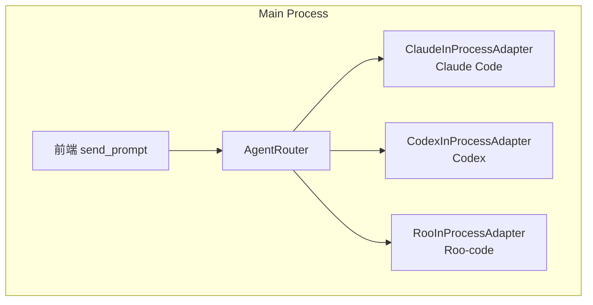

# Remote Code Rust

高性能 Rust 实现的 AI 编码代理平台，兼容 Claude Code / OpenAI Codex 协议，支持多 Agent 统一管理。

## 项目概览

| 指标 | 数值 |
|------|------|
| 应用程序 | 5 个（CLI、GUI、Control Plane、Runner、Migrate） |
| Workspace Packages | 当前 `cargo metadata --no-deps` 实测 231 个 Rust packages（Claude / Codex / Roo / Adapters / Apps） |
| 内置工具 | 62 |
| 测试 | 按 crate 和功能维护单元 / 集成测试；完整 workspace 测试耗时较长 |
| Clippy 状态 | `cargo clippy --workspace -- -D warnings` 是发布门禁 |
| `unsafe` 代码 | 平台 FFI 允许，CI 通过 clippy / audit / secret scan 约束风险；新增 unsafe 必须 code review |
| Rust 版本 | 1.93 (Edition 2024) |
| 许可证 | Proprietary |

## 特性

- 🦀 **Rust 核心引擎** — 内存安全、零成本抽象、高性能异步运行时（Tokio），GUI 前端使用 TypeScript + React 19
- 🤖 **多 Provider 支持** — OpenAI、Anthropic、GLM/ZhipuAI、AWS Bedrock、Google Vertex AI
- 🔄 **自动故障转移** — 多 Provider 健康追踪 + 熔断器 + 指数退避重试
- 🔧 **62 内置工具** — 文件操作、代码搜索（Grep 14+ 参数）、Web 搜索、LSP、后台任务、代理系统
- 🧠 **智能上下文管理** — 自动 Token 估算、5 种压缩策略、Anthropic Prompt Cache 优化
- 🛡️ **消息规范化管道** — 6 步 API 契约保证（角色交替、工具配对、思维块清理）
- ⏱️ **流式看门狗** — 90s 可配置空闲超时，防止 SSE 连接挂起
- 🔒 **细粒度权限系统** — 5 种模式 + 规则引擎 + 通配符匹配 + 审计日志
- 🏗️ **分布式架构** — Control Plane + Runner + WebSocket 实时流
- 🔌 **MCP 协议** — stdio / HTTP / WebSocket 三种传输层
- 📦 **插件系统** — JSON-RPC stdio 协议，隔离进程运行
- 🧩 **Skills 系统** — Markdown frontmatter 技能发现与索引
- 🤝 **多代理系统（Swarm）** — AgentScheduler + 并行执行 + 邮箱消息传递
- 🌐 **多 Agent 统一管理** — Claude / Codex / Roo 三引擎各自独立的 in-process 适配器，统一 `AgentAdapter` trait
- ⚡ **QueryEngine 执行路径** — Claude Agent 使用 QueryEngine 统一执行路径，Codex 使用 AppServer 协议，Roo 使用 Provider+ToolDispatcher
- 💾 **记忆系统** — RC.md 持久化记忆（全局 / 项目双作用域）
- 🛡️ **沙箱执行** — Seatbelt (macOS) / Landlock (Linux) / Windows 策略
- 📊 **成本追踪** — 多模型 Token 使用统计 + 费用累计
- ⚡ **流式响应** — SSE 流式 + 工具执行实时回调
- 🔍 **BM25 工具搜索** — 智能工具发现，减少 ~60% 上下文占用
- 🎯 **延迟工具加载** — 核心/扩展分离，按需加载工具描述
- 📡 **SSH 模式** — 远程主机安全执行
- ⌨️ **Vim 模式** — Normal / Insert / Visual / Buffer 四种模式
- 🖥️ **桌面 GUI** — Tauri v2 + React 19，内置 Provider/Model/Runtime 管理
- 📱 **移动端 / PWA 远程控制** — 桌面 GUI 内置远程 Runner 服务，手机端经控制平面控制本机 Agent；服务器只做安全中继
- 🔐 **OAuth2 认证** — PKCE 流程 + 自动 Token 刷新
- 📈 **遥测与分析** — Datadog / 自有端点 / 文件导出三种方式
- 🎤 **语音输入** — Web Speech API + 音频级别实时反馈

## 部署边界

生产部署采用“本地执行、云端中继”的边界：

- 用户电脑运行独立桌面应用和本地 Runner，Agent、Provider Key、工作区文件、工具执行都留在用户电脑。
- 云服务器只运行 `remote-code-control-plane`、Web/PWA 静态资源、认证/配对/事件中继和安装包下载，不运行 coding agent，不运行 `remote-code-runner`，不保存本地工作区。
- 手机 App 或 PWA 连接控制平面后，通过已配对的本机 Runner 远程控制桌面软件。
- 独立 `remote-code-runner` 默认使用 `outbound` 长轮询模式，不暴露入站端口；需要直连 API 时必须显式使用 `--mode inbound` 并配置 runner API token。
- 远程客户端默认使用 `relay_only` 中继模式；直连/混合模式必须显式设置 `VITE_REMOTE_CODE_TRANSPORT_MODE=hybrid` 或 `direct_only`。
- WebSocket 事件流使用短期一次性 `stream_ticket`，URL 中的长期 `access_token` 查询参数默认禁用；控制平面旧兼容开关为 `REMOTE_CODE_ALLOW_QUERY_ACCESS_TOKEN=true`，本地 Runner 旧兼容开关为 `REMOTE_CODE_RUNNER_ALLOW_QUERY_ACCESS_TOKEN=true`，两者都只应临时使用。
- 用户名/密码派生的 user-key 认证只接受服务端 `REMOTE_CODE_CONTROL_PLANE_USER_KEY_HASHES` 中预配置的 SHA-256 哈希；生产环境优先使用 bootstrap/pairing 设备信任链。
- Runner API token 与控制平面 token 分离：`REMOTE_CODE_RUNNER_AUTH_TOKEN` 只保护可选直连 runner API，`REMOTE_CODE_CONTROL_PLANE_AUTH_TOKEN` / pairing token 用于控制平面注册、心跳和命令轮询，不要复用。
- QUIC 通道当前是实验能力，默认不启动；只有设置 `REMOTE_CODE_CONTROL_PLANE_QUIC_EXPERIMENTAL=1` 且提供 QUIC 证书/私钥时才会开启。
- 腾讯云部署材料位于 [`deploy/tencent-cloud`](deploy/tencent-cloud)，默认面向 `remote-code.yz520gzy.top`。

### 当前发布状态

当前目标是 Windows 桌面 exe + 云端 relay + 手机端远控的产品闭环。发布前必须至少完成这些本地门禁：

```powershell
cargo fmt --all -- --check
git diff --check
cargo check --workspace --all-targets
cargo clippy --workspace -- -D warnings
cargo audit --quiet
cd apps\remote-code-gui
npm ci
npm audit --audit-level=moderate --registry=https://registry.npmjs.org/
npm test
npm run build
```

`cargo audit` 中存在已接受且有到期复核日期的上游未修复风险，记录在 [`.cargo/audit.toml`](.cargo/audit.toml)。移动端原生推送、Android/iOS 真机打包和应用商店级加固需要单独验收，不应仅凭 Web 构建通过就标记为正式移动端发布。

### 本地发布验证

Windows 本地发布前建议执行：

```powershell
powershell -ExecutionPolicy Bypass -File scripts\verify-release.ps1 -IncludeAudit
```

需要同时重打桌面安装包时执行：

```powershell
powershell -ExecutionPolicy Bypass -File scripts\verify-release.ps1 -IncludeDesktopBundle -IncludeAudit -UseProxy
```

清理本地构建缓存但保留已生成安装包：

```powershell
powershell -ExecutionPolicy Bypass -File scripts\clean-build-caches.ps1 -Aggressive
```

默认清理不会删除 `src-tauri/gen` 生成 schema；只有明确传入 `-RemoveGeneratedTauriArtifacts` 才会移除 Tauri 生成目录。

部署到腾讯云中继服务器只上传本地构建产物，不上传源码、不在服务器编译：

```powershell
powershell -ExecutionPolicy Bypass -File deploy\deploy.ps1
```

`deploy.ps1` 默认要求 `target\x86_64-unknown-linux-gnu\release\remote-code-control-plane`
已经存在；不要把 Windows `.exe` 上传到 Linux 中继机。GitHub Release 会额外产出
`remote-code-cloud-relay-x86_64-unknown-linux-gnu` 专用云端中继包。

## 项目结构

```
remote-code-rust/
├── agents/                        # Agent 引擎
│   ├── claudecode/                # Claude Code Agent（Rust 重写，原 remote-code CLI）
│   │   ├── src/                   # CLI / TUI / Headless / 交互式模式
│   │   └── Cargo.toml
│   ├── codex/                     # OpenAI Codex 源码（codex-rs，独立 Git 仓库）
│   └── roo-code/                  # Roo Code 源码（独立 Git 仓库）
├── apps/                          # 应用程序
│   ├── remote-code-gui/           # 桌面 GUI（Tauri v2 + React 19）
│   ├── remote-code-control-plane/ # 控制平面
│   ├── remote-code-runner/        # 远程 Runner
│   └── remote-code-migrate/       # 数据迁移
├── crates/                        # 库 crates（shared / claude / codex / adapters / roo）
│   ├── shared/                    # 三 Agent 共享 crate
│   │   ├── rc-agent-protocol/     # 多 Agent 协议抽象层（trait + events + types）
│   │   └── rc-engine-events/      # 共享运行时事件类型（RuntimeEventDetail 15 variants）
│   ├── adapters/                  # 三 Agent 独立适配器
│   │   ├── rc-claude-adapter/     # Claude 适配器（QueryEngine）
│   │   ├── rc-codex-adapter/      # Codex 适配器（AppServer + event_mapper）
│   │   └── rc-roo-adapter/        # Roo 适配器（Provider + ToolDispatcher）
│   ├── claude/
│   │   ├── claude-query-engine/       # QueryEngine 执行路径
│   │   ├── claude-core/               # 核心运行时类型
│   │   ├── claude-provider/           # Provider 标准化与流式
│   │   └── ...                    # 其他 Claude 核心 crate
│   ├── codex/                     # Codex 核心 crate（core, exec, protocol 等）
│   └── roo/                       # Roo 核心 crate（provider, task, tools 等）
├── plans/                         # 设计文档
│   ├── multi-agent-architecture.md  # 多 Agent 架构设计
│   ├── PROJECT_STATUS.md            # 项目状态
│   └── archive/                     # 归档文档
├── scripts/                       # 构建与工具脚本
├── deploy/                        # 部署配置
└── fixtures/                      # 测试固件
```

## 架构

### 应用程序

| 应用 | 说明 |
|------|------|
| `remote-code` (claudecode) | Claude Code Rust 重写 — 交互式 / 无头 / 远程模式 |
| `remote-code-gui` | 桌面 GUI（Tauri v2 + React 19） |
| `remote-code-mobile` | 移动端（Tauri v2 iOS/Android，Rust 原生后端 + 响应式 React 前端） |
| `remote-code-control-plane` | 云端控制平面（HTTP + WebSocket），只做认证、配对、事件中继和下载 |
| `remote-code-runner` | 本机 Runner 代理，运行在用户电脑或可信工作站，不部署到云服务器 |
| `remote-code-migrate` | 数据迁移工具 |

### 库 Crate

| Crate | 职责 |
|-------|------|
| `claude-core` | 共享运行时类型、错误、会话模型、Hook 类型 |
| `claude-config` | CLI 解析、环境变量、配置优先级、Provider 配置、遗留导入 |
| `claude-provider` | Provider 标准化、请求构建、传输、重试、SSE 流、故障转移、成本追踪、消息规范化、流式看门狗、思维预算限制 |
| `claude-tools` | 62 内置工具、工具注册、权限检查、BM25 搜索、延迟加载 |
| `claude-permissions` | 5 种权限模式、审批请求、规则引擎、审计记录 |
| `claude-session` | 会话持久化（SQLite + NDJSON）、索引、导出、恢复、重放 |
| `claude-mcp` | MCP 客户端/服务器生命周期、JSON-RPC 传输、工具投影 |
| `claude-plugins` | 插件清单、JSON-RPC 进程运行时、能力协商 |
| `claude-skills` | SKILL.md 发现、TOML frontmatter 解析、索引 |
| `claude-skill-search` | 远程技能加载、TTL 缓存 |
| `claude-agents` | 调度器、邮箱、任务生命周期、并行执行 |
| `claude-swarm` | 多代理类型系统、Team 文件、权限请求、消息传递 |
| `claude-tui` | ratatui 界面、Vim 键绑定、视口状态、渲染 |
| `claude-compact` | 上下文压缩策略（5 种）、Session Memory 压缩 |
| `claude-query-engine` | 统一查询循环、状态机、流式执行器、Token 预算 |
| `claude-system-prompt` | 系统提示词构建、缓存、各段落模块化 |
| `claude-runtime-prompt` | 运行时提示词、自动记忆注入 |
| `rc-engine-events` | 引擎事件类型、流处理 |
| `claude-event-bus` | 进程内事件总线 |
| `claude-file-history` | 文件备份、差异统计、快照 |
| `claude-ide` | IDE 桥接（JSON-RPC 2.0）、stdio/HTTP 连接 |
| `claude-ui-bridge` | UI 桥接层 |
| `claude-analytics` | 事件导出（Datadog / 自有 / 文件） |
| `claude-auth` | API Key、OAuth2、订阅验证 |
| `claude-context` | Effort 级别、Fast Mode、运行时身份 |
| `claude-model` | 模型信息与元数据 |
| `claude-voice` | 语音转文字（STT）、文字转语音（TTS Mock） |
| `claude-telemetry` | 追踪设置、结构化日志、Token 估算 |
| `claude-teleport` | Teleport 远程环境 API |
| `claude-transcript` | 会话转录、边界标记、存储 |
| `claude-protocol` | 类型化运行时事件、兼容性序列化 |
| `claude-settings` | 设置加载、合并、验证、MCP/Sandbox/Provider 配置 |
| `claude-lsp` | 简化 LSP 协议支持 |
| `claude-managed-settings` | 托管设置策略 |
| `claude-integration-tests` | 集成测试 |
| `claude-runner` | Runner 协议、HTTP API、心跳 |
| `claude-control-plane` | API 模型、Runner 注册、WebSocket 扇出 |
| `claude-utils` | 工具函数（Git、Diff、Markdown、图片、Cron 等） |
| `rc-agent-protocol` | 多 Agent 协议抽象层：`AgentAdapter` trait、`UnifiedAgentEvent`、`AgentRouter` |
| `rc-claude-adapter` | Claude 适配器：`ClaudeInProcessAdapter` = `QueryEngine` |
| `rc-codex-adapter` | Codex 适配器：`CodexInProcessAdapter` + `event_mapper` (753 行) |
| `rc-roo-adapter` | Roo 适配器：`RooInProcessAdapter` + 26 Provider 后端 |
| `claude-checkpoint` | 对话级版本控制 — SHA256 快照、SQLite 存储、undo/rollback |
| `claude-specialized-agents` | 专用 Agent 系统 — Markdown+YAML 定义、@agent 提及、5 个内置 Agent |
| `claude-git` | Git 操作 — gix 分支解析、CLI status/staging/commit/diff/log |

### 数据流

```
用户输入 → Provider 请求（含上下文管理）
    ↓
Provider 响应 → 解析工具调用
    ↓
工具调用 → 权限检查 → 执行 → 收集结果
    ↓
工具结果 → 追加到对话 → 返回 Provider
    ↓
重复直到 Provider 发出纯文本响应（无工具调用）
```

## 内置工具（62）

### 文件操作
`read_file` · `write_file` · `edit_file` · `replace_in_file` · `list_directory`

### 搜索
`search_text` · `glob` · `grep` · `lsp`（简化 LSP）

### 执行
`bash_command`（带沙箱支持） · `powershell` · `repl` · `monitor` · `terminal_capture`

### Web
`web_search` · `web_fetch` · `web_browser`

### 代理系统
`agent` · `send_message` · `team_create` · `team_status` · `team_delete` · `team_list`

### 任务管理
`task_create` · `task_get` · `task_list` · `task_stop` · `task_update` · `todo_write`

### 记忆
`memory_read` · `memory_write`

### 其他
`ask_user` · `config_read` · `sleep` · `snip` · `skill_discover` · `tool_search` · `verify_plan` · `terminal_capture` · `notebook_edit` · `enter_plan_mode` · `exit_plan_mode` · `brief` · `review_artifact` · `send_user_file` · `discover_skills` · `enter_worktree` · `exit_worktree` · `list_worktrees` · `ctx_inspect` · `schedule_cron` · `mcp_call` · `list_mcp_resources` · `read_mcp_resource` · `mcp_auth` · `voice_input` · `workflow` · `suggest_pr` · `synthetic_output` · `overflow_test` · `remote_trigger` · `tungsten` · `daemon` · `broadcast_message` · `list_peers`

## 快速开始

### 前置要求

- Rust 1.93.1+（`rustup update` 或查看 `rust-toolchain.toml`）
- Node.js 18+（GUI 开发）
- 系统依赖：`pkg-config`、`libssl-dev`（Linux）、Xcode Command Line Tools（macOS）

### 编译

```bash
# 克隆仓库
git clone https://github.com/yanzhi0922/remote-code-rust.git
cd remote-code-rust

# 编译（Release 模式）
cargo build --release

# 编译检查（开发模式）
cargo check --workspace
```

### Windows 桌面 GUI

```bash
cd apps/remote-code-gui
npm install
npm run desktop:build
```

桌面安装包由 Tauri NSIS 生成。安装后打开 `Remote Code`，在 `设置 -> 远程控制` 填写控制平面 URL、保存配对账号密码，即可让手机 App 通过控制平面远程控制本机 GUI 内置 Agent。
正式发布必须在磁盘空间充足的 Windows 发布机上完成 `npm run desktop:build`，
并做一次真实桌面 Runner 上线、手机/PWA 配对、审批和事件流回归；普通 `npm run build`
只验证 Web 前端产物，不等价于可安装的桌面发行包。

### 构建 Agent 二进制

以下脚本仅用于本地开发机或可信 Runner 机器。云服务器只部署控制平面和静态资源，
不要在云服务器上运行这些 Agent 构建脚本。

```bash
# PowerShell (Windows)
powershell -ExecutionPolicy Bypass -File scripts/build-agents.ps1 all

# Bash (Linux/macOS)
./scripts/build-agents.sh all

# 单独构建
powershell -ExecutionPolicy Bypass -File scripts/build-agents.ps1 roo-code
powershell -ExecutionPolicy Bypass -File scripts/build-agents.ps1 codex
```

> Agent 源码位于 `agents/` 目录，为独立 Git 仓库，需单独克隆：
> ```bash
> cd agents
> gh repo clone openai/codex       # Codex 源码
> # roo-code 已包含在仓库中
> ```

### 配置

```bash
# 设置 API 密钥（任选一个 Provider）
export ANTHROPIC_API_KEY=your_key_here    # Anthropic Claude
export OPENAI_API_KEY=your_key_here       # OpenAI GPT
export GLM_API_KEY=your_key_here          # GLM/ZhipuAI

# 或使用配置文件
# ~/.remote-code/settings.json
```

### 运行

```bash
# 交互式 TUI 模式
cargo run --bin remote-code -- tui

# 无头模式（管道输入）
echo "请帮我分析这个项目" | cargo run --bin remote-code -- headless

# Doctor 环境检查
cargo run --bin remote-code -- doctor

# 运行时状态快照
cargo run --bin remote-code -- status

# 桌面 GUI 模式
cd apps/remote-code-gui
npm install
npm run tauri dev
```

## 代码质量

本项目采用严格的代码质量标准：

| 规则 | 级别 |
|------|------|
| `unsafe_code` | `allow` — 允许 Windows PTY、UDS、sandbox、exec policy parser 等平台 FFI；新增 unsafe 必须接受 code review |
| `dbg_macro` | `deny` — 禁止调试宏 |
| `todo!` / `unimplemented!` | `deny` — 禁止未实现代码 |
| `unwrap_used` | `warn` — 不建议直接 unwrap |
| Release LTO | `thin` + `codegen-units = 1` |
| `cargo audit` | CI 运行；`.cargo/audit.toml` 记录已接受的上游未修复 RustSec 风险 |
| Secret Scan | CI 运行 gitleaks，防止密钥进入仓库 |

### 验证

```bash
# 编译检查
cargo check --workspace

# 运行全部测试（耗时较长，依赖当前 workspace 状态）
cargo test --workspace

# Clippy 静态分析（CI 门禁）
cargo clippy --workspace -- -D warnings

# RustSec 审计（已接受风险写入 .cargo/audit.toml）
cargo audit --quiet

# 格式检查
cargo fmt --all -- --check
```

## 权限模式

| 模式 | 读取 | 编辑 | 命令 | 说明 |
|------|------|------|------|------|
| `default` | ✅ 自动 | ❌ 询问 | ❌ 询问 | 安全默认 |
| `acceptEdits` | ✅ 自动 | ✅ 自动 | ❌ 询问 | CI 友好 |
| `bypassPermissions` | ✅ 自动 | ✅ 自动 | ✅ 自动 | 全自动 |
| `dontAsk` | ✅ 自动 | ❌ 拒绝 | ❌ 拒绝 | 只读 |
| `plan` | ✅ 自动 | ❌ 拒绝 | ❌ 拒绝 | 规划模式 |

## Provider 支持

| Provider | 协议 | 流式 | 说明 |
|----------|------|------|------|
| OpenAI | `openai` | ✅ SSE | GPT-4, GPT-4o 等 |
| Anthropic | `anthropic` | ✅ SSE | Claude 3.5 Sonnet, Opus 等 |
| GLM/ZhipuAI | `openai` | ✅ SSE | GLM-4, ChatGLM |
| AWS Bedrock | `anthropic` | ✅ SSE | Claude on AWS |
| Google Vertex AI | `anthropic` | ✅ SSE | Claude on GCP |

## 部署

项目包含腾讯云部署方案：

```bash
# 查看 deploy/ 目录
ls deploy/tencent-cloud/

# 包含：
# - Caddyfile.example    — 反向代理配置
# - deploy-remote-code-gui.sh — 一键部署脚本
# - systemd service 文件
# - 环境变量模板
```

## 多 Agent 架构

Remote Code GUI 支持三种 AI Agent 引擎，采用统一的进程内适配器架构：

| Agent | 适配器 | 通信方式 | 说明 |
|-------|--------|----------|------|
| **Remote Code** | `ClaudeInProcessAdapter` | 进程内 QueryEngine | 默认引擎，基于 Claude Code 的 Rust 重写 |
| **OpenAI Codex** | `CodexInProcessAdapter` | 进程内事件泵 | 原生 Codex AppServerClient，无子进程 |
| **Roo Code** | `RooInProcessAdapter` | 进程内 Provider+Dispatcher | 26 个 Provider 后端，原生 Roo AgentLoop |

### 架构概览



**核心优势**：
- 全部进程内运行 — Claude Code、Codex 和 Roo-code 均在主进程内运行，无 IPC 开销
- 统一事件模型 — `UnifiedAgentEvent` 标准化所有 Agent 事件
- 统一权限流程 — 所有 Agent 共享 GUI 审批界面
- 统一构建 — `Makefile` + `scripts/build-agents.{ps1,sh}` 一键构建

详细设计见 [plans/three-agent-integration.md](plans/three-agent-integration.md) 和 [plans/multi-agent-architecture.md](plans/multi-agent-architecture.md)。

## 已知限制

| 限制 | 说明 |
|------|------|
| TTS 为 Mock 实现 | `claude-voice::tts` 目前返回占位响应，未接入真实 TTS 服务 |
| Roo 权限系统未完全接线 | `RooInProcessAdapter::resolve_permission()` 可用但未完全接入 GUI 交互式权限弹窗 |
| Roo Token 估算粗糙 | 使用 `text.len() / 4` 近似而非 tiktoken |
| Roo MCP 未接入 | 声明了 McpSupport 能力但未在 send_message 中集成 McpServerConnection |
| `rama-*` 依赖为预发布 | 锁定 `0.3.0-alpha.4`，待迁移至稳定版 |
| 原生移动推送未完成 | 当前可注册/展示本地通知，但 APNs/FCM/WebPush token 获取和服务端发送链路仍需真机实现与验收 |
| Android/iOS 发布需真机验证 | Web/PWA 构建通过不等价于移动端正式发布，需补齐 SDK、签名、R8/ProGuard 和商店目标 SDK 验证 |
| QUIC 仍为实验通道 | 默认关闭，只能通过 `REMOTE_CODE_CONTROL_PLANE_QUIC_EXPERIMENTAL=1` 显式启用 |

## 项目文档

| 文档 | 说明 |
|------|------|
| [ARCHITECTURE.md](ARCHITECTURE.md) | 完整架构设计文档 |
| [COMPATIBILITY.md](COMPATIBILITY.md) | 兼容性说明 |
| [PROVENANCE.md](PROVENANCE.md) | 来源证明 |
| [ROADMAP.md](ROADMAP.md) | 路线图 |
| [plans/multi-agent-architecture.md](plans/multi-agent-architecture.md) | 多 Agent 架构设计 |
| [plans/PROJECT_STATUS.md](plans/PROJECT_STATUS.md) | 项目状态与路线图 |
| [plans/](plans/) | 全部设计文档 |

## 许可证

Proprietary — 保留所有权利。
