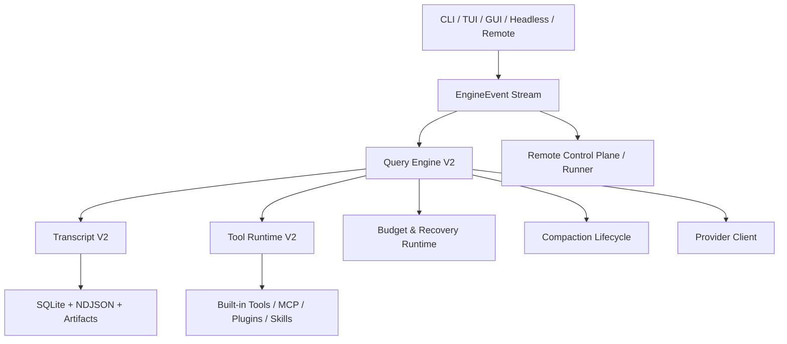

# remote-code-rust Claude CLI 能力复刻总方案

> 日期: 2026-04-14  
> 状态: 调研完成，待实施  
> 决策级别: 架构主线  
> 适用范围: `remote-code-rust` 全仓，重点覆盖 CLI，同时统一 TUI / GUI / Headless / Remote 的运行时内核

---

## 1. 最终结论

如果目标是让 `remote-code-rust` 的 CLI 达到接近 Claude Code 的核心能力与稳定性，**最佳路线不是把 `.research/claude-code-rev` 整棵源码树直接翻译成 Rust**，而是：

**把 `.research/claude-code-rev` 当作“功能规格书 + 行为参考”，在当前 Rust 仓库上做一次系统性的 clean-room 能力复刻工程。**

这条路线的核心判断如下：

- 当前 `remote-code-rust` 已经有完整骨架，不是空白项目：
  - CLI / TUI / Headless 入口
  - provider 层
  - session store
  - tool runtime
  - hooks
  - MCP / plugins / skills
  - remote control plane / runner
  - agent / task 骨架
- `.research/claude-code-rev` 的价值在于：
  - 明确了 Claude Code 级 CLI 的关键能力模型
  - 提供了复杂场景下的状态机参考
  - 暴露了 resume、budget、compaction、tool runtime、remote ingress 的成熟语义
- `.research/claude-code-rev` 不适合作为直接移植目标：
  - 体量极大
  - 混有大量 Anthropic 内部产品面能力
  - feature flag 复杂
  - 当前研究树是 restored source tree，不适合作为直接 vendored 依赖

因此，本方案的目标不是“把 Claude Code 变成 Rust”，而是：

**把 Claude Code 的 CLI 内核能力，按 Rust 架构重新实现，并继续保留 `remote-code-rust` 自己在多 provider、自有 remote、强类型、可测试性上的优势。**

---

## 2. 研究对象与证据范围

本次方案基于以下两部分代码树的静态分析：

### 2.1 当前 `remote-code-rust`

重点分析位置：

- `apps/remote-code/src/main.rs`
- `apps/remote-code/src/cli.rs`
- `apps/remote-code/src/conversation.rs`
- `apps/remote-code/src/headless.rs`
- `apps/remote-code/src/hooks.rs`
- `crates/claude/rc-provider/src/lib.rs`
- `crates/claude/rc-provider/src/context.rs`
- `crates/claude/rc-session/src/lib.rs`
- `crates/claude/rc-tools/src/lib.rs`
- `crates/claude/rc-tools/src/specs.rs`
- `crates/claude/rc-control-plane/src/types.rs`
- `crates/claude/rc-runner/src/lib.rs`
- `crates/claude/rc-agents/src/lib.rs`

### 2.2 `.research/claude-code-rev`

重点分析位置：

- `.research/claude-code-rev/package.json`
- `.research/claude-code-rev/src/main.tsx`
- `.research/claude-code-rev/src/query.ts`
- `.research/claude-code-rev/src/QueryEngine.ts`
- `.research/claude-code-rev/src/query/tokenBudget.ts`
- `.research/claude-code-rev/src/commands.ts`
- `.research/claude-code-rev/src/services/compact/*`

---

## 3. 关键研究结论

### 3.1 当前 Rust CLI 不是 Claude Code 的字面复刻

更准确的定性是：

- **受 Claude Code 产品思路影响**
- **在 Rust 中进行了大量自主重写**
- **只覆盖了 Claude 内核的一部分**

当前 Rust 的架构主干已经具备产品化基础，但 CLI 内核复杂度和 Claude Code 仍有明显差距。

### 3.2 当前 Rust 已有大量可复用资产

以下能力不应推倒重来：

- `SessionStore`：SQLite + transcript + export + resume state
- `ProviderClient`：OpenAI / Anthropic / Bedrock / Vertex / Coding Plan provider 兼容
- `ContextWindowManager`：已有多种 compaction 策略基础
- `rc-tools`：已有 40+ built-in tools 骨架
- `headless`：已有 stream-json / runtime event 输出链路
- `rc-control-plane` / `rc-runner`：已有 remote 事件模型与审批 / artifact / pairing 结构
- `rc-agents`：已有任务调度和 budget 模型骨架

### 3.3 当前 Rust 与 Claude Code 的最大差距不在“命令数量”，而在“运行时状态机”

真正的差距集中在：

- Query Engine 状态机
- transcript 语义层
- compact 生命周期
- budget 控制
- shell/background 任务模型
- crash-safe resume
- result taxonomy
- 统一事件流

### 3.4 `.research/claude-code-rev` 中有大量不应直接复刻的产品面能力

包括但不限于：

- `assistant / KAIROS`
- `bridge / remoteControlServer`
- `mobile`
- `teleport`
- `voice`
- `ultraplan`
- 多种内部实验 feature flag

这些能力可以作为灵感来源，但不应进入第一优先级，也不应成为架构主线。

### 3.5 当前 Rust 在多 provider 兼容上已经比 Claude Code 研究树更适合本项目

当前 Rust 已支持：

- `anthropic`
- `openai`
- `bedrock`
- `vertex`
- `glm`
- `glm-coding`
- `minimax-token-plan`
- `minimax-coding`
- `tencent-coding`
- `aliyun-coding`
- `qianfan-coding`
- `kimi-coding`
- `volcengine-coding`

这部分必须保留，不能因为复刻 Claude CLI 而倒退。

---

## 4. 决策

### 4.1 架构决策

**采用“Claude Parity Program”方案。**

定义如下：

- 以 `.research/claude-code-rev` 为行为规格
- 以当前 `remote-code-rust` 为实现底座
- 新建独立的 CLI 内核层，不继续把复杂度堆在现有 `conversation.rs`
- 统一 CLI / TUI / GUI / Headless / Remote 的事件真相源
- 保留当前 Rust 的多 provider、自有 remote、自有安全模型

### 4.2 明确不采用的方案

#### 方案 A：直接 Rust 翻译 `.research/claude-code-rev`

结论：**否**

原因：

- 体量过大
- 非核心 feature 太多
- 维护成本极高
- 代码组织和产品耦合不适合原样映射到当前仓库

#### 方案 B：继续在 `apps/remote-code/src/conversation.rs` 上逐步打补丁

结论：**否**

原因：

- 现有 loop 结构不适合继续承接 Claude 级状态机
- 越补越难测
- 最终会形成脆弱的 if/else 状态泥团

#### 方案 C：丢弃当前 Rust CLI，从零做新 CLI

结论：**否**

原因：

- 会直接丢失大量已验证资产
- 会打断已有 TUI / GUI / Remote 路线
- 当前仓库已具备足够强的基础设施，没必要白白重做

---

## 5. 目标定义

### 5.1 总目标

在当前仓库内完成一次全面的 CLI 内核升级，使其达到以下状态：

- 可作为项目最核心入口长期稳定运行
- 长任务 / 复杂任务 / 多回合任务具备更强恢复能力
- transcript、resume、interrupt、budget、compaction、tool runtime 行为接近 Claude Code 核心体验
- CLI / TUI / GUI / Remote 共享统一运行时语义

### 5.2 产物定义

本计划最终应产出以下主线能力：

- `Query Engine V2`
- `Transcript V2`
- `Tool Runtime V2`
- `CLI Surface V2`
- `EngineEvent` 统一事件模型
- `Compaction Lifecycle V2`
- `Background Task Runtime`
- `Budget & Recovery Runtime`

---

## 6. 范围边界

### 6.1 P0 必做范围

- Query loop 状态机升级
- transcript 语义层升级
- resume / continue / fork-session
- max turns / budget / task budget
- compaction 生命周期
- shell 背景任务
- permissions 语义
- hooks 生命周期补全
- stream-json 输出契约升级
- 统一事件总线

### 6.2 P1 高价值增强

- 更强的 resume selector / title-based resume
- compact 后文件 / task / skill 恢复
- 更强的 subagent 生命周期
- 远程 viewer 与 CLI 引擎事件深度对齐

### 6.3 P2 延后项

- assistant / kairos 风格能力
- teleport
- voice
- Anthropic 内部体验特性
- 非关键产品面实验能力

---

## 7. 核心设计原则

### 7.1 复刻行为，不复刻源码

以 Claude Code 的运行时语义为目标，不复制其 TypeScript 源码结构。

### 7.2 Transcript 是真相源

不是 UI，不是 CLI 输出，不是 remote event fan-out。

### 7.3 统一事件流

CLI、TUI、GUI、Headless、Remote 都只消费同一套 `EngineEvent`。

### 7.4 崩溃恢复优先

所有复杂状态机设计必须首先回答：中途中断后如何恢复。

### 7.5 Provider 抽象不倒退

Claude parity 不得以牺牲多 provider 兼容为代价。

### 7.6 远程协议继续自研

CLI 行为向 Claude 对齐，不等于 remote 协议向 Claude bridge 对齐。

---

## 8. 现有代码映射与改造方向

### 8.1 `apps/remote-code/src/conversation.rs`

现状：

- 承担了 prompt loop 主逻辑
- 负责工具调用与结果写回
- 已有基础 compaction 检查
- 已有 max turns enforcement

问题：

- 复杂度过于集中
- 不适合继续承载 Claude 级状态机
- transcript 与 loop 耦合过深

改造方向：

- 逐步退化为 orchestrator / compatibility shim
- 主要逻辑迁移到新 crate `rc-query-engine`

### 8.2 `crates/claude/rc-session`

现状：

- SQLite + NDJSON transcript
- 基础 resume/export/stats 能力

问题：

- 缺少 transcript 语义层版本化
- 缺少 compact boundary
- 缺少 background task / pending execution 快照

改造方向：

- 升级为 `Transcript V2`
- 增加 schema version、boundary、fork lineage、pending state

### 8.3 `crates/claude/rc-provider/src/context.rs`

现状：

- 已有 standard/reactive/micro/auto/sliding/priority/semantic compaction 策略

问题：

- 更像“压缩算法集合”
- 还不是“上下文生命周期管理系统”

改造方向：

- 把 compact 结果接入 transcript 和引擎状态机
- 引入 post-compact restoration、boundary event、budget continuity

### 8.4 `crates/claude/rc-tools`

现状：

- built-in tools 较丰富
- shell schema 已具备 `cwd` / `description` / `background`

问题：

- background 任务模型还不够完整
- 工具执行、任务持久化、恢复、结果 spill 还不够统一

改造方向：

- 升级成 `Tool Runtime V2`
- 引入 background task 生命周期、interrupt、output artifact、恢复机制

### 8.5 `apps/remote-code/src/headless.rs`

现状：

- 已能产出 message/tool/context/subtask 事件

问题：

- 目前事件源仍来自旧 conversation loop

改造方向：

- 切换为消费 `Query Engine V2` 的统一 `EngineEvent`

### 8.6 `crates/claude/rc-control-plane` / `crates/claude/rc-runner`

现状：

- 已有 remote session / approval / artifact / pairing / event types

问题：

- 事件虽较完整，但最终仍应对齐 CLI 内核的新 transcript / event 模型

改造方向：

- Remote 不重做协议方向
- 只对齐 CLI 引擎事件和 transcript 语义

---

## 9. 目标架构

### 9.1 新增 crate 建议

- `crates/claude/rc-query-engine`
- `crates/claude/rc-transcript`
- `crates/claude/rc-engine-events`
- 可选：`crates/claude/rc-context-runtime`
- 可选：`crates/claude/rc-background-tasks`

### 9.2 保留并增强的 crate

- `crates/claude/rc-session`
- `crates/claude/rc-provider`
- `crates/claude/rc-tools`
- `crates/claude/rc-config`
- `crates/claude/rc-control-plane`
- `crates/claude/rc-runner`

---

## 10. 模块级实施方案

## 10.1 Query Engine V2

### 目标

把当前简单 turn loop 升级为完整的 agent query runtime。

### 必做职责

- 单轮执行状态机
- partial assistant message 聚合
- tool-use / tool-result 配对
- pending tool execution 记录
- retry / abort / interrupt
- turn budget enforcement
- max budget enforcement
- task budget enforcement
- compact trigger / retry graph
- transcript flush ordering
- result taxonomy 输出

### 关键状态

- `Idle`
- `RunningModelCall`
- `StreamingAssistant`
- `WaitingToolExecution`
- `RunningToolExecution`
- `WaitingApproval`
- `Compacting`
- `Interrupted`
- `Completed`
- `Failed`

### 关键输出

- `EngineEvent::MessageDelta`
- `EngineEvent::MessageCommitted`
- `EngineEvent::ToolStarted`
- `EngineEvent::ToolProgress`
- `EngineEvent::ToolFinished`
- `EngineEvent::ApprovalRequested`
- `EngineEvent::ApprovalResolved`
- `EngineEvent::ContextOverflow`
- `EngineEvent::ContextCompacted`
- `EngineEvent::BackgroundTaskStarted`
- `EngineEvent::BackgroundTaskFinished`
- `EngineEvent::Result`
- `EngineEvent::RuntimeError`

---

## 10.2 Transcript V2

### 目标

把当前 session 日志升级为可恢复、可压缩、可分叉、可跨前端共享的权威记录层。

### 必做结构

- transcript schema version
- session metadata
- conversation entries
- engine events
- compact boundary records
- fork lineage
- pending execution snapshot
- pending approvals snapshot
- background task snapshot
- subagent / task snapshot
- artifact references

### 新语义要求

- assistant streaming 与最终 committed message 要有稳定归并规则
- tool call 与 tool result 必须一一可追踪
- compact 后必须写 boundary
- resume 必须从稳定恢复点继续
- fork-session 必须保留 lineage

---

## 10.3 Compaction Lifecycle V2

### 目标

把现有 compaction 算法升级成完整的生命周期系统。

### 必做组成

- proactive autocompact
- microcompact
- reactive compact
- compact boundary
- post-compact restore
- compact failure breaker
- compact-aware hooks
- compact budget continuity

### 具体要求

- 所有 compact 都写 boundary
- compact 结果不能只是替换一段 conversation
- compact 前后事件必须进 transcript
- compact 失败不能导致无限循环
- compact 后 resume 不能丢失关键语义

---

## 10.4 Tool Runtime V2

### 目标

把当前 tool execution 升级成稳定、可中断、可恢复、可观察的执行层。

### 优先级最高的子项

#### Shell / Bash / PowerShell

- foreground / background 统一任务模型
- `cwd` 强语义
- description 传递
- output artifact spill
- 长输出截断与 sidecar
- interrupt 传播
- 命令分类：read-only / mutating / network / risky

#### File / Edit / Replace

- edit failure taxonomy
- partial apply 明确化
- transcript 中保留高层意图

#### Agent / Delegate

- 子任务生命周期事件
- 背景子代理状态
- task stack 恢复

#### MCP / Plugins / Skills

- turn 间动态刷新
- transcript 中记录关键调用边界
- resume 后重新装载策略

---

## 10.5 CLI Surface V2

### 目标

补齐 Claude Code 的核心 CLI 入口语义，但不复制其非必要产品面。

### 必做参数与命令语义

- `--continue`
- `--resume`
- `--fork-session`
- `--max-turns`
- `--max-budget-usd`
- `--task-budget`
- `--system-prompt`
- `--system-prompt-file`
- `--append-system-prompt`
- `--append-system-prompt-file`
- `--json-schema`
- `--bare`
- `--add-dir`
- `--strict-mcp-config`
- `--agent`
- `--fallback-model`

### 用户体验要求

- resume by session id
- resume by title
- cwd-scoped continue
- print/json/stream-json 行为明确且稳定
- 失败输出可机器消费

---

## 10.6 Hooks Lifecycle V2

### 必做生命周期

- `startup`
- `resume`
- `pre_compact`
- `post_compact`
- `pre_tool_use`
- `post_tool_use`
- `post_tool_use_failure`
- `session_end`
- 可选 `interrupt`

### 必做保证

- hook 结果写 transcript
- hook 失败不破坏主循环
- compact / resume 不重复脏跑

---

## 10.7 Unified EngineEvent

### 目标

把 CLI / TUI / GUI / Headless / Remote 统一挂在同一套事件上。

### 设计要求

- 事件必须可序列化
- 事件必须可落 transcript
- 事件必须可重放
- 事件必须可映射到 remote control plane
- 事件必须覆盖 UI 所需最小语义

### 直接收益

- CLI、TUI、GUI、Remote 不再各自拼状态
- 测试可直接基于事件序列做 golden diff
- remote viewer 与本地 CLI 的一致性显著提升

---

## 11. 详细分阶段计划

## Phase 0: 规格冻结

### 目标

先冻结“Claude 核心能力矩阵”，不急着写功能。

### 交付物

- `docs/claude-parity-matrix.md`
- `docs/engine-event-schema.md`
- `docs/transcript-v2-schema.md`
- `docs/query-engine-v2-state-machine.md`
- `tests/golden/` 语料目录

### 工作项

- 列出 `.research/claude-code-rev` 中所有高价值能力
- 标记 `P0 / P1 / P2 / No-Port`
- 为当前 Rust 仓库逐项做 gap mapping
- 确定新 crate 边界

### 完成标准

- 后续工程不再反复讨论“要不要做某 feature”

---

## Phase 1: Query Engine V2 落地

### 目标

引入新引擎，但先不切默认路径。

### 工作项

- 新建 `rc-query-engine`
- 定义 engine state machine
- 接入 provider client
- 接入 tool runtime
- 接入 transcript sink
- 输出 `EngineEvent`

### 完成标准

- 可在隔离测试中跑完整 agent loop
- 不依赖旧 `conversation.rs` 的核心执行逻辑

---

## Phase 2: Transcript V2 落地

### 目标

建立权威 transcript。

### 工作项

- 设计 schema version
- 写 boundary record
- 实现 pending snapshot
- 实现 lineage / fork
- 实现 transcript replay adapter

### 完成标准

- crash-safe resume
- compact-safe resume
- transcript replay 可驱动测试与 UI

---

## Phase 3: Budget / Recovery / Compaction 主线

### 目标

补齐 Claude 级别的长任务恢复能力。

### 工作项

- `max_turns`
- `max_budget_usd`
- `task_budget`
- proactive compact
- reactive compact
- compact breaker
- post-compact restoration
- compact-aware hooks

### 完成标准

- provider 413 / 529 / timeout 下有可预测恢复路径
- 不再只靠“超限报错然后退出”

---

## Phase 4: Tool Runtime V2

### 目标

把 shell、background task、artifact spill 做扎实。

### 工作项

- background task runtime
- output file spill
- task ID lifecycle
- shell interrupt
- tool result truncation policy
- tool error taxonomy
- permission auto-mode

### 完成标准

- 长 shell 任务可后台运行
- 结果可恢复
- 中断有效

---

## Phase 5: CLI Surface V2

### 目标

补齐核心 CLI 能力面。

### 工作项

- 新参数接入
- resume / fork-session 语义补齐
- bare mode
- json schema mode
- system prompt override
- stricter print/json/stream-json contract

### 完成标准

- 用户入口能力不再明显落后于 Claude 核心 CLI

---

## Phase 6: TUI / GUI / Headless / Remote 对齐

### 目标

让所有前端消费统一事件流。

### 工作项

- TUI 接 `EngineEvent`
- headless 接 `EngineEvent`
- GUI / remote viewer 接 `EngineEvent`
- old UI adapters 清理

### 完成标准

- 同一 session 在多前端观察一致

---

## Phase 7: 切换默认引擎

### 工作项

- 保留 legacy engine 作为短期 fallback
- 新旧引擎做 golden diff
- 切默认路径到 V2
- 验证 main branch 主线稳定

### 完成标准

- 默认 CLI 使用 V2
- 旧路径仅作短期兼容

---

## Phase 8: 清理遗留层

### 工作项

- 删除旧 adapter
- 删除重复逻辑
- 清理过时参数
- 更新文档与测试基线

### 完成标准

- 代码主干回归清晰

---

## 12. 测试与验收方案

## 12.1 单元测试

覆盖：

- state machine transition
- tool-use / tool-result pairing
- partial message aggregation
- transcript boundary write/read
- fork-session lineage
- background task lifecycle
- permission policy
- compact trigger policy
- budget accounting

## 12.2 Golden Transcript Test

建立一组固定任务：

- 小任务
- 多轮工具任务
- 大量文件编辑任务
- shell 长任务
- compact 触发任务
- interrupt 任务
- resume 任务

分别记录：

- engine event 序列
- transcript snapshot
- final result taxonomy

每次改动做差分比较。

## 12.3 故障注入测试

必须覆盖：

- provider timeout
- provider 529
- prompt-too-long / 413
- tool execution error
- permission denied
- background shell orphan risk
- SQLite busy / partial flush

## 12.4 真实长跑测试

必须用真实 provider 和真实项目连续跑：

- `minimax-m2.7`
- `glm-5.1`
- 至少一个 OpenAI / Anthropic 兼容 provider

任务类型：

- 多文件重构
- 长 shell 编译 / 测试
- 高难度 bugfix
- 中途 interrupt / resume
- compact 触发后继续执行

## 12.5 多前端一致性测试

同一 session 同时经：

- CLI
- TUI
- headless
- remote viewer

验证：

- 状态一致
- 消息顺序一致
- tool/result 对齐
- approval / artifact 一致

---

## 13. 风险与规避

## 13.1 最大风险

### 风险 A：一边补功能，一边继续在旧 loop 上堆复杂度

规避：

- 强制引入 `rc-query-engine`
- 旧 `conversation.rs` 不再直接继续长逻辑

### 风险 B：transcript 没先升级，导致 resume 一直脆弱

规避：

- `Transcript V2` 提前到 Phase 2
- 所有关键状态必须有持久化投影

### 风险 C：UI 和 remote 继续各自消费不同状态

规避：

- 强制统一到 `EngineEvent`

### 风险 D：为了 Claude parity 反而丢掉多 provider 兼容

规避：

- 所有新增状态机必须 provider-neutral
- Anthropic 语义只在协议适配层体现

### 风险 E：过早追逐产品面 feature

规避：

- 严格执行 `P0 / P1 / P2 / No-Port`

---

## 14. 迁移策略

### 14.1 双轨期

短期内保留：

- Legacy engine
- V2 engine

通过 feature flag 或内部配置切换。

### 14.2 切换策略

- 先 golden diff
- 再真实长跑
- 再切 CLI 默认
- 再切 TUI / headless / remote
- 最后删 legacy

### 14.3 main 分支策略

由于当前项目要求只维护一个 `main`：

- 每个阶段都必须做到可编译、可测、可回滚
- 不允许留下长时间不可运行的大半成品

---

## 15. 建议的文档与代码交付清单

### 文档

- `plans/claude-cli-parity-program.md`
- `docs/claude-parity-matrix.md`
- `docs/query-engine-v2-state-machine.md`
- `docs/transcript-v2-schema.md`
- `docs/engine-event-schema.md`
- `docs/budget-recovery-design.md`
- `docs/tool-runtime-v2.md`

### 代码

- `crates/claude/rc-query-engine/`
- `crates/claude/rc-transcript/`
- `crates/claude/rc-engine-events/`
- 可选 `crates/claude/rc-background-tasks/`

### 测试

- `tests/golden/*`
- `tests/fault-injection/*`
- `tests/real-provider/*`

---

## 16. 最终建议

如果只保留一句话，这份方案的最终建议是：

**把 `.research/claude-code-rev` 当作 Claude Code 核心能力规格书，在你当前 `remote-code-rust` 上实施一次“内核级重构”，重点打造 `Query Engine V2 + Transcript V2 + Tool Runtime V2 + Unified EngineEvent`。**

这条路线：

- 比整棵源码树 Rust 翻译更稳
- 比继续在旧 loop 上打补丁更稳
- 比丢弃现有仓库从零重做更稳

也是唯一既能追上 Claude CLI 核心能力，又不牺牲你当前项目已有优势的方案。

---

## 17. 立即执行建议

如果立刻进入实施，第一批动作固定如下：

1. 写 `docs/claude-parity-matrix.md`
2. 新建 `crates/claude/rc-query-engine`
3. 抽 `EngineEvent` 类型
4. 设计 `Transcript V2`
5. 给现有 `conversation.rs` 建 compatibility adapter
6. 先跑 golden corpus，不直接切主路径

这六步完成前，不建议继续往旧 `conversation.rs` 里追加大功能。
