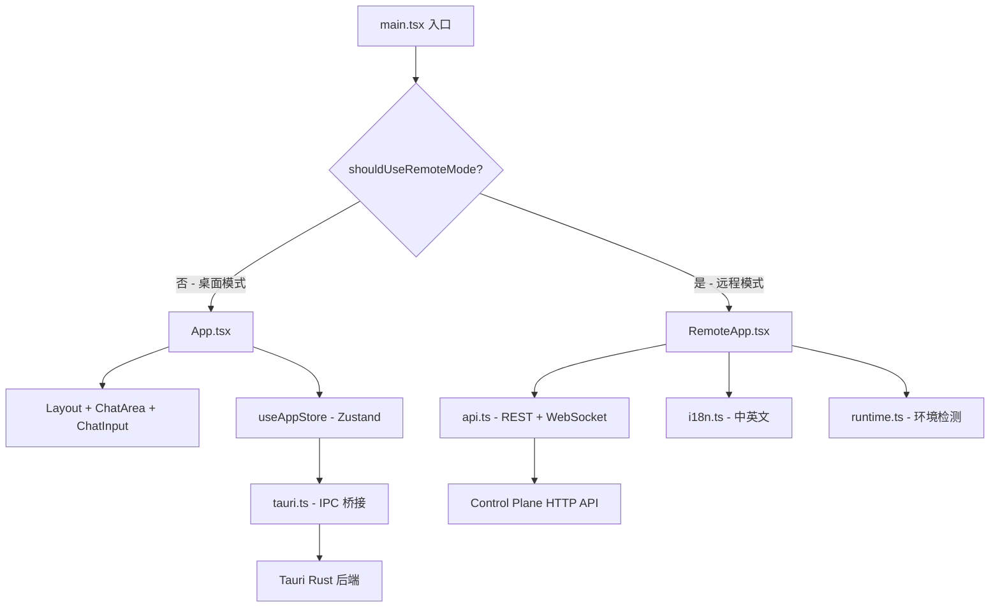
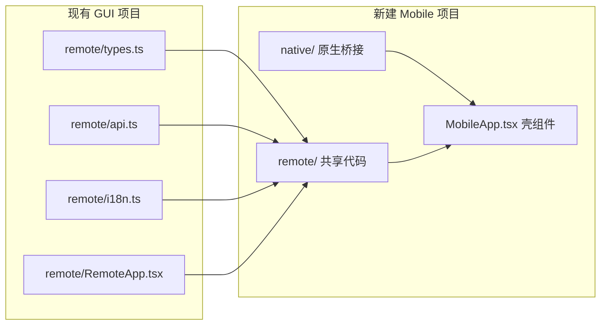
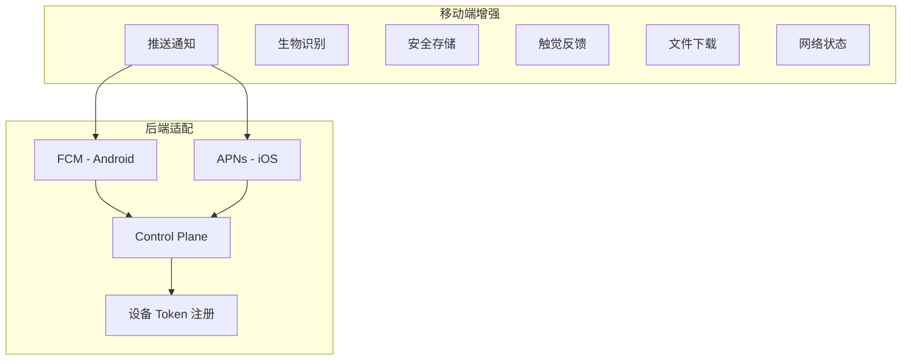

# 移动端原生 App 开发 — 全面调研报告

> 日期: 2026-04-13  
> 状态: 调研完成，待决策  
> 结论: **强烈推荐 Capacitor 方案**

---

## 一、现有代码库分析

### 1.1 前端架构概览

当前 [`apps/remote-code-gui/`](apps/remote-code-gui/) 是一个 Tauri v2 桌面应用，前端采用 React 19 + TypeScript + TailwindCSS 3 + Zustand 5 技术栈。



### 1.2 关键文件清单

| 文件 | 行数 | 用途 | 移动端可复用性 |
|------|------|------|----------------|
| [`RemoteApp.tsx`](apps/remote-code-gui/src/remote/RemoteApp.tsx) | 1827 | 远程客户端完整 UI | ⭐⭐⭐⭐⭐ 95% |
| [`api.ts`](apps/remote-code-gui/src/remote/api.ts) | 253 | REST API + Bearer 认证 | ⭐⭐⭐⭐⭐ 100% |
| [`types.ts`](apps/remote-code-gui/src/remote/types.ts) | 217 | 远程端类型定义 | ⭐⭐⭐⭐⭐ 100% |
| [`i18n.ts`](apps/remote-code-gui/src/remote/i18n.ts) | 459 | 中英文国际化 | ⭐⭐⭐⭐⭐ 100% |
| [`runtime.ts`](apps/remote-code-gui/src/lib/runtime.ts) | 175 | 环境检测 + token 管理 | ⭐⭐⭐⭐ 80% |
| [`useAppStore.ts`](apps/remote-code-gui/src/stores/useAppStore.ts) | 725 | 桌面端状态管理 | ❌ 0% - Tauri 专用 |
| [`tauri.ts`](apps/remote-code-gui/src/lib/tauri.ts) | 312 | Tauri IPC 桥接 | ❌ 0% - Tauri 专用 |
| [`components/`](apps/remote-code-gui/src/components/) | ~2000 | 桌面端 UI 组件 | ❌ 0% - 桌面专用 |

### 1.3 依赖分析

**核心依赖（移动端全部可复用）：**
- `react` 19 + `react-dom` 19
- `zustand` 5（状态管理）
- `react-markdown` + `rehype-highlight` + `rehype-katex` + `remark-gfm` + `remark-math`（Markdown 渲染）
- `lucide-react`（图标）
- `clsx` + `tailwind-merge`（样式工具）

**Tauri 专用（移动端不需要）：**
- `@tauri-apps/api` — Tauri IPC
- `@tauri-apps/plugin-dialog` — 原生文件对话框
- `@tauri-apps/plugin-opener` — 外部链接打开

**Web UI 库（移动端可继续使用）：**
- `@radix-ui/react-dialog` — 对话框
- `@radix-ui/react-dropdown-menu` — 下拉菜单
- `@radix-ui/react-scroll-area` — 滚动区域
- `@radix-ui/react-slot` — 组件插槽

### 1.4 移动端需要的功能

基于 [`RemoteApp.tsx`](apps/remote-code-gui/src/remote/RemoteApp.tsx) 分析，移动端 App 需要支持：

1. **Bootstrap 认证** — 初始声明 + 设备配对
2. **Bearer Token 认证** — 安全存储和自动刷新
3. **WebSocket 实时事件流** — session events、approval events
4. **Session 列表** — 查看、切换、创建
5. **Timeline 事件展示** — 消息、工具调用、审批、制品
6. **Approval 审批** — approve/deny 操作
7. **Artifact 下载** — 查看和下载制品
8. **发送 Prompt / 中断 Session**
9. **i18n** — 中英文切换
10. **离线处理** — 自动重连、状态恢复

---

## 二、四种方案对比分析

### 2.1 总览对比

| 维度 | Capacitor | React Native | Flutter | Tauri Mobile |
|------|-----------|-------------|---------|-------------|
| **代码复用率** | ~95% | ~15% | 0% | ~60% |
| **学习曲线** | 零 | 中 | 高 | 中 |
| **开发成本** | 最低 | 高 | 最高 | 高 |
| **维护成本** | 最低 | 高 | 最高 | 高 |
| **原生性能** | WebView | 原生渲染 | 原生渲染 | WebView |
| **WebSocket** | ✅ 完美 | ⚠️ 需适配 | ✅ Dart 实现 | ✅ 完美 |
| **推送通知** | ✅ 官方插件 | ✅ 原生支持 | ✅ 原生支持 | ✅ 有插件 |
| **生物识别** | ✅ 社区插件 | ✅ 原生支持 | ✅ 原生支持 | ✅ 官方插件 |
| **成熟度** | ⭐⭐⭐⭐⭐ | ⭐⭐⭐⭐⭐ | ⭐⭐⭐⭐⭐ | ⭐⭐ |
| **生产案例** | 极多 | 极多 | 极多 | 极少 |
| **包体积** | ~20MB | ~8MB | ~15MB | ~30MB+ |
| **技术栈匹配** | ✅ 完全 | ⚠️ 部分 | ❌ 不匹配 | ✅ Rust 匹配 |

### 2.2 方案 A: Capacitor ✅ 推荐

**原理：** 将现有 React Web App 包装在原生 WebView 中，通过 Capacitor Bridge 访问原生 API。

**核心优势：**

1. **代码复用率 ~95%**
   - [`RemoteApp.tsx`](apps/remote-code-gui/src/remote/RemoteApp.tsx) — 几乎原封不动使用
   - [`api.ts`](apps/remote-code-gui/src/remote/api.ts) — 100% 复用
   - [`types.ts`](apps/remote-code-gui/src/remote/types.ts) — 100% 复用
   - [`i18n.ts`](apps/remote-code-gui/src/remote/i18n.ts) — 100% 复用
   - TailwindCSS、Radix UI、lucide-react — 全部继续使用

2. **零学习曲线** — 继续使用 React + TypeScript + TailwindCSS

3. **WebSocket 完美支持** — WebView 内的 WebSocket 与浏览器行为完全一致

4. **快速上线** — 核心步骤仅需：
   ```bash
   npm i @capacitor/core @capacitor/cli
   npx cap init
   npm i @capacitor/android @capacitor/ios
   npx cap add android && npx cap add ios
   npx cap sync
   ```

5. **丰富的官方插件生态：**
   - `@capacitor/push-notifications` → 审批推送通知
   - `@capawesome-team/capacitor-biometrics` → 生物识别解锁
   - `@capacitor/preferences` → 安全 token 存储
   - `@capacitor/network` → 网络状态检测
   - `@capacitor/app` → App 生命周期管理
   - `@capacitor/haptics` → 触觉反馈
   - `@capacitor/share` → 分享 artifact
   - `@capacitor/filesystem` → 下载 artifact 到本地

6. **成熟稳定** — Ionic 团队维护，v7 已经非常成熟

7. **Live Update** — 可以通过 Capacitor Live Update 推送 Web 层更新，无需重新发布 App

**已知限制：**

1. **WebView 性能** — 不是真正的原生渲染，但远程控制 UI 主要是文本和列表，影响极小
2. **包体积** — Android ~20MB（包含 WebView 引擎）
3. **后台执行** — iOS 后台最多 30 秒，Android 最多 10 分钟（前台 WebSocket 完全正常）
4. **动画性能** — 复杂动画不如原生流畅（但我们的 UI 不涉及复杂动画）

### 2.3 方案 B: React Native ❌ 不推荐

**原理：** 使用 React Native 组件重写 UI，通过 JSI/JSBridge 调用原生 API。

**不推荐理由：**

1. **代码复用率仅 ~15%** — 只有 [`types.ts`](apps/remote-code-gui/src/remote/types.ts) 和 [`i18n.ts`](apps/remote-code-gui/src/remote/i18n.ts) 的数据部分可复用
2. **UI 全部重写** — Radix UI → RN 组件，TailwindCSS → StyleSheet/NativeWind
3. **react-markdown 不可用** — 需要找替代方案或使用 WebView 嵌入（那就不如直接用 Capacitor）
4. **WebSocket 兼容性问题** — React Native 的 WebSocket 有已知的限制和 bug
5. **双倍维护成本** — Web 版和 RN 版两套代码
6. **构建复杂** — 需要原生构建链（Android SDK, Xcode）

### 2.4 方案 C: Flutter ❌ 不推荐

**原理：** 使用 Dart 语言和 Flutter 框架从零构建。

**不推荐理由：**

1. **代码复用率 0%** — Dart 语言完全不同，所有代码需要用 Dart 重写
2. **学习曲线最陡** — 需要学习 Dart 语言 + Flutter 框架 + Flutter Widget 体系
3. **与现有项目完全隔离** — 无法共享任何前端代码
4. **维护成本最高** — 三套代码（Web + Desktop + Flutter Mobile）
5. **技术栈不匹配** — 项目是 Rust + TypeScript，引入 Dart 增加技术栈复杂度

### 2.5 方案 D: Tauri Mobile ❌ 不推荐

**原理：** 利用现有 Tauri v2 的移动端支持，将桌面 GUI 移植到移动端。

**不推荐理由：**

1. **移动端不成熟** — 社区反馈强烈：
   > "I've built 3 mobile apps with Tauri and I can confidently say I won't be building a 4th. Debugging iOS on Tauri is a nightmare."
   
   > "Desktop is fine with Tauri. Mobile is still a bit too rough for production use and/or non-trivial use cases."

2. **调试困难** — 幽灵崩溃无堆栈跟踪，Web UI 可能根本加载不出来
3. **插件开发困难** — 需要同时处理 TypeScript + Rust + Swift/Kotlin
4. **不适合纯远程客户端** — 移动端是纯远程客户端，不需要本地 Rust 后端，打包 Rust 运行时是浪费
5. **生产案例极少** — 没有已知的 Tauri Mobile 生产级移动应用

---

## 三、推荐方案详细设计（Capacitor）

### 3.1 项目结构

```
apps/remote-code-mobile/              # 新建 Capacitor 项目
├── package.json                       # 依赖配置
├── capacitor.config.ts                # Capacitor 配置
├── vite.config.ts                     # Vite 构建配置
├── index.html                         # HTML 入口
├── src/
│   ├── main.tsx                       # React 入口（仅加载 MobileApp）
│   ├── MobileApp.tsx                  # 移动端壳组件
│   ├── remote/                        # 从 remote-code-gui 共享
│   │   ├── RemoteApp.tsx              # 主 UI（微调移动端适配）
│   │   ├── api.ts                     # API 层（直接复用）
│   │   ├── types.ts                   # 类型定义（直接复用）
│   │   └── i18n.ts                    # 国际化（直接复用）
│   ├── native/                        # Capacitor 原生桥接层
│   │   ├── push.ts                    # 推送通知
│   │   ├── biometric.ts              # 生物识别
│   │   ├── secureStorage.ts          # 安全存储
│   │   └── appLifecycle.ts           # 前后台切换
│   └── index.css                      # TailwindCSS 样式
├── android/                           # Capacitor 生成的 Android 项目
├── ios/                               # Capacitor 生成的 iOS 项目
└── public/
    └── assets/                        # App 图标和启动画面
```

### 3.2 代码共享策略



**推荐方式：** 在 workspace 中通过 npm workspace 或直接文件引用共享 `remote/` 目录。

### 3.3 关键技术适配

| 现有实现 | 移动端适配 | 说明 |
|----------|-----------|------|
| `localStorage` 存储 token | `@capacitor/preferences` + 加密 | iOS Keychain / Android EncryptedSP |
| 浏览器 WebSocket | WebView WebSocket | 无需修改，完全兼容 |
| `sw.js` Service Worker | 保留但可选 | Capacitor 原生层提供离线能力 |
| 浏览器 `fetch` | WebView `fetch` | 无需修改，完全兼容 |
| URL 参数传递 token | Deep Link / 原生 Intent | 需要新增原生层处理 |
| 浏览器前后台事件 | `@capacitor/app` 生命周期 | 需要适配重连逻辑 |

### 3.4 新增原生功能



1. **推送通知** — 审批请求实时推送
   - 前端: `@capacitor/push-notifications`
   - 后端: Control Plane 集成 FCM + APNs
   - 新增 API: `POST /devices/:id/push-token`

2. **生物识别** — App 启动可选验证
   - `@capawesome-team/capacitor-biometrics`

3. **安全存储** — Token 加密存储
   - `@capacitor/preferences` + 加密插件

4. **触觉反馈** — 审批操作反馈
   - `@capacitor/haptics`

5. **文件下载** — Artifact 下载到本地
   - `@capacitor/filesystem`

6. **网络状态** — 原生网络检测
   - `@capacitor/network`

---

## 四、实施路线图

### Phase 1: 基础 Capacitor 包装

- [ ] 创建 `apps/remote-code-mobile/` Capacitor 项目
- [ ] 配置 `capacitor.config.ts`（appId, appName, webDir）
- [ ] 复用 `remote/` 目录代码（types, api, i18n, RemoteApp）
- [ ] 适配安全存储（localStorage → Capacitor Preferences）
- [ ] 适配前后台切换（App 生命周期 → WebSocket 重连）
- [ ] 移动端 UI 微调（安全区域、状态栏、启动画面）
- [ ] 生成 Android APK + iOS IPA 测试构建

### Phase 2: 原生增强

- [ ] 集成推送通知（FCM + APNs）
- [ ] Control Plane 新增设备 push token 注册端点
- [ ] 集成生物识别可选解锁
- [ ] 集成触觉反馈
- [ ] 集成网络状态原生检测
- [ ] Artifact 下载到本地文件系统
- [ ] Deep Link 支持（扫码配对直接打开 App）

### Phase 3: 发布准备

- [ ] App 图标和启动画面设计
- [ ] 隐私政策和使用条款页面
- [ ] Apple Developer 账号注册
- [ ] Google Play Developer 账号注册
- [ ] App Store / Google Play 提交审核
- [ ] CI/CD 自动化构建（GitHub Actions）

---

## 五、风险评估

### 低风险

| 风险 | 影响 | 缓解措施 |
|------|------|----------|
| WebView 性能 | 远程控制 UI 主要是文本和列表 | 无复杂动画，性能足够 |
| WebSocket 兼容性 | WebView WebSocket 与浏览器一致 | 无需额外处理 |
| 代码复用 | RemoteApp.tsx 已有响应式设计 | 仅需微调移动端适配 |

### 中风险

| 风险 | 影响 | 缓解措施 |
|------|------|----------|
| iOS App Store 审核 | 需要 Apple Developer 账号 | 提前注册，准备隐私政策 |
| 推送通知后端 | Control Plane 需要集成 FCM/APNs | Phase 2 再实施 |
| 前后台切换 | WebSocket 断开需要重连 | 已有重连逻辑，适配 App 生命周期 |

### 需要额外投入

1. 后端推送通知基础设施（FCM + APNs）
2. App 图标和启动画面设计
3. Apple Developer + Google Play Developer 账号费用
4. 安全存储适配测试
5. 多设备测试矩阵

---

## 六、结论

**强烈推荐 Capacitor 方案。**

理由：
1. 代码复用率 ~95%，开发成本最低
2. 技术栈完全一致（React + TypeScript + TailwindCSS）
3. WebSocket、fetch、Service Worker 完全兼容
4. 插件生态丰富，满足所有需求
5. 成熟稳定，大量生产案例
6. 可以渐进式增强（先 Web 包装，后添加原生功能）
7. 维护成本最低 — 一套代码同时服务 Web PWA 和原生 App
