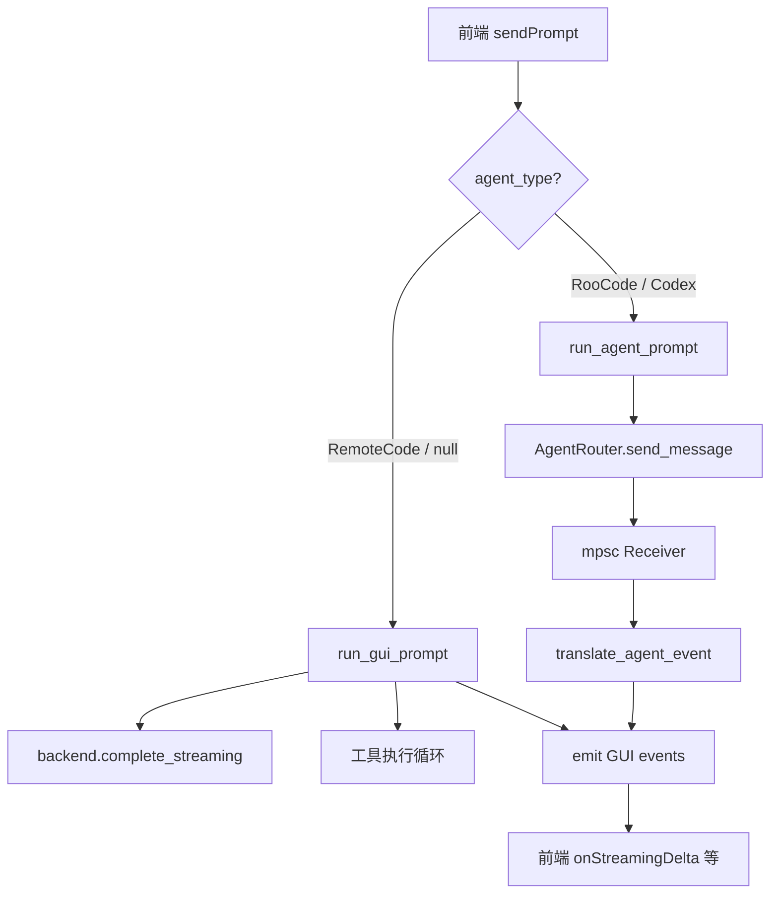

# Phase 5: GUI 集成多 Agent 架构 — 详细实施方案

## 1. 架构概览

### 1.1 核心设计决策

**决策：双路径分发策略**

`send_prompt` 命令根据会话的 `agent_type` 选择不同的执行路径：

- **RemoteCode（默认）**：沿用现有 [`run_gui_prompt`](apps/remote-code-gui/src-tauri/src/lib.rs:2624) 对话循环，直接调用 `backend.complete_streaming()` + 工具执行循环。零改动。
- **RooCode / Codex**：通过 [`AgentRouter`](crates/claude/rc-agent-protocol/src/router.rs:25) 创建对应适配器，调用 `adapter.send_message()` 获取 `mpsc::Receiver<UnifiedAgentEvent>` 事件流，由新函数 `run_agent_prompt` 将事件翻译为现有 GUI 事件。

**理由**：
1. 现有 [`run_gui_prompt`](apps/remote-code-gui/src-tauri/src/lib.rs:2624) 深度耦合了 provider API 调用、工具执行、上下文窗口管理、权限代理等逻辑，不适合改造为通用 Agent 接口。
2. 外部 Agent（RooCode/Codex）自带完整的工具执行和上下文管理能力，不需要 GUI 侧的工具执行循环。
3. 双路径策略确保默认路径零回归风险。

### 1.2 事件翻译映射

[`UnifiedAgentEvent`](crates/claude/rc-agent-protocol/src/events.rs:15) → GUI 事件映射表：

| UnifiedAgentEvent 变体 | GUI 事件常量 | DTO 类型 |
|---|---|---|
| `MessageDelta` | `APP_EVENT_STREAMING_DELTA` | `StreamingDeltaDto` |
| `ToolCallStarted` | `APP_EVENT_TOOL_START` | `ToolProgressDto` |
| `ToolCallProgress` | `APP_EVENT_TOOL_PROGRESS` | `ToolProgressDto` |
| `ToolCallCompleted` | `APP_EVENT_TOOL_RESULT` | `ToolResultDto` |
| `PermissionRequest` | `APP_EVENT_PERMISSION_REQUEST` | 新增 DTO |
| `SubtaskStarted` | `APP_EVENT_SUBTASK_STARTED` | `SubtaskStartedDto` |
| `SubtaskProgress` | `APP_EVENT_SUBTASK_PROGRESS` | `SubtaskProgressDto` |
| `SubtaskCompleted` | `APP_EVENT_SUBTASK_COMPLETED` | `SubtaskCompletedDto` |
| `ContextUsage` | `APP_EVENT_CONTEXT_USAGE` | `ContextUsageDto` |
| `ContextOverflow` | `APP_EVENT_CONTEXT_OVERFLOW` | `ContextOverflowDto` |
| `ContextCompacted` | `APP_EVENT_CONTEXT_COMPACTED` | `ContextCompactedDto` |
| `Error` | `APP_EVENT_PROMPT_DONE`（is_error=true） | `PromptDoneDto` |
| `Completed` | `APP_EVENT_PROMPT_DONE`（is_error=false） | `PromptDoneDto` |
| `Started` / `Ready` / `Stopped` | `APP_EVENT_AGENT_STATUS_CHANGED`（新增） | `AgentStatusChangedDto` |

### 1.3 数据流架构



---

## 2. Phase 5.1: Tauri 后端集成

### 2.1 步骤 1：添加依赖

**文件**: [`apps/remote-code-gui/src-tauri/Cargo.toml`](apps/remote-code-gui/src-tauri/Cargo.toml)

**修改**: 在 `[dependencies]` 中添加：

```toml
rc-agent-protocol = { path = "../../../crates/claude/rc-agent-protocol" }
```

**风险**: 低。`rc-agent-protocol` 仅依赖 `tokio`、`serde`、`anyhow`、`async-trait`、`uuid`、`chrono`、`thiserror`、`tracing`、`futures`，均为 workspace 共享依赖。

---

### 2.2 步骤 2：新增 import 和常量

**文件**: [`apps/remote-code-gui/src-tauri/src/lib.rs`](apps/remote-code-gui/src-tauri/src/lib.rs)

**修改 1** — 在 import 区（约第 1-62 行）添加：

```rust
use rc_agent_protocol::adapter::AgentAdapter;
use rc_agent_protocol::events::UnifiedAgentEvent;
use rc_agent_protocol::permission::PermissionDecision as AgentPermissionDecision;
use rc_agent_protocol::router::AgentRouter;
use rc_agent_protocol::types::{AgentConfig, AgentType as ProtocolAgentType};
```

**修改 2** — 在常量区（约第 64-84 行）添加：

```rust
const APP_EVENT_AGENT_STATUS_CHANGED: &str = "gui://agent-status-changed";
```

---

### 2.3 步骤 3：新增 DTO 结构体

**文件**: [`apps/remote-code-gui/src-tauri/src/lib.rs`](apps/remote-code-gui/src-tauri/src/lib.rs)

**位置**: 在现有 DTO 结构体区域（约第 100-200 行之间，`StreamingDeltaDto` 等附近）添加：

```rust
#[derive(Debug, Clone, Serialize)]
struct AgentTypeInfoDto {
    agent_type: String,
    display_name: String,
    available: bool,
    installed: bool,
}

#[derive(Debug, Clone, Serialize)]
struct AgentStatusChangedDto {
    session_id: String,
    agent_type: String,
    status: String,
}
```

---

### 2.4 步骤 4：扩展 AppState

**文件**: [`apps/remote-code-gui/src-tauri/src/lib.rs`](apps/remote-code-gui/src-tauri/src/lib.rs:751)

**修改**: 在 [`AppState`](apps/remote-code-gui/src-tauri/src/lib.rs:751) 中添加 `agent_router` 字段：

```rust
struct AppState {
    runtime: Mutex<RuntimeState>,
    pending_permissions: Arc<Mutex<HashMap<String, oneshot::Sender<PermissionDecision>>>>,
    running_prompts: Arc<Mutex<HashMap<String, tokio::task::JoinHandle<()>>>>,
    agent_router: Arc<Mutex<AgentRouter>>,  // 新增
}
```

**同步修改**: 在 `AppState` 构造处（搜索 `AppState {` 初始化）添加：

```rust
agent_router: Arc::new(Mutex::new(AgentRouter::new())),
```

---

### 2.5 步骤 5：会话元数据存储 agent_type

**策略**: 在 session 的 named event 中记录 agent_type，不修改 SessionStore schema。

在 [`create_session`](apps/remote-code-gui/src-tauri/src/lib.rs:3088) 中，初始化会话后追加一条 named event：

```rust
store.append_named_event(
    config.session_id,
    "agent_type",
    serde_json::json!({
        "agent_type": agent_type_str,
    }),
)?;
```

新增辅助函数读取会话的 agent_type：

```rust
fn get_session_agent_type(store: &SessionStore, session_id: Uuid) -> String {
    // 尝试读取 named event "agent_type"
    // 如果不存在或读取失败，默认返回 "remote_code"
    store
        .read_named_event(session_id, "agent_type")
        .ok()
        .and_then(|val| val.get("agent_type").and_then(|v| v.as_str()).map(String::from))
        .unwrap_or_else(|| "remote_code".to_owned())
}
```

> **注意**: 需要确认 `SessionStore` 是否有 `read_named_event` 方法。如果没有，可以使用 session metadata 或在 `RuntimeConfig` 中添加 `agent_type` 字段。

---

### 2.6 步骤 6：修改 `create_session` 命令

**文件**: [`apps/remote-code-gui/src-tauri/src/lib.rs`](apps/remote-code-gui/src-tauri/src/lib.rs:3088)

**当前签名**:
```rust
async fn create_session(
    state: State<'_, AppState>,
    title: Option<String>,
    project_path: Option<String>,
) -> std::result::Result<String, String>
```

**修改后签名**:
```rust
async fn create_session(
    state: State<'_, AppState>,
    title: Option<String>,
    project_path: Option<String>,
    agent_type: Option<String>,  // 新增
) -> std::result::Result<String, String>
```

**修改内容**:
1. 解析 `agent_type` 参数，默认 `"remote_code"`
2. 验证 agent_type 是否合法（必须是 `remote_code`、`roo_code`、`codex` 之一）
3. 在会话初始化后，将 agent_type 写入 session named event
4. 如果是 RooCode/Codex，在 `agent_router` 中预注册适配器

```rust
let agent_type_str = agent_type
    .as_deref()
    .unwrap_or("remote_code")
    .to_owned();
let agent_type = serde_json::from_str::<ProtocolAgentType>(
    &format!("\"{}\"", agent_type_str),
).map_err(|e| format!("无效的 agent_type: {e}"))?;

// ... 现有初始化逻辑 ...

// 存储 agent_type 到会话元数据
runtime.session_store.append_named_event(
    config.session_id,
    "agent_type",
    serde_json::json!({ "agent_type": agent_type_str }),
).map_err(|e| format!("{e:#}"))?;

// 如果是外部 Agent，预创建并注册适配器
if agent_type != ProtocolAgentType::RemoteCode {
    let agent_config = AgentConfig {
        agent_type,
        binary_path: None,
        args: vec![],
        env: vec![],
        working_dir: Some(normalized_project_path.clone()),
        model: config.provider.model.clone(),
        provider: Some(config.provider.name.clone()),
        api_key: None,
        base_url: config.provider.base_url.clone(),
    };
    let mut router = state.agent_router.lock().await;
    router.create_and_register(config.session_id.to_string(), &agent_config)
        .await
        .map_err(|e| format!("Agent 启动失败: {e:#}"))?;
}
```

---

### 2.7 步骤 7：新增 `run_agent_prompt` 函数

**文件**: [`apps/remote-code-gui/src-tauri/src/lib.rs`](apps/remote-code-gui/src-tauri/src/lib.rs)

**位置**: 在 [`run_gui_prompt`](apps/remote-code-gui/src-tauri/src/lib.rs:2624) 函数之后（约第 3015 行后）

**函数签名**:

```rust
async fn run_agent_prompt(
    app: AppHandle,
    session_id: String,
    agent_router: Arc<Mutex<AgentRouter>>,
    prompt: &str,
) -> Result<PromptRunOutcome>
```

**核心逻辑**:

```rust
async fn run_agent_prompt(
    app: AppHandle,
    session_id: String,
    agent_router: Arc<Mutex<AgentRouter>>,
    prompt: &str,
) -> Result<PromptRunOutcome> {
    // 1. 通过 AgentRouter 发送消息
    let mut receiver = {
        let mut router = agent_router.lock().await;
        router.send_message(&session_id, prompt).await?
    };

    // 2. 发送 prompt_started 事件
    let _ = app.emit(APP_EVENT_AGENT_STATUS_CHANGED, AgentStatusChangedDto {
        session_id: session_id.clone(),
        agent_type: "external".to_owned(),
        status: "busy".to_owned(),
    });

    // 3. 事件循环：从 receiver 读取 UnifiedAgentEvent 并翻译
    let mut response_text = String::new();
    let mut tool_calls = Vec::new();
    let mut usage = UsageSummary::default();

    while let Some(event) = receiver.recv().await {
        match event {
            UnifiedAgentEvent::MessageDelta { session_id: sid, delta } => {
                let _ = app.emit(APP_EVENT_STREAMING_DELTA, StreamingDeltaDto {
                    session_id: sid,
                    delta,
                });
            }
            UnifiedAgentEvent::ToolCallStarted { session_id: sid, tool_name, tool_input } => {
                let _ = app.emit(APP_EVENT_TOOL_START, ToolProgressDto {
                    tool_call_id: String::new(),
                    tool_name: tool_name.clone(),
                    message: "running".to_owned(),
                });
            }
            UnifiedAgentEvent::ToolCallProgress { session_id: sid, tool_name, progress } => {
                let _ = app.emit(APP_EVENT_TOOL_PROGRESS, ToolProgressDto {
                    tool_call_id: String::new(),
                    tool_name,
                    message: progress,
                });
            }
            UnifiedAgentEvent::ToolCallCompleted { session_id: sid, tool_name, result } => {
                let _ = app.emit(APP_EVENT_TOOL_RESULT, ToolResultDto {
                    tool_call_id: String::new(),
                    tool_name,
                    is_error: false,
                    output: result.to_string(),
                });
            }
            UnifiedAgentEvent::PermissionRequest { session_id: sid, request_id, tool_name, input } => {
                // 翻译为 GUI 权限请求事件
                // 需要创建对应的 PermissionRequestDto
                // 此处需要将 request_id 映射到 pending_permissions
            }
            UnifiedAgentEvent::SubtaskStarted { session_id: sid, task_id, description } => {
                let _ = app.emit(APP_EVENT_SUBTASK_STARTED, SubtaskStartedDto {
                    session_id: sid,
                    task_id,
                    parent_task_id: None,
                    description,
                    depth: 0,
                });
            }
            UnifiedAgentEvent::SubtaskProgress { session_id: sid, task_id, progress } => {
                let _ = app.emit(APP_EVENT_SUBTASK_PROGRESS, SubtaskProgressDto {
                    session_id: sid,
                    task_id,
                    turn: 0,
                    max_turns: 0,
                    summary: progress,
                });
            }
            UnifiedAgentEvent::SubtaskCompleted { session_id: sid, task_id, result } => {
                let _ = app.emit(APP_EVENT_SUBTASK_COMPLETED, SubtaskCompletedDto {
                    session_id: sid,
                    task_id,
                    success: true,
                    output_preview: result.to_string(),
                    turns_used: 0,
                });
            }
            UnifiedAgentEvent::ContextUsage { session_id: sid, used, total } => {
                let _ = app.emit(APP_EVENT_CONTEXT_USAGE, ContextUsageDto {
                    session_id: sid,
                    estimated_tokens: used,
                    max_input_tokens: total,
                    threshold_tokens: (total as f64 * 0.8) as usize,
                    ratio: used as f64 / total as f64,
                });
            }
            UnifiedAgentEvent::ContextOverflow { session_id: sid } => {
                let _ = app.emit(APP_EVENT_CONTEXT_OVERFLOW, ContextOverflowDto {
                    session_id: sid,
                    estimated_tokens: 0,
                    max_input_tokens: 0,
                    threshold_tokens: 0,
                    ratio: 1.0,
                });
            }
            UnifiedAgentEvent::ContextCompacted { session_id: sid } => {
                let _ = app.emit(APP_EVENT_CONTEXT_COMPACTED, ContextCompactedDto {
                    session_id: sid,
                    entries_removed: 0,
                    usage_ratio: 0.0,
                });
            }
            UnifiedAgentEvent::Error { session_id: sid, message, recoverable } => {
                if !recoverable {
                    return Err(anyhow!("Agent 错误: {message}"));
                }
                // 可恢复错误继续循环
            }
            UnifiedAgentEvent::Completed { session_id: sid, result } => {
                response_text = result.response_text;
                usage.input_tokens = result.usage.input_tokens;
                usage.output_tokens = result.usage.output_tokens;
                tool_calls = result.tool_calls.iter().map(|tc| ToolCall {
                    id: tc.id.clone(),
                    name: tc.name.clone(),
                    input: tc.input.clone(),
                }).collect();
                break;
            }
            UnifiedAgentEvent::Started(info) | UnifiedAgentEvent::Ready => {
                let _ = app.emit(APP_EVENT_AGENT_STATUS_CHANGED, AgentStatusChangedDto {
                    session_id: session_id.clone(),
                    agent_type: "external".to_owned(),
                    status: "ready".to_owned(),
                });
            }
            UnifiedAgentEvent::Stopped => {
                break;
            }
        }
    }

    Ok(PromptRunOutcome {
        text: response_text,
        tool_calls,
        usage,
        num_turns: 1,
        stop_reason: "stop".to_owned(),
    })
}
```

---

### 2.8 步骤 8：修改 `send_prompt` 命令

**文件**: [`apps/remote-code-gui/src-tauri/src/lib.rs`](apps/remote-code-gui/src-tauri/src/lib.rs:3119)

**修改位置**: 在 [`send_prompt`](apps/remote-code-gui/src-tauri/src/lib.rs:3119) 函数中，tokio::spawn 内部（约第 3166 行），在创建 `ProviderCompatBackend` 之前，根据 agent_type 分支：

```rust
let agent_type_str = get_session_agent_type(&session_store, config.session_id);
let is_external_agent = agent_type_str != "remote_code";

let handle = tokio::spawn(async move {
    let result = if is_external_agent {
        // 外部 Agent 路径
        run_agent_prompt(
            app.clone(),
            config.session_id.to_string(),
            agent_router,
            &prompt,
        ).await
    } else {
        // 现有 RemoteCode 路径（零改动）
        let backend = ProviderCompatBackend::new(Arc::clone(&provider), &config.provider);
        run_gui_prompt(
            app.clone(),
            config.clone(),
            &backend,
            session_store,
            pending_permissions,
            &prompt,
        ).await
    };
    // ... 现有的 result 处理逻辑不变 ...
});
```

**需要在 spawn 前提取的额外变量**:

```rust
let agent_router = Arc::clone(&state.agent_router);
```

---

### 2.9 步骤 9：新增 Tauri 命令

**文件**: [`apps/remote-code-gui/src-tauri/src/lib.rs`](apps/remote-code-gui/src-tauri/src/lib.rs)

**新增命令 1** — `list_available_agents`:

```rust
#[tauri::command]
async fn list_available_agents(
    state: State<'_, AppState>,
) -> std::result::Result<Vec<AgentTypeInfoDto>, String> {
    let agents = vec![
        AgentTypeInfoDto {
            agent_type: "remote_code".to_owned(),
            display_name: "Remote Code".to_owned(),
            available: true,
            installed: true,
        },
        AgentTypeInfoDto {
            agent_type: "roo_code".to_owned(),
            display_name: "Roo Code".to_owned(),
            available: true,
            installed: false, // TODO: 检测二进制是否存在
        },
        AgentTypeInfoDto {
            agent_type: "codex".to_owned(),
            display_name: "OpenAI Codex".to_owned(),
            available: true,
            installed: false, // TODO: 检测二进制是否存在
        },
    ];
    Ok(agents)
}
```

**新增命令 2** — `install_agent`:

```rust
#[tauri::command]
async fn install_agent(
    agent_type: String,
) -> std::result::Result<(), String> {
    // TODO: 下载并安装 agent 二进制
    Err("尚未实现".to_owned())
}
```

**新增命令 3** — `uninstall_agent`:

```rust
#[tauri::command]
async fn uninstall_agent(
    agent_type: String,
) -> std::result::Result<(), String> {
    // TODO: 卸载 agent 二进制
    Err("尚未实现".to_owned())
}
```

---

### 2.10 步骤 10：注册新命令

**文件**: [`apps/remote-code-gui/src-tauri/src/lib.rs`](apps/remote-code-gui/src-tauri/src/lib.rs:3880)

**修改**: 在 [`invoke_handler`](apps/remote-code-gui/src-tauri/src/lib.rs:3880) 宏中添加：

```rust
.invoke_handler(tauri::generate_handler![
    // ... 现有命令 ...
    pick_folder,
    // 新增命令
    list_available_agents,
    install_agent,
    uninstall_agent,
])
```

---

## 3. Phase 5.2: 前端集成

### 3.1 步骤 11：扩展类型定义

**文件**: [`apps/remote-code-gui/src/lib/types.ts`](apps/remote-code-gui/src/lib/types.ts)

**新增类型**（在文件末尾，约第 631 行后）：

```typescript
// ── Agent Types ──────────────────────────────────────────────────────

export type AgentType = 'remote_code' | 'roo_code' | 'codex';

export interface AgentTypeInfo {
  agent_type: AgentType;
  display_name: string;
  available: boolean;
  installed: boolean;
}

export interface AgentStatusChangedInfo {
  session_id: string;
  agent_type: string;
  status: string;
}
```

---

### 3.2 步骤 12：扩展 Tauri API 层

**文件**: [`apps/remote-code-gui/src/lib/tauri.ts`](apps/remote-code-gui/src/lib/tauri.ts)

**修改 1** — import 新类型（第 3-37 行 import 区）：

```typescript
import type {
  // ... 现有 imports ...
  AgentTypeInfo,
  AgentStatusChangedInfo,
} from './types';
```

**修改 2** — 修改 [`createSession`](apps/remote-code-gui/src/lib/tauri.ts:59) 签名：

```typescript
// 修改前
export function createSession(title?: string, projectPath?: string): Promise<string> {
  return invoke<string>('create_session', {
    title: title ?? null,
    projectPath: projectPath ?? null,
  });
}

// 修改后
export function createSession(
  title?: string,
  projectPath?: string,
  agentType?: string,
): Promise<string> {
  return invoke<string>('create_session', {
    title: title ?? null,
    projectPath: projectPath ?? null,
    agentType: agentType ?? null,
  });
}
```

**修改 3** — 新增 API 函数（在文件末尾，约第 339 行后）：

```typescript
export function listAvailableAgents(): Promise<AgentTypeInfo[]> {
  return invoke<AgentTypeInfo[]>('list_available_agents');
}

export function installAgent(agentType: string): Promise<void> {
  return invoke('install_agent', { agentType });
}

export function uninstallAgent(agentType: string): Promise<void> {
  return invoke('uninstall_agent', { agentType });
}

export function onAgentStatusChanged(
  callback: EventCallback<AgentStatusChangedInfo>,
): Promise<UnlistenFn> {
  return listen<AgentStatusChangedInfo>('gui://agent-status-changed', callback);
}
```

---

### 3.3 步骤 13：扩展 Zustand Store

**文件**: [`apps/remote-code-gui/src/stores/useAppStore.ts`](apps/remote-code-gui/src/stores/useAppStore.ts)

**修改 1** — import 新类型（第 2-23 行）：

```typescript
import type {
  // ... 现有 imports ...
  AgentTypeInfo,
  AgentStatusChangedInfo,
} from '../lib/types';
```

**修改 2** — 扩展 [`AppState`](apps/remote-code-gui/src/stores/useAppStore.ts:113) 接口：

```typescript
interface AppState {
  // ... 现有字段 ...

  // ── Agent 相关 ──
  availableAgents: AgentTypeInfo[];
  activeAgentType: string;

  // ... 现有 actions ...

  // ── Agent 相关 actions ──
  loadAgents: () => Promise<void>;
  selectAgent: (agentType: string) => void;
}
```

**修改 3** — 在 `create` 调用中添加初始值（约第 364 行）：

```typescript
export const useAppStore = create<AppState>((set, get) => ({
  // ... 现有初始值 ...
  pendingPermission: null,

  // Agent 相关初始值
  availableAgents: [],
  activeAgentType: 'remote_code',
```

**修改 4** — 在 `init` action 中添加 `loadAgents` 调用（约第 409 行）：

```typescript
await Promise.all([
  get().refreshProjects(),
  get().refreshSessions(),
  get().loadArchivedSessions(),
  get().loadSettings(),
  get().loadProviderConfigs(),
  get().refreshRuntimeStatus(),
  get().loadAgents(),  // 新增
]);
```

**修改 5** — 修改 [`createSession`](apps/remote-code-gui/src/stores/useAppStore.ts:482) action：

```typescript
createSession: async (title?: string, projectPath?: string) => {
  const effectiveProjectPath = projectPath ?? get().activeProjectPath ?? undefined;
  if (!effectiveProjectPath) {
    throw new Error('请先选择项目文件夹，再新建会话。');
  }
  const agentType = get().activeAgentType;  // 新增
  const sessionId = await tauri.createSession(title, effectiveProjectPath, agentType);  // 修改
  set({
    activeSessionId: sessionId,
    activeProjectPath: effectiveProjectPath,
    conversation: [],
  });
  // ... 后续不变 ...
},
```

**修改 6** — 在 `registerEventListeners` 中添加新事件监听（约第 358 行前）：

```typescript
tauri.onAgentStatusChanged((event) => {
  // 可用于显示 Agent 状态通知
  // 暂时仅做日志，后续可扩展 UI
  console.log('[AgentStatusChanged]', event.payload);
}),
```

**修改 7** — 添加新 action 实现（在现有 actions 末尾）：

```typescript
loadAgents: async () => {
  try {
    const availableAgents = await tauri.listAvailableAgents();
    set({ availableAgents });
  } catch {
    // Agent 列表加载失败不阻塞应用
  }
},

selectAgent: (agentType: string) => {
  set({ activeAgentType: agentType });
},
```

---

### 3.4 步骤 14：新建 AgentSelector 组件

**新文件**: `apps/remote-code-gui/src/components/agent/AgentSelector.tsx`

**内容大纲**:

```typescript
import { useAppStore } from '../../stores/useAppStore';
import type { AgentTypeInfo } from '../../lib/types';

export function AgentSelector() {
  const availableAgents = useAppStore((s) => s.availableAgents);
  const activeAgentType = useAppStore((s) => s.activeAgentType);
  const selectAgent = useAppStore((s) => s.selectAgent);

  return (
    <div className="flex items-center gap-2">
      {availableAgents.filter(a => a.available).map((agent) => (
        <button
          key={agent.agent_type}
          onClick={() => selectAgent(agent.agent_type)}
          className={`px-3 py-1.5 rounded-lg text-sm font-medium transition-colors ${
            activeAgentType === agent.agent_type
              ? 'bg-blue-600 text-white'
              : 'bg-gray-100 text-gray-700 hover:bg-gray-200'
          }`}
          title={agent.installed ? agent.display_name : `${agent.display_name} (未安装)`}
          disabled={!agent.installed}
        >
          {agent.display_name}
          {!agent.installed && <span className="ml-1 text-xs opacity-60">未安装</span>}
        </button>
      ))}
    </div>
  );
}
```

**新文件**: `apps/remote-code-gui/src/components/agent/index.ts`

```typescript
export { AgentSelector } from './AgentSelector';
```

---

### 3.5 步骤 15：集成 AgentSelector 到 ChatArea

**文件**: [`apps/remote-code-gui/src/components/chat/ChatArea.tsx`](apps/remote-code-gui/src/components/chat/ChatArea.tsx)

**修改**: 在 ChatInput 上方或工具栏区域添加 AgentSelector：

```typescript
import { AgentSelector } from '../agent';

// 在 ChatArea 组件 JSX 中，ChatInput 上方添加：
<div className="flex items-center justify-between px-4 py-2 border-b border-gray-200">
  <AgentSelector />
</div>
```

---

## 4. 编译顺序与增量验证

每一步都应确保 `cargo check` 通过：

| 步骤 | 验证命令 | 预期结果 |
|---|---|---|
| 步骤 1 | `cargo check -p remote-code-gui` | 编译通过，新依赖可用 |
| 步骤 2-3 | `cargo check -p remote-code-gui` | 编译通过，新类型/常量可用 |
| 步骤 4 | `cargo check -p remote-code-gui` | 编译通过，AppState 扩展成功 |
| 步骤 5-6 | `cargo check -p remote-code-gui` | 编译通过，create_session 签名变更 |
| 步骤 7 | `cargo check -p remote-code-gui` | 编译通过，run_agent_prompt 可用 |
| 步骤 8 | `cargo check -p remote-code-gui` | 编译通过，send_prompt 分支逻辑 |
| 步骤 9-10 | `cargo check -p remote-code-gui` | 编译通过，新命令注册 |
| 步骤 11-15 | `cd apps/remote-code-gui && npx tsc --noEmit` | TypeScript 编译通过 |

---

## 5. 风险评估

### 5.1 高风险区域

| 风险 | 影响 | 缓解措施 |
|---|---|---|
| [`send_prompt`](apps/remote-code-gui/src-tauri/src/lib.rs:3119) spawn 闭包中的变量借用变更 | 编译错误或运行时 panic | 仅在 `is_external_agent` 分支中 clone `agent_router`，不影响现有路径 |
| [`create_session`](apps/remote-code-gui/src-tauri/src/lib.rs:3088) 签名变更 | 前端调用不匹配 | `agent_type` 为 `Option<String>`，前端传 `null` 时行为与修改前一致 |
| `AgentRouter` 的 `Mutex` 锁竞争 | 外部 Agent 路径死锁 | `run_agent_prompt` 在 spawn 前获取 `Arc<Mutex<AgentRouter>>`，锁持有时间短（仅 send_message 调用） |

### 5.2 中风险区域

| 风险 | 影响 | 缓解措施 |
|---|---|---|
| Session named event 存储 agent_type | 如果 SessionStore 不支持 `read_named_event`，需要替代方案 | 备选：在 `RuntimeConfig` 中添加 `agent_type: Option<String>` 字段 |
| `UnifiedAgentEvent::PermissionRequest` 翻译 | 需要与现有 `pending_permissions` HashMap 集成 | 创建 oneshot channel 并插入 HashMap，与现有权限流程一致 |
| 外部 Agent 进程生命周期管理 | Agent 进程崩溃未清理 | 在 `run_agent_prompt` 中处理 `Stopped` 事件，在 session 关闭时调用 `agent_router.close_session()` |

### 5.3 低风险区域

| 风险 | 影响 | 缓解措施 |
|---|---|---|
| 前端类型扩展 | 无回归风险 | 纯增量修改 |
| AgentSelector 组件 | 无回归风险 | 独立新组件，不影响现有组件 |
| `list_available_agents` 命令 | 无回归风险 | 纯新增命令 |

---

## 6. 后续优化（Phase 5.3+）

以下功能不在本次实施范围内，但需要预留扩展点：

1. **Agent 二进制安装/卸载**: `install_agent` / `uninstall_agent` 命令的实际实现
2. **Agent 健康检查**: 定期 ping 外部 Agent 进程，更新 `installed` 状态
3. **会话恢复**: 恢复已关闭会话时重新连接 Agent 适配器
4. **多 Agent 协作**: 在同一会话中切换 Agent 类型
5. **Agent 配置 UI**: 允许用户配置 Agent 的 model、provider 等参数