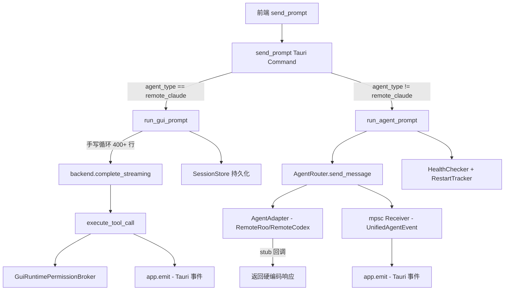
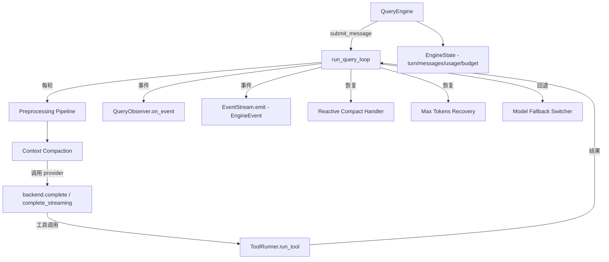
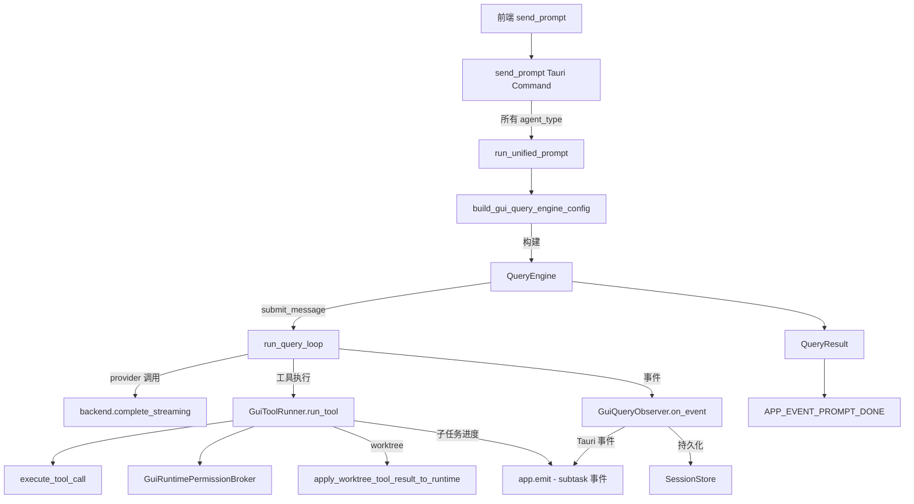

# QueryEngine 统一执行路径设计方案

> 日期: 2026-04-28
> 状态: 设计评审中

---

## 1. 当前架构分析

### 1.1 两条独立执行路径



### 1.2 路径 A: [`run_gui_prompt()`](apps/remote-code-gui/src-tauri/src/lib.rs:2652)

**调用链**: `send_prompt()` → `run_gui_prompt()` → 手写 for 循环

**功能清单**:

| # | 功能 | 实现方式 |
|---|------|---------|
| 1 | 会话初始化 | `initialize_session_conversation()` + plan mode 注入 |
| 2 | 上下文窗口管理 | `ContextWindowManager::for_model()` → budget 检查 + 自动压缩 |
| 3 | 流式 LLM 调用 | `backend.complete_streaming()` + `StreamingCallbacks` |
| 4 | 工具执行 | `execute_tool_call()` + `ToolExecutionContext` |
| 5 | 权限控制 | `GuiRuntimePermissionBroker` → `LayeredPermissionBroker` |
| 6 | 进度回调 | `progress_cb` → 解析 `DelegateProgressEvent` → 子任务事件 |
| 7 | Worktree 管理 | `apply_worktree_tool_result_to_runtime()` |
| 8 | 会话持久化 | `store.append_conversation_entry()` + `store.append_named_event()` |
| 9 | Tauri 事件发射 | 12 种事件类型（streaming-delta, tool-start 等） |
| 10 | 用量统计 | `UsageSummary` 累积 input/output tokens |
| 11 | Turn 循环控制 | `for turn in 0..max_turns` + 空工具调用终止 |

### 1.3 路径 B: [`run_agent_prompt()`](apps/remote-code-gui/src-tauri/src/lib.rs:3079)

**调用链**: `send_prompt()` → `run_agent_prompt()` → `AgentRouter.send_message()` → 事件循环

**功能清单**:

| # | 功能 | 实现方式 |
|---|------|---------|
| 1 | Agent 状态通知 | `APP_EVENT_AGENT_STATUS_CHANGED` |
| 2 | 事件流消费 | `mpsc::Receiver<UnifiedAgentEvent>` → tokio select 循环 |
| 3 | 事件翻译 | `UnifiedAgentEvent` → Tauri 事件（12 种映射） |
| 4 | 权限桥接 | oneshot channel ↔ 前端 ↔ `router.resolve_permission()` |
| 5 | 健康检查 | `HealthChecker` + 定时 ticker |
| 6 | 自动重启 | `RestartTracker` + `router.create_and_register()` |
| 7 | 上下文事件 | ContextUsage/Overflow/Compacted 透传 |

**关键问题**: RemoteRoo/RemoteCodex 的 `send_message` 回调是 **stub**，返回硬编码文本，没有实际执行能力。

### 1.4 QueryEngine 架构（已存在）



**QueryEngine 已覆盖的能力**:

- ✅ 多轮对话循环（含 turn budget）
- ✅ 上下文窗口管理和自动压缩
- ✅ 流式/缓冲两种 provider 调用模式
- ✅ 工具执行（通过 `ToolRunner` trait）
- ✅ 事件通知（`QueryObserver` + `EngineEvent` 双通道）
- ✅ 预处理管线
- ✅ Prompt-too-long 恢复（reactive compact）
- ✅ Max-output-tokens 恢复
- ✅ 模型回退（fallback model）
- ✅ 失败追踪 + 熔断器
- ✅ Stop hooks
- ✅ 结构化输出强制
- ✅ 工具结果摘要
- ✅ 状态机（Initializing → BuildingPrompt → CallingProvider → ProcessingResponse → ExecutingTools → Finalizing → Idle）

---

## 2. 差距分析

### 2.1 `run_gui_prompt()` 有但 QueryEngine 没有直接覆盖的

| 功能 | 当前位置 | QueryEngine 对应 | 差距 |
|------|---------|-----------------|------|
| `DelegateProgressEvent` 子任务进度 | `progress_cb` in `ToolExecutionContext` | 无直接对应 | 需要在 `GuiToolRunner` 中通过 `EventStream` 或直接 `app.emit` 转发 |
| Worktree 运行时更新 | `apply_worktree_tool_result_to_runtime()` | 无 | 需要在 `GuiToolRunner.run_tool()` 中处理 |
| Plan mode 注入 | `inject_plan_mode_runtime_messages()` | 无 | 需要在构建 `ProcessUserInputContext` 时注入 |
| `normalize_exit_plan_mode_tool_calls` | 在响应后调用 | 无 | 需要在 observer 的 `AssistantMessageCommitted` 中处理 |
| 会话持久化（`SessionStore`） | 直接调用 store | 无 | 需要在 `GuiQueryObserver` 中实现 |
| Tauri 事件发射 | 直接 `app.emit()` | 无 | 需要在 `GuiQueryObserver` 中实现 |

### 2.2 `run_agent_prompt()` 有但 QueryEngine 没有直接覆盖的

| 功能 | 当前位置 | 差距 |
|------|---------|------|
| 健康检查 + 自动重启 | `HealthChecker` + `RestartTracker` | 需要在统一路径外保留 |
| Agent 状态通知 | `APP_EVENT_AGENT_STATUS_CHANGED` | 需要在 observer 中添加 |
| 权限桥接（oneshot channel） | 前端 ↔ oneshot ↔ adapter | 需要在 `GuiToolRunner` 中集成 `GuiRuntimePermissionBroker` |

---

## 3. 目标架构

### 3.1 统一后的调用链



### 3.2 三个 Agent 的统一方式

| Agent 类型 | 当前路径 | 统一后 |
|-----------|---------|--------|
| RemoteClaude | `run_gui_prompt()` 手写循环 | `QueryEngine::submit_message()` |
| RemoteRoo | `run_agent_prompt()` → stub callback | `QueryEngine::submit_message()` via `GuiToolRunner` |
| RemoteCodex | `run_agent_prompt()` → stub callback | `QueryEngine::submit_message()` via `GuiToolRunner` |

**关键设计决策**: RemoteRoo 和 RemoteCodex 不再通过 `AgentAdapter` 进程外调用，而是直接使用与 RemoteClaude 相同的 `QueryEngine` 路径。`AgentAdapter` trait 和 `AgentRouter` 保留用于未来真正的外部 Agent 接入。

---

## 4. 接口映射表

### 4.1 `run_gui_prompt()` 功能 → QueryEngine 接口

| `run_gui_prompt()` 功能 | QueryEngine 对应接口 | 实现位置 |
|------------------------|---------------------|---------|
| `initialize_session_conversation()` | 在 `run_unified_prompt()` 中调用，传入 `existing_messages` | 新函数 |
| `RuntimePlanModeController` 安装 | 在构建 `ProcessUserInputContext` 时处理 | `build_gui_query_engine_config()` |
| `inject_plan_mode_runtime_messages()` | 在提交前修改 `conversation` → `existing_messages` | `build_gui_query_engine_config()` |
| `ContextWindowManager::for_model()` | `QueryEngineConfig.context_manager`（默认行为） | 自动 |
| `ToolExecutionContext` 构建 | `GuiToolRunner` 内部持有 | `GuiToolRunner` |
| `progress_cb` 子任务事件 | `GuiToolRunner.run_tool()` 中直接 `app.emit` | `GuiToolRunner` |
| `GuiRuntimePermissionBroker` | `GuiToolRunner` 内部持有并使用 | `GuiToolRunner` |
| `backend.complete_streaming()` | `QueryEngineConfig.backend` + `ProviderInvocationMode::Streaming` | 自动 |
| `StreamingCallbacks.on_text_delta` | `QueryObserver::StreamingTextDelta` 事件 | `GuiQueryObserver` |
| `execute_tool_call()` | `GuiToolRunner.run_tool()` | `GuiToolRunner` |
| `runtime_provider_tool_spec()` 验证 | `GuiToolRunner.run_tool()` 内部 | `GuiToolRunner` |
| `apply_worktree_tool_result_to_runtime()` | `GuiToolRunner.run_tool()` 后处理 | `GuiToolRunner` |
| `context_manager.truncate_tool_output_default()` | `GuiToolRunner.run_tool()` 内部 | `GuiToolRunner` |
| `store.append_conversation_entry()` | `GuiQueryObserver.on_event()` | `GuiQueryObserver` |
| `store.append_named_event()` | `GuiQueryObserver.on_event()` | `GuiQueryObserver` |
| `app.emit()` 各种事件 | `GuiQueryObserver.on_event()` | `GuiQueryObserver` |
| `UsageSummary` 累积 | `EngineState.usage` | 自动 |
| Turn 循环 + 终止 | `run_query_loop()` 内部 | 自动 |
| Context overflow + compact | `run_query_loop()` 内部 | 自动 |

### 4.2 Tauri 事件映射: `QueryObserverEvent` → Tauri Event

| QueryObserverEvent | Tauri 事件常量 | DTO 类型 |
|--------------------|---------------|----------|
| `StreamingTextDelta` | `APP_EVENT_STREAMING_DELTA` | `StreamingDeltaDto` |
| `StreamingToolCallStarted` | `APP_EVENT_TOOL_START` | `ToolProgressDto` |
| `ToolCallStarted` | `APP_EVENT_TOOL_START` | `ToolProgressDto` |
| `ToolResultCommitted` | `APP_EVENT_TOOL_RESULT` | `ToolResultDto` |
| `ContextBudgetEvaluated` | `APP_EVENT_CONTEXT_USAGE` | `ContextUsageDto` |
| `ContextBudgetEvaluated` (needs_compaction) | `APP_EVENT_CONTEXT_OVERFLOW` | `ContextOverflowDto` |
| `ContextCompactionApplied` | `APP_EVENT_CONTEXT_COMPACTED` | `ContextCompactedDto` |
| `AssistantMessageCommitted` | 无直接对应（内部持久化用） | - |
| `QueryFinished` | `APP_EVENT_PROMPT_DONE` | `PromptDoneDto` |
| `QueryFailed` | `APP_EVENT_PROMPT_DONE` (is_error=true) | `PromptDoneDto` |

**额外事件（需在 `GuiToolRunner` 中直接发射）**:

| 事件来源 | Tauri 事件 | 说明 |
|---------|-----------|------|
| `DelegateProgressEvent::SubtaskStarted` | `APP_EVENT_SUBTASK_STARTED` | 子任务进度回调 |
| `DelegateProgressEvent::SubtaskProgress` | `APP_EVENT_SUBTASK_PROGRESS` | 子任务进度 |
| `DelegateProgressEvent::SubtaskCompleted` | `APP_EVENT_SUBTASK_COMPLETED` | 子任务完成 |
| `DelegateProgressEvent::BatchProgress` | `APP_EVENT_BATCH_PROGRESS` | 批量进度 |
| `APP_EVENT_TASK_SNAPSHOT` | `APP_EVENT_TASK_SNAPSHOT` | 任务快照 |

---

## 5. 核心组件设计

### 5.1 `GuiToolRunner`（新组件）

```rust
// 位置: apps/remote-code-gui/src-tauri/src/query_engine_gui.rs

struct GuiToolRunner {
    app: AppHandle,
    store: Arc<SessionStore>,
    config: Mutex<RuntimeConfig>,
    broker: Arc<dyn PermissionBroker>,
    sub_agent_completion: Arc<dyn SubAgentCompletion>,
    read_file_state: FileStateCache,
    session_id: Uuid,
    task_paths: AppPaths,
}

#[async_trait]
impl ToolRunner for GuiToolRunner {
    async fn run_tool(
        &self,
        tool_call: &ToolCall,
        context: &ProcessUserInputContext,
    ) -> Result<ToolRunResult> {
        // 1. 验证工具规格
        let _spec = runtime_provider_tool_spec(&tool_call.name).await?;

        // 2. 发射 tool-start 事件
        let _ = self.app.emit(APP_EVENT_TOOL_START, ToolProgressDto { ... });

        // 3. 构建 ToolExecutionContext（含 progress_cb）
        let tool_context = self.build_tool_context();

        // 4. 执行工具
        let raw_result = execute_tool_call(tool_call, &tool_context, self.broker.as_ref()).await;

        // 5. 处理 worktree 更新
        let mut config = self.config.lock().await.clone();
        if apply_worktree_tool_result_to_runtime(...) {
            persist_session_context(self.store.as_ref(), &config)?;
        }

        // 6. 截断工具输出
        let truncated = self.context_manager.truncate_tool_output_default(&result.content);

        // 7. 返回 ToolRunResult
        Ok(ToolRunResult { result, pre_messages: vec![], post_messages: vec![], permission_denial })
    }
}
```

### 5.2 `GuiQueryObserver`（新组件）

```rust
// 位置: apps/remote-code-gui/src-tauri/src/query_engine_gui.rs

struct GuiQueryObserver {
    app: AppHandle,
    store: Arc<SessionStore>,
    session_id: Uuid,
    config: Mutex<RuntimeConfig>,
}

#[async_trait]
impl QueryObserver for GuiQueryObserver {
    async fn on_event(&self, event: QueryObserverEvent) -> Result<()> {
        match event {
            QueryObserverEvent::StreamingTextDelta { delta, .. } => {
                let _ = self.app.emit(APP_EVENT_STREAMING_DELTA, StreamingDeltaDto { ... });
            }
            QueryObserverEvent::ToolCallStarted { tool_call, .. } => {
                let _ = self.app.emit(APP_EVENT_TOOL_START, ToolProgressDto { ... });
            }
            QueryObserverEvent::ToolResultCommitted { tool_call, result, .. } => {
                // 持久化到 SessionStore
                let tool_entry = ConversationEntry::tool(...);
                self.store.append_conversation_entry(self.session_id, &tool_entry)?;
                // 发射 Tauri 事件
                let _ = self.app.emit(APP_EVENT_TOOL_RESULT, ToolResultDto { ... });
            }
            QueryObserverEvent::AssistantMessageCommitted { message, .. } => {
                // 持久化 assistant 消息
                let entry = message.as_conversation_entry().unwrap();
                self.store.append_conversation_entry(self.session_id, &entry)?;
                self.store.append_named_event(self.session_id, "assistant_turn", json!({...}))?;
            }
            QueryObserverEvent::ContextBudgetEvaluated { context, .. } => {
                let _ = self.app.emit(APP_EVENT_CONTEXT_USAGE, ContextUsageDto { ... });
                if context.needs_compaction {
                    let _ = self.app.emit(APP_EVENT_CONTEXT_OVERFLOW, ContextOverflowDto { ... });
                }
            }
            QueryObserverEvent::ContextCompactionApplied { .. } => {
                // 持久化压缩事件
                self.store.append_named_event(self.session_id, "context_compacted", json!({...}))?;
                let _ = self.app.emit(APP_EVENT_CONTEXT_COMPACTED, ContextCompactedDto { ... });
            }
            QueryObserverEvent::QueryFinished { stop_reason, turns, final_text, usage } => {
                self.store.append_named_event(self.session_id, "result", json!({...}))?;
                let _ = self.app.emit(APP_EVENT_PROMPT_DONE, PromptDoneDto { ... });
            }
            QueryObserverEvent::QueryFailed { error, .. } => {
                let _ = self.app.emit(APP_EVENT_PROMPT_DONE, PromptDoneDto { is_error: true, ... });
            }
            // 其他事件按需处理
            _ => {}
        }
        Ok(())
    }
}
```

### 5.3 `run_unified_prompt()`（新函数，替代两条路径）

```rust
// 位置: apps/remote-code-gui/src-tauri/src/query_engine_gui.rs

async fn run_unified_prompt(
    app: AppHandle,
    config: RuntimeConfig,
    backend: &dyn ConversationBackend,
    store: Arc<SessionStore>,
    pending_permissions: Arc<Mutex<HashMap<String, oneshot::Sender<PermissionDecision>>>>,
    prompt: &str,
    agent_type: &str,  // 用于日志和区分，不再影响执行路径
) -> Result<PromptRunOutcome> {
    // 1. 会话初始化（与 run_gui_prompt 相同）
    let mut conversation = initialize_session_conversation(&store, &config, Some(prompt))?;
    let plan_mode_controller = RuntimePlanModeController::load(&config, store.as_ref())?;
    // ... plan mode 注入 ...

    // 2. 构建 QueryEngineConfig
    let query_config = build_gui_query_engine_config(
        &app,
        &config,
        backend,
        store.clone(),
        pending_permissions.clone(),
        plan_mode_controller,
    )?;

    // 3. 创建 QueryEngine
    let existing_messages: Vec<Message> = conversation.iter().cloned().map(Message::from).collect();
    let mut engine = QueryEngine::new(query_config, existing_messages);

    // 4. 构建 ProcessUserInputContext
    let context = build_gui_process_context(&config, agent_type);

    // 5. 提交消息
    let user_message = vec![Message::from(ConversationEntry::user(prompt))];
    let result = engine.submit_message(user_message, context).await;

    // 6. 转换结果
    match result {
        Ok(query_result) => Ok(PromptRunOutcome {
            text: query_result.final_text.unwrap_or_default(),
            tool_calls: extract_tool_calls_from_state(&engine),
            usage: convert_usage(&engine.state().usage),
            num_turns: query_result.turns,
            stop_reason: query_result.stop_reason,
        }),
        Err(EngineError::Stopped(reason)) => Err(anyhow!("Query stopped: {reason}")),
        Err(EngineError::Other(e)) => Err(e),
    }
}
```

---

## 6. 修改文件清单

### 6.1 新增文件

| 文件 | 说明 |
|------|------|
| `apps/remote-code-gui/src-tauri/src/query_engine_gui.rs` | `GuiToolRunner`、`GuiQueryObserver`、`run_unified_prompt()`、`build_gui_query_engine_config()` |

### 6.2 修改文件

| 文件 | 修改内容 | 影响范围 |
|------|---------|---------|
| [`apps/remote-code-gui/src-tauri/src/lib.rs`](apps/remote-code-gui/src-tauri/src/lib.rs) | 1. `send_prompt()` 改为调用 `run_unified_prompt()` 2. 删除 `run_gui_prompt()` 3. 删除 `run_agent_prompt()` 4. 简化 `create_session()` — 不再为外部 agent 创建 stub adapter 5. 添加 `mod query_engine_gui;` | **大改** — 删除约 800 行手写循环和事件翻译代码 |
| [`apps/remote-code-gui/src-tauri/Cargo.toml`](apps/remote-code-gui/src-tauri/Cargo.toml) | 添加 `rc-query-engine` 依赖 | 小改 |
| [`crates/rc-query-engine/src/config.rs`](crates/rc-query-engine/src/config.rs) | 可能需要扩展 `ToolRunResult` 以支持 worktree 更新回调 | 小改 |
| [`crates/rc-agent-protocol/src/adapters/remote_roo.rs`](crates/rc-agent-protocol/src/adapters/remote_roo.rs) | 保留但标记为 deprecated（未来用于真正的外部 Agent） | 无功能变更 |
| [`crates/rc-agent-protocol/src/adapters/remote_codex.rs`](crates/rc-agent-protocol/src/adapters/remote_codex.rs) | 同上 | 无功能变更 |

### 6.3 不需要修改的文件

| 文件 | 原因 |
|------|------|
| [`crates/rc-query-engine/src/engine.rs`](crates/rc-query-engine/src/engine.rs) | QueryEngine 本身无需修改 |
| [`crates/rc-query-engine/src/query_loop.rs`](crates/rc-query-engine/src/query_loop.rs) | 查询循环逻辑无需修改 |
| [`crates/rc-query-engine/src/observer.rs`](crates/rc-query-engine/src/observer.rs) | Observer trait 无需修改 |
| [`crates/rc-engine-events/src/types.rs`](crates/rc-engine-events/src/types.rs) | EngineEvent 类型无需修改 |
| [`agents/claudecode/src/query_engine_compat.rs`](agents/claudecode/src/query_engine_compat.rs) | CLI 路径保持独立 |

---

## 7. 风险评估

### 7.1 高风险

| 风险 | 影响 | 应对方案 |
|------|------|---------|
| **事件时序差异** | QueryEngine 的事件发射时序可能与手写循环不同，导致前端渲染异常 | 编写集成测试对比两条路径的事件序列；逐步灰度切换 |
| **会话持久化遗漏** | `run_gui_prompt()` 的持久化逻辑分散在各处，迁移到 observer 可能遗漏某些 `append_named_event` 调用 | 逐一核对所有 `store.append_*` 调用，在 observer 中完整复现 |
| **Worktree 状态不一致** | `apply_worktree_tool_result_to_runtime()` 修改 `RuntimeConfig` 和 `ToolExecutionContext`，在 `ToolRunner` 中需要正确传递状态变更 | 在 `GuiToolRunner` 中持有 `Mutex<RuntimeConfig>`，确保状态变更正确传播 |

### 7.2 中风险

| 风险 | 影响 | 应对方案 |
|------|------|---------|
| **Plan mode 兼容性** | Plan mode 的消息注入和工具调用规范化逻辑需要正确迁移 | 在 `build_gui_query_engine_config()` 中完整复现 plan mode 初始化逻辑 |
| **子任务进度事件丢失** | `DelegateProgressEvent` 通过 `progress_cb` 发射，不在 `QueryObserver` 事件模型中 | 在 `GuiToolRunner` 中直接发射 Tauri 事件，绕过 observer |
| **Streaming 模式差异** | QueryEngine 的流式模式通过 observer 的 `StreamingTextDelta` 事件传递，与直接 `StreamingCallbacks` 可能有细微差别 | 使用 `ProviderInvocationMode::Streaming` 并在 observer 中正确处理 |

### 7.3 低风险

| 风险 | 影响 | 应对方案 |
|------|------|---------|
| **性能差异** | QueryEngine 多了一层抽象，可能有微小的性能开销 | QueryEngine 已在生产环境（CLI）验证，开销可忽略 |
| **错误消息格式变化** | 错误消息格式可能与前端预期不同 | 在 `QueryFailed` 事件中保持与当前一致的错误格式 |
| **健康检查功能丢失** | `run_agent_prompt()` 的健康检查和自动重启功能不再需要（因为不再使用外部进程） | 如果未来重新引入外部 Agent，可在 adapter 层恢复 |

---

## 8. 实施步骤

### Phase 1: 基础设施（前置条件）

- [ ] **Step 1.1**: 在 `apps/remote-code-gui/src-tauri/Cargo.toml` 中添加 `rc-query-engine` 依赖
- [ ] **Step 1.2**: 创建 `apps/remote-code-gui/src-tauri/src/query_engine_gui.rs` 文件
- [ ] **Step 1.3**: 在 `lib.rs` 中添加 `mod query_engine_gui;`

### Phase 2: 实现 GuiToolRunner

- [ ] **Step 2.1**: 实现 `GuiToolRunner` 结构体，包装 `execute_tool_call()` + `GuiRuntimePermissionBroker`
- [ ] **Step 2.2**: 在 `run_tool()` 中集成 `progress_cb` → 子任务事件发射
- [ ] **Step 2.3**: 在 `run_tool()` 中集成 `apply_worktree_tool_result_to_runtime()`
- [ ] **Step 2.4**: 在 `run_tool()` 中集成 `context_manager.truncate_tool_output_default()`
- [ ] **Step 2.5**: 编写单元测试验证工具执行和事件发射

### Phase 3: 实现 GuiQueryObserver

- [ ] **Step 3.1**: 实现 `GuiQueryObserver` 结构体，包装 `app.emit()` + `SessionStore`
- [ ] **Step 3.2**: 逐一映射所有 `QueryObserverEvent` → Tauri 事件
- [ ] **Step 3.3**: 实现会话持久化（`append_conversation_entry` + `append_named_event`）
- [ ] **Step 3.4**: 编写单元测试验证事件映射和持久化

### Phase 4: 实现 run_unified_prompt

- [ ] **Step 4.1**: 实现 `build_gui_query_engine_config()` — 构建 `QueryEngineConfig`
- [ ] **Step 4.2**: 实现 `build_gui_process_context()` — 构建 `ProcessUserInputContext`
- [ ] **Step 4.3**: 实现 `run_unified_prompt()` — 主入口函数
- [ ] **Step 4.4**: 处理 plan mode 初始化和消息注入
- [ ] **Step 4.5**: 处理 `normalize_exit_plan_mode_tool_calls`

### Phase 5: 切换 send_prompt

- [ ] **Step 5.1**: 修改 `send_prompt()` 中的 `is_external_agent` 分支逻辑，统一调用 `run_unified_prompt()`
- [ ] **Step 5.2**: 简化 `create_session()` — 移除 stub adapter 创建代码
- [ ] **Step 5.3**: 保留 `AgentRouter` 和 `AgentAdapter` 基础设施（用于未来扩展），但不再在 GUI 路径中使用

### Phase 6: 清理和验证

- [ ] **Step 6.1**: 删除 `run_gui_prompt()` 函数
- [ ] **Step 6.2**: 删除 `run_agent_prompt()` 函数
- [ ] **Step 6.3**: 编写集成测试对比新旧路径的事件序列
- [ ] **Step 6.4**: 端到端测试 — 在 GUI 中验证所有功能正常
- [ ] **Step 6.5**: 更新 `ARCHITECTURE.md` 文档

---

## 9. 关键设计决策记录

### 决策 1: 不修改 QueryEngine 本身

**理由**: QueryEngine 已在 CLI 路径（`query_engine_compat.rs`）中验证成熟。GUI 路径的差异通过 `ToolRunner` 和 `QueryObserver` 的具体实现来桥接，不需要修改 QueryEngine 核心。

### 决策 2: 保留 AgentAdapter/AgentRouter 基础设施

**理由**: 未来可能接入真正的外部 Agent（如 RooCode 独立进程、Codex API）。保留 trait 定义和 router 结构，但 GUI 主路径不再使用。

### 决策 3: 子任务进度事件在 ToolRunner 中直接发射

**理由**: `DelegateProgressEvent` 通过 `progress_cb` 回调传递，不在 `QueryObserverEvent` 模型中。为了避免修改 QueryEngine 的 observer 接口，选择在 `GuiToolRunner` 中直接通过 `app.emit()` 发射这些事件。

### 决策 4: 分阶段切换，支持回滚

**理由**: 通过 feature flag 或配置项控制是否使用新路径，确保在发现问题时可以快速回滚到 `run_gui_prompt()`。

---

## 10. 参考对照表

### CLI 路径 vs GUI 路径的组件映射

| CLI 组件 (`query_engine_compat.rs`) | GUI 对应组件（新） |
|-------------------------------------|-------------------|
| `CompatToolRunner` | `GuiToolRunner` |
| `CompatObserver` | `GuiQueryObserver` |
| `CompatSharedState` | 分散在 `GuiToolRunner` 和 `GuiQueryObserver` 中 |
| `PromptEventSink` | 直接 `app.emit()` |
| `HookRunState` + `RuntimeHookDiscovery` | 简化版或省略（GUI 不使用 hooks） |
| `run_prompt_with_query_engine_compat()` | `run_unified_prompt()` |
