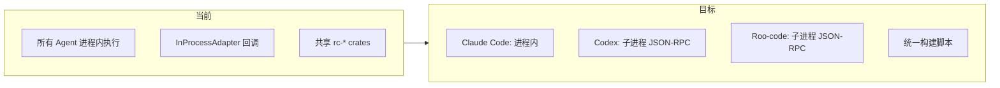
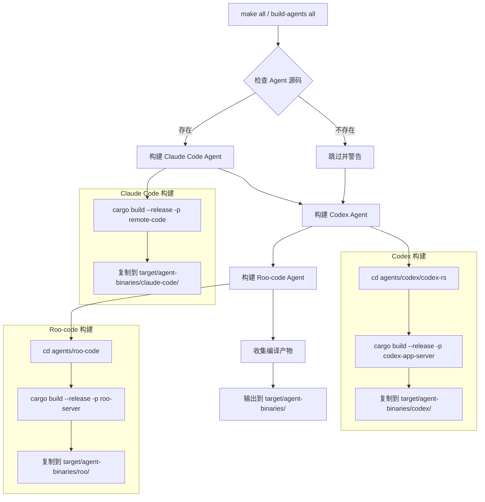
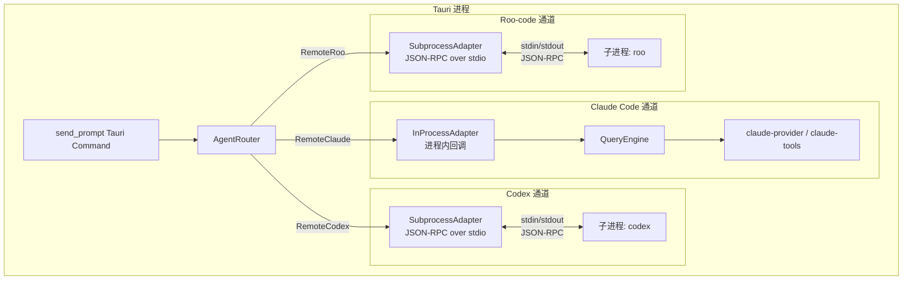
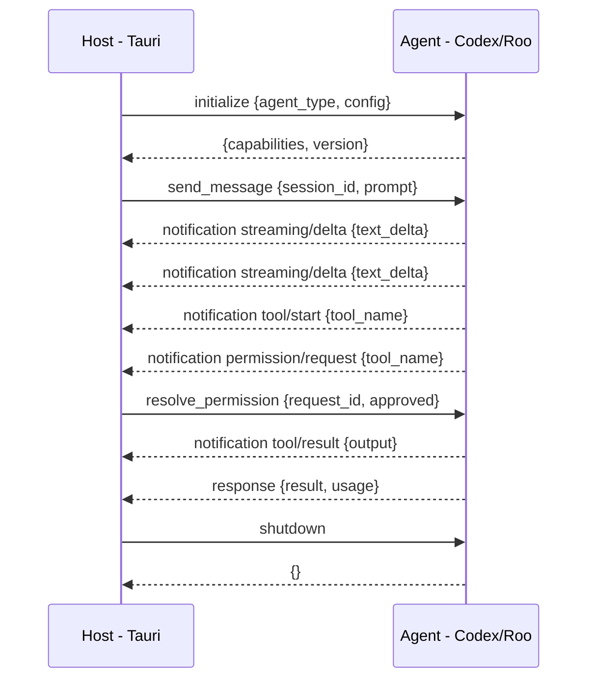
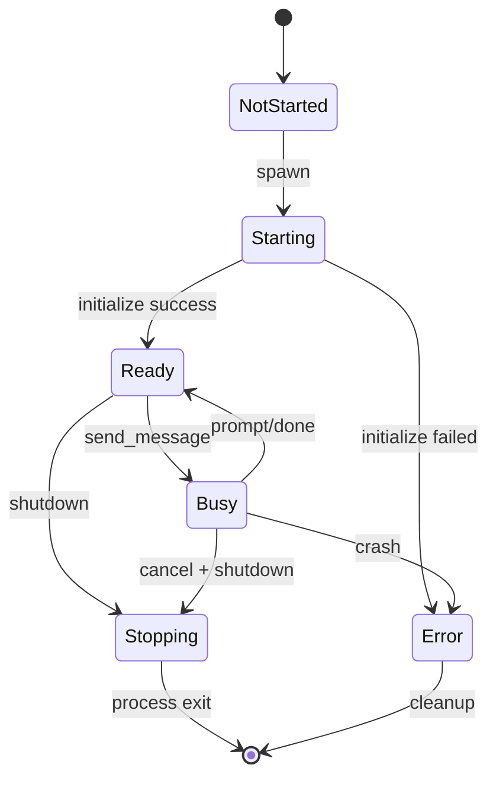
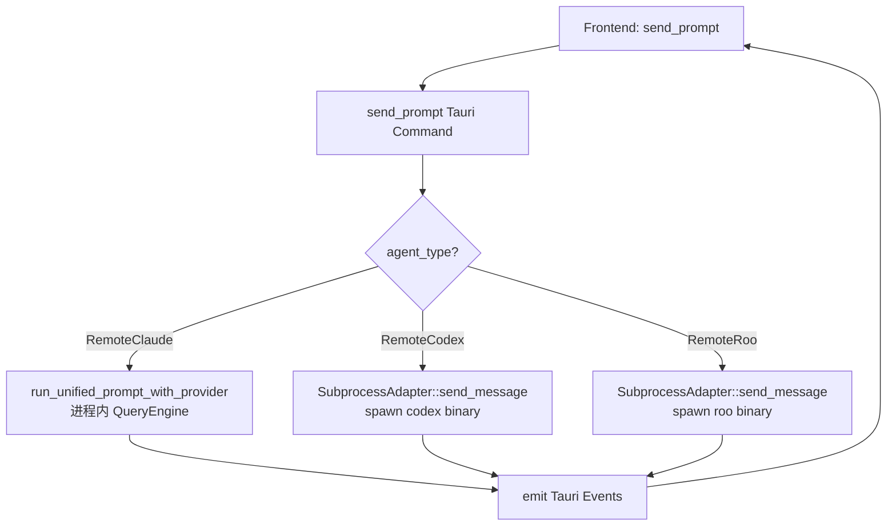

# 三 Agent 独立 Binary Target 整合方案

> **版本**: v1.0  
> **日期**: 2026-04-28  
> **状态**: 设计评审中

---

## 1. 概述

### 1.1 目标

将三个 Agent（Claude Code、Codex、Roo-code）各自编译为独立的可执行文件，通过统一的构建入口协调编译，并设计混合通信机制支持 GUI 集成。

### 1.2 核心设计原则

1. **三个独立 Workspace** — 不合并 Cargo workspace，避免依赖冲突
2. **混合通信模式** — Claude Code Agent 进程内执行；Codex/Roo-code 通过子进程 JSON-RPC over stdio 通信
3. **统一构建入口** — 顶层脚本/Makefile 一键构建全部 Agent
4. **最小改动** — 复用现有 `rc-agent-protocol` 中的 JSON-RPC 类型和 `AgentAdapter` trait

### 1.3 当前 vs 目标架构



---

## 2. 目录结构

### 2.1 变更后的目录结构

```
remote-code-rust/
├── Cargo.toml                          # 主 workspace（不变）
├── crates/                             # 共享 crates（不变）
│   ├── rc-agent-protocol/              # 新增 SubprocessAdapter
│   ├── claude-core/
│   ├── claude-provider/
│   └── ...
├── agents/
│   ├── claudecode/                     # 主 workspace member（不变）
│   │   ├── Cargo.toml                  # package: remote-code
│   │   └── src/
│   ├── codex/                          # 独立 workspace（.gitignore 排除）
│   │   └── codex-rs/
│   │       ├── Cargo.toml              # 独立 workspace root
│   │       └── ...
│   └── roo-code/                       # 独立 workspace（.gitignore 排除）
│       ├── Cargo.toml                  # 独立 workspace root
│       └── ...
├── apps/
│   └── remote-code-gui/
│       └── src-tauri/                  # Tauri 后端（需改动）
├── scripts/
│   ├── build-agents.sh                 # 统一构建脚本（升级）
│   └── build-agents.ps1                # Windows 版本（升级）
├── target/
│   └── agent-binaries/                 # 编译产物输出
│       ├── claude-code/                # → remote-code(.exe)
│       ├── codex/                      # → codex(.exe)
│       └── roo/                        # → roo(.exe)
└── Makefile                            # 新增：统一构建入口
```

### 2.2 目录结构变更说明

| 变更项 | 说明 |
|--------|------|
| `agents/claudecode/` | 保持在主 workspace 中，package name 不变 |
| `agents/codex/` | 保持独立 workspace，被 `.gitignore` 排除 |
| `agents/roo-code/` | 保持独立 workspace，被 `.gitignore` 排除 |
| `scripts/build-agents.*` | 升级：增加 Claude Code Agent 构建 |
| `Makefile` | 新增：统一构建入口 |
| `target/agent-binaries/` | 所有 Agent 编译产物的统一输出目录 |

---

## 3. Agent 命名规范

### 3.1 Package Name 与 Binary Name

| Agent | 目录 | Package Name | Binary Name | 说明 |
|-------|------|-------------|-------------|------|
| Claude Code | `agents/claudecode/` | `remote-code` | `remote-code` | 主 CLI，保持不变 |
| Codex | `agents/codex/codex-rs/` | `codex-exec` 或 `codex-app-server` | `codex` | OpenAI Codex CLI |
| Roo-code | `agents/roo-code/` | `roo-server` | `roo` | Roo Code Server |

### 3.2 Claude Code Agent 命名决策

**推荐方案：保持 `remote-code` 不变**

理由：
- `remote-code` 是项目的主品牌名，改名影响面大
- 已有的 CLI 命令、文档、用户习惯都基于 `remote-code`
- 在 GUI 中通过 `agent_type` 字段区分，不需要通过 binary name 区分
- 如果未来需要明确区分，可在 `Cargo.toml` 中添加 `[[bin]]` 别名：

```toml
# agents/claudecode/Cargo.toml（可选的别名方案）
[[bin]]
name = "remote-code"
path = "src/main.rs"

[[bin]]
name = "claude-code"
path = "src/main.rs"
```

### 3.3 Codex/Roo-code Binary Name 映射

构建脚本负责将编译产物重命名为统一的短名称：

| 源 Binary | 目标 Binary | 重命名规则 |
|-----------|------------|-----------|
| `codex-app-server` / `codex-exec` | `codex` | 构建脚本自动检测并复制 |
| `roo-server` | `roo` | 构建脚本自动重命名 |

---

## 4. 构建流程设计

### 4.1 构建流程图



### 4.2 Makefile 设计

```makefile
# Makefile — 统一构建入口

.PHONY: all claude codex roo gui clean

# 默认目标：构建所有 Agent
all: claude codex roo

# 构建 Claude Code Agent（主 workspace member）
claude:
	cargo build --release -p remote-code
	@mkdir -p target/agent-binaries/claude-code
	$(eval BIN := $(shell cargo metadata --format-version=1 --no-deps \
		| jq -r '.packages[0].targets[0].name'))
	cp target/release/remote-code$(EXT) target/agent-binaries/claude-code/

# 构建 Codex Agent（独立 workspace）
codex:
	$(MAKE) -C agents/codex/codex-rs release
	@mkdir -p target/agent-binaries/codex
	cp agents/codex/codex-rs/target/release/codex-app-server$(EXT) \
		target/agent-binaries/codex/codex$(EXT) 2>/dev/null || \
	cp agents/codex/codex-rs/target/release/codex$(EXT) \
		target/agent-binaries/codex/codex$(EXT)

# 构建 Roo-code Agent（独立 workspace）
roo:
	$(MAKE) -C agents/roo-code release
	@mkdir -p target/agent-binaries/roo
	cp agents/roo-code/target/release/roo-server$(EXT) \
		target/agent-binaries/roo/roo$(EXT)

# 构建 Tauri GUI
gui:
	cd apps/remote-code-gui && npm run tauri build

# 清理所有 Agent 编译产物
clean:
	rm -rf target/agent-binaries

# 平台检测
EXT :=
ifeq ($(OS),Windows_NT)
    EXT := .exe
endif
```

### 4.3 升级后的 build-agents.ps1

现有 `scripts/build-agents.ps1` 需要增加 Claude Code Agent 的构建步骤：

```powershell
# 新增 Build-ClaudeCode 函数
function Build-ClaudeCode {
    Write-Host "`n=== Building Claude Code Agent ===" -ForegroundColor Cyan
    Push-Location $ProjectRoot
    try {
        Write-Host "  Compiling remote-code (release)..."
        cargo build --release -p remote-code 2>&1 | Write-Host
        if ($LASTEXITCODE -ne 0) {
            Write-Error "Failed to build remote-code"
            return $false
        }
        $OutDir = Join-Path $OutputBase "claude-code"
        if (-not (Test-Path $OutDir)) {
            New-Item -ItemType Directory -Path $OutDir -Force | Out-Null
        }
        Copy-Item "target\release\remote-code.exe" $OutDir -Force
        Write-Host "  -> Copied to $OutDir\remote-code.exe" -ForegroundColor Green
        return $true
    }
    finally {
        Pop-Location
    }
}
```

### 4.4 Cargo Alias 方案（可选）

在 `.cargo/config.toml` 中定义 alias：

```toml
[alias]
build-agents = "!scripts/build-agents.sh all"
build-claude = "build --release -p remote-code"
```

> 注意：Cargo alias 不支持跨 workspace 构建，因此 `build-agents` 必须通过外部脚本实现。

---

## 5. 通信机制设计

### 5.1 混合通信架构



### 5.2 通信模式对比

| 维度 | Claude Code Agent | Codex / Roo-code Agent |
|------|-------------------|----------------------|
| 通信方式 | 进程内回调 | 子进程 JSON-RPC over stdio |
| Adapter | `InProcessAdapter`（现有） | `SubprocessAdapter`（新增） |
| 启动方式 | 直接调用 rc-* crates | `tokio::process::Command` |
| 生命周期 | 随 Tauri 进程 | 按需启动/停止 |
| 延迟 | 最低（函数调用） | 较低（IPC 开销） |
| 隔离性 | 共享地址空间 | 进程隔离 |
| 适用场景 | 深度集成的主 Agent | 第三方独立 Agent |

### 5.3 SubprocessAdapter 设计

新增 `crates/claude/rc-agent-protocol/src/adapters/subprocess.rs`：

```rust
//! Subprocess-based Agent adapter using JSON-RPC over stdio.

pub struct SubprocessAdapter {
    /// Agent metadata.
    info: AgentInfo,
    /// Runtime status.
    status: AgentStatus,
    /// Agent type discriminator.
    agent_type: AgentType,
    /// Path to the agent binary.
    binary_path: PathBuf,
    /// Child process handle.
    child: Option<tokio::process::Child>,
    /// JSON-RPC request ID counter.
    next_id: AtomicU64,
    /// Pending requests awaiting responses.
    pending: Arc<Mutex<HashMap<u64, oneshot::Sender<JsonRpcResponse>>>>,
    /// Event receiver (agent → host notifications).
    event_rx: Option<mpsc::Receiver<UnifiedAgentEvent>>,
}
```

### 5.4 JSON-RPC 协议定义

复用现有 `crates/claude/rc-agent-protocol/src/jsonrpc.rs` 中的类型，定义以下方法：

#### 5.4.1 Host → Agent 请求

| Method | 参数 | 返回 | 说明 |
|--------|------|------|------|
| `initialize` | `{agent_type, config}` | `{capabilities, version}` | 握手初始化 |
| `send_message` | `{session_id, prompt, context}` | `{result, usage}` | 发送用户消息 |
| `cancel` | `{session_id}` | `{}` | 取消当前操作 |
| `resolve_permission` | `{request_id, decision}` | `{}` | 响应权限请求 |
| `shutdown` | `{}` | `{}` | 优雅关闭 |

#### 5.4.2 Agent → Host 通知

| Method | 参数 | 说明 |
|--------|------|------|
| `streaming/delta` | `{session_id, text_delta}` | 流式文本增量 |
| `tool/start` | `{session_id, tool_name, tool_input}` | 工具调用开始 |
| `tool/result` | `{session_id, tool_output, is_error}` | 工具调用结果 |
| `permission/request` | `{session_id, tool_name, description, risk_level}` | 权限请求 |
| `prompt/done` | `{session_id, text, usage, stop_reason}` | 提示完成 |
| `error` | `{session_id, message}` | 错误通知 |

#### 5.4.3 消息流示例



### 5.5 Agent 二进制端协议实现

Codex 和 Roo-code 需要在各自的二进制中实现 JSON-RPC stdio 服务端。有两种策略：

**策略 A：修改 Agent 源码（推荐）**

在 Codex/Roo-code 的 main.rs 中增加 `--serve-stdio` 模式：

```rust
// agents/codex/codex-rs/app-server/src/main.rs（示意）
#[derive(Parser)]
struct Cli {
    #[arg(long)]
    serve_stdio: bool,
    // ...existing args
}

#[tokio::main]
async fn main() {
    let cli = Cli::parse();
    if cli.serve_stdio {
        run_stdio_server().await;  // JSON-RPC over stdin/stdout
    } else {
        run_normal_cli().await;    // 原有 CLI 模式
    }
}
```

**策略 B：Wrapper Binary（备选）**

在 `crates/` 下创建 `rc-agent-wrapper` crate，作为通用的 stdio 服务端 wrapper：

```
crates/claude/rc-agent-wrapper/
├── Cargo.toml
└── src/
    └── main.rs    # 读取 stdin JSON-RPC，调用 Agent 逻辑，写 stdout
```

> **推荐策略 A**：直接修改 Agent 源码更简洁。Codex 和 Roo-code 都是开源项目，可以 fork 后添加 stdio 模式。

### 5.6 进程生命周期管理



关键设计点：
- **按需启动**：首次 `send_prompt` 时才 spawn 子进程
- **超时保护**：`initialize` 请求设置 30s 超时
- **自动重启**：子进程崩溃时自动重新 spawn（最多 3 次）
- **优雅关闭**：先发送 `shutdown`，等待 5s 后强制 kill
- **健康检查**：定期 ping 子进程（每 60s）

---

## 6. GUI 集成变更

### 6.1 当前 GUI 调用链

```
Frontend (React)
  → tauri.invoke('send_prompt', {prompt, session_id})
    → send_prompt() [lib.rs:2765]
      → run_unified_prompt_with_provider() [query_engine_gui.rs:557]
        → QueryEngine::submit_message()
          → claude-provider → LLM API
```

### 6.2 目标 GUI 调用链



### 6.3 send_prompt 改动

在 `apps/remote-code-gui/src-tauri/src/lib.rs` 的 `send_prompt` 函数中增加分支：

```rust
// 当前代码（lib.rs:2799）：
let _agent_type_str = agent_type_str; // used for logging only

// 改为：
match agent_type_str.as_deref() {
    // Claude Code Agent：保持现有进程内执行路径
    Some("remote_claude") | None => {
        let result = query_engine_gui::run_unified_prompt_with_provider(
            &app, config.clone(), provider, session_store,
            pending_permissions, &prompt,
        ).await;
        // ... emit events
    }

    // Codex / Roo-code Agent：通过 SubprocessAdapter
    Some("remote_codex") | Some("remote_roo") => {
        let adapter = get_or_create_subprocess_adapter(
            &state, &agent_type_str, &config,
        ).await?;
        let events = adapter.send_message(&sid, &prompt).await?;
        // 将 UnifiedAgentEvent 转换为 Tauri events
        for event in events {
            emit_agent_event(&app, &sid, event);
        }
    }

    _ => return Err(format!("Unknown agent type: {agent_type_str}")),
}
```

### 6.4 新增 Tauri Command

```rust
/// 获取 Agent 二进制路径配置
#[tauri::command]
async fn get_agent_binary_paths(
    state: State<'_, AppState>,
) -> Result<HashMap<String, String>, String> {
    let runtime = state.runtime.lock().await;
    Ok(HashMap::from([
        ("claude_code".into(), "target/agent-binaries/claude-code/remote-code".into()),
        ("codex".into(), "target/agent-binaries/codex/codex".into()),
        ("roo".into(), "target/agent-binaries/roo/roo".into()),
    ]))
}

/// 配置 Agent 二进制搜索路径
#[tauri::command]
async fn configure_agent_binary_path(
    state: State<'_, AppState>,
    agent_type: String,
    binary_path: String,
) -> Result<(), String> {
    // 允许用户自定义 Agent 二进制路径
    todo!()
}
```

### 6.5 前端变更

前端变更较小，主要是：

1. **Agent 选择 UI**：在创建会话时选择 Agent 类型（已有）
2. **Agent 状态显示**：显示子进程 Agent 的连接状态
3. **错误处理**：处理子进程启动失败的情况

```typescript
// apps/remote-code-gui/src/session/contracts.ts（示意）
interface AgentStatus {
  type: 'remote_claude' | 'remote_codex' | 'remote_roo';
  status: 'starting' | 'ready' | 'busy' | 'stopped' | 'error';
  binaryPath?: string;
  pid?: number;
}
```

### 6.6 AppState 扩展

```rust
// 在 AppState 中增加子进程管理器
pub struct AppState {
    pub runtime: Arc<Mutex<GuiRuntime>>,
    pub pending_permissions: Arc<Mutex<HashMap<String, oneshot::Sender<PermissionDecision>>>>,
    pub running_prompts: Arc<Mutex<HashMap<String, tokio::task::JoinHandle<()>>>>,
    // 新增：子进程 Agent 管理器
    pub subprocess_agents: Arc<Mutex<HashMap<String, Arc<SubprocessAdapter>>>>,
}
```

---

## 7. rc-agent-protocol 变更

### 7.1 新增文件

| 文件 | 说明 |
|------|------|
| `src/adapters/subprocess.rs` | SubprocessAdapter 实现 |
| `src/adapters/subprocess_config.rs` | 子进程配置（binary path、环境变量等） |
| `src/process_manager.rs` | 子进程生命周期管理 |

### 7.2 修改文件

| 文件 | 变更 |
|------|------|
| `src/adapters/mod.rs` | 增加 `mod subprocess` 导出 |
| `src/lib.rs` | 增加 `SubprocessAdapter` 的 re-export |
| `src/jsonrpc.rs` | 增加协议方法常量定义 |

### 7.3 SubprocessAdapter trait 实现

```rust
// SubprocessAdapter 实现 AgentAdapter trait
#[async_trait]
impl AgentAdapter for SubprocessAdapter {
    async fn start(&mut self) -> anyhow::Result<()> { ... }
    async fn send_message(&mut self, session_id: &str, message: &str)
        -> anyhow::Result<Vec<UnifiedAgentEvent>> { ... }
    async fn cancel(&mut self, session_id: &str) -> anyhow::Result<()> { ... }
    async fn resolve_permission(
        &mut self, request_id: &str, session_id: &str, decision: PermissionDecision
    ) -> anyhow::Result<()> { ... }
    async fn stop(&mut self) -> anyhow::Result<()> { ... }
    fn info(&self) -> &AgentInfo { ... }
    fn status(&self) -> AgentStatus { ... }
}
```

---

## 8. 迁移步骤

### Phase 1: 构建基础设施（无代码变更）

- [ ] **Step 1.1**: 升级 `scripts/build-agents.sh`，增加 Claude Code Agent 构建步骤
- [ ] **Step 1.2**: 升级 `scripts/build-agents.ps1`，增加 Claude Code Agent 构建步骤
- [ ] **Step 1.3**: 创建顶层 `Makefile`
- [ ] **Step 1.4**: 验证三个 Agent 均可独立编译并输出到 `target/agent-binaries/`

### Phase 2: SubprocessAdapter 实现

- [ ] **Step 2.1**: 在 `rc-agent-protocol` 中创建 `src/adapters/subprocess.rs`
- [ ] **Step 2.2**: 实现子进程启动逻辑（`tokio::process::Command`）
- [ ] **Step 2.3**: 实现 JSON-RPC 请求/响应管道（stdin/stdout）
- [ ] **Step 2.4**: 实现 JSON-RPC 通知解析（agent → host 事件流）
- [ ] **Step 2.5**: 实现进程生命周期管理（启动、重启、关闭）
- [ ] **Step 2.6**: 编写 SubprocessAdapter 单元测试（使用 mock 子进程）

### Phase 3: Agent 端 stdio 服务实现

- [ ] **Step 3.1**: 在 Codex agent 中添加 `--serve-stdio` 模式
- [ ] **Step 3.2**: 在 Roo-code agent 中添加 `--serve-stdio` 模式
- [ ] **Step 3.3**: 定义并实现 JSON-RPC 方法（initialize、send_message、cancel 等）
- [ ] **Step 3.4**: 实现事件通知（streaming/delta、tool/start、permission/request 等）
- [ ] **Step 3.5**: 端到端测试：Host ↔ Agent JSON-RPC 通信

### Phase 4: GUI 集成

- [ ] **Step 4.1**: 在 `AppState` 中增加 `subprocess_agents` 字段
- [ ] **Step 4.2**: 修改 `send_prompt()` 增加 agent_type 分支路由
- [ ] **Step 4.3**: 实现 `get_or_create_subprocess_adapter()` 辅助函数
- [ ] **Step 4.4**: 将 `UnifiedAgentEvent` 转换为 Tauri 事件
- [ ] **Step 4.5**: 新增 `get_agent_binary_paths` 和 `configure_agent_binary_path` 命令
- [ ] **Step 4.6**: 前端增加 Agent 状态显示和错误处理

### Phase 5: 测试与优化

- [ ] **Step 5.1**: 集成测试：三个 Agent 同时运行
- [ ] **Step 5.2**: 压力测试：子进程崩溃恢复
- [ ] **Step 5.3**: 性能测试：JSON-RPC 延迟 vs 进程内调用
- [ ] **Step 5.4**: 文档更新：README、ARCHITECTURE.md

---

## 9. 风险和注意事项

### 9.1 高风险

| 风险 | 影响 | 缓解措施 |
|------|------|---------|
| Codex/Roo-code 不支持 stdio 模式 | 无法通过子进程通信 | 使用 Wrapper Binary 策略 B |
| JSON-RPC 延迟影响用户体验 | 流式输出卡顿 | 使用 NDJSON 而非严格 JSON-RPC；增加缓冲区 |
| 子进程崩溃导致会话丢失 | 用户工作中断 | 自动重启 + 会话状态持久化 |
| Windows stdio 编码问题 | 中文乱码 | 强制 UTF-8 编码；使用字节流而非文本流 |

### 9.2 中风险

| 风险 | 影响 | 缓解措施 |
|------|------|---------|
| Codex/Roo-code 更新导致协议不兼容 | 通信失败 | 版本协商（initialize 时交换版本号） |
| 多个 Agent 同时运行资源竞争 | 系统卡顿 | 限制并发 Agent 数量；资源监控 |
| 构建脚本跨平台兼容性 | Windows/macOS/Linux 构建失败 | 同时维护 .sh 和 .ps1；CI 验证 |

### 9.3 低风险

| 风险 | 影响 | 缓解措施 |
|------|------|---------|
| Agent 二进制路径配置 | 找不到二进制 | 默认路径 + 用户可配置 |
| Cargo workspace 隔离 | 无法共享编译缓存 | 各 workspace 独立 target 目录 |

### 9.4 注意事项

1. **不要修改 Codex/Roo-code 的核心逻辑**：只添加 stdio 服务层，保持与上游的兼容性
2. **保持 InProcessAdapter 不变**：Claude Code Agent 的进程内路径是性能最优的，不应改动
3. **JSON-RPC 消息大小限制**：stdio 管道没有硬性限制，但需要设置合理的消息大小上限（如 100MB）
4. **信号处理**：子进程需要正确处理 SIGTERM/SIGINT 以实现优雅关闭
5. **日志隔离**：子进程的日志应写入独立文件，不与主进程日志混合
6. **环境变量传递**：API Key 等敏感信息通过环境变量传递给子进程，不要通过 JSON-RPC 参数

---

## 10. 备选方案

### 10.1 方案 A：全部进程内（当前方案）

保持三个 Agent 全部使用 `InProcessAdapter`，不编译独立二进制。

- ✅ 最简单，零改动
- ❌ Codex/Roo-code 无法使用独立二进制
- ❌ 依赖冲突问题未解决

### 10.2 方案 B：全部子进程

三个 Agent 全部作为子进程运行，通过 JSON-RPC 通信。

- ✅ 完全隔离，无依赖冲突
- ✅ 统一通信模式
- ❌ Claude Code Agent 性能损失（额外的 IPC 开销）
- ❌ 改动量大

### 10.3 方案 C：混合模式（本方案 ✅）

Claude Code Agent 进程内，Codex/Roo-code 子进程。

- ✅ Claude Code Agent 性能最优
- ✅ Codex/Roo-code 独立隔离
- ✅ 改动量适中
- ❌ 两种通信模式需要维护

---

## 11. 总结

本方案采用**混合通信模式**，核心设计决策：

1. **Claude Code Agent** 保持进程内执行（`InProcessAdapter`），复用现有 `QueryEngine` 路径
2. **Codex / Roo-code Agent** 通过子进程执行（`SubprocessAdapter`），使用 JSON-RPC over stdio 通信
3. **统一构建** 通过升级后的 `scripts/build-agents.*` 和新增 `Makefile` 实现
4. **GUI 集成** 通过在 `send_prompt()` 中增加 agent_type 分支路由实现
5. **协议复用** 现有 `rc-agent-protocol` 中的 JSON-RPC 类型和 `AgentAdapter` trait

这个方案在**最小改动量**和**最大灵活性**之间取得了平衡，同时保持了 Claude Code Agent 的性能优势。