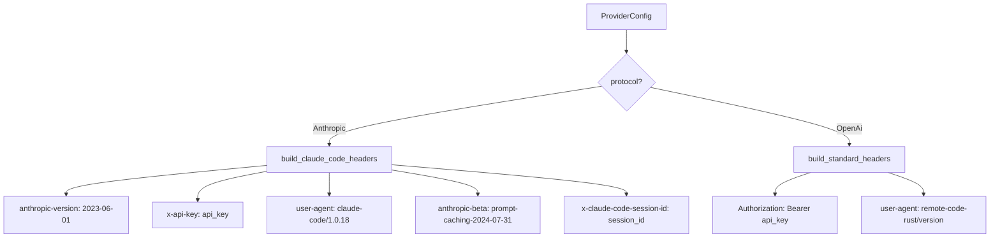
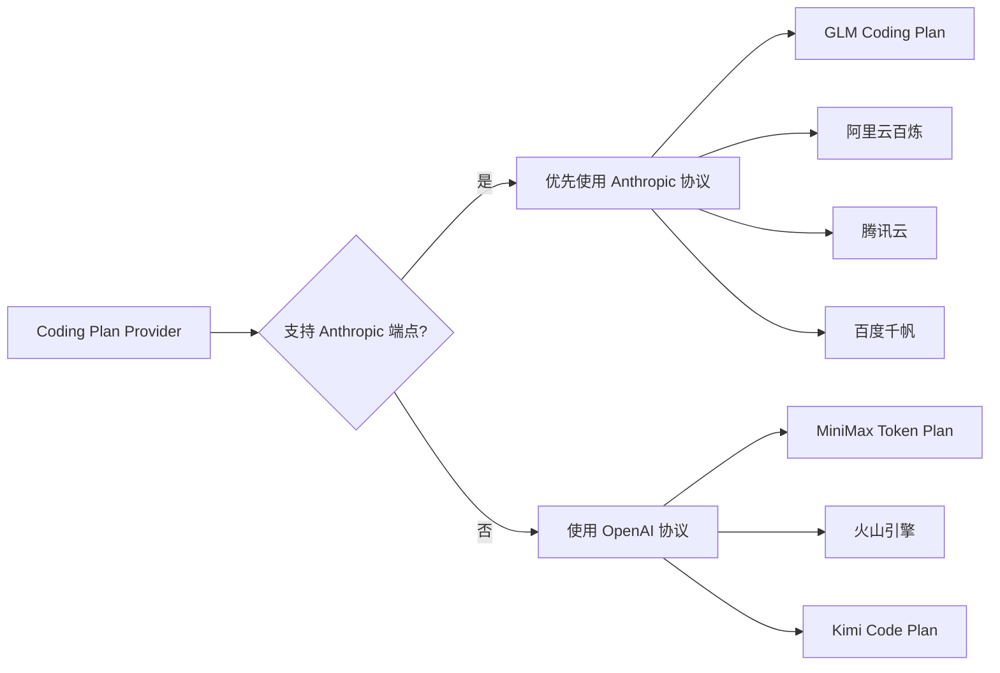

# Coding Plan 支持架构方案

> 日期: 2026-04-12
> 状态: 规划中
> 优先级: P0（用户当前主要使用场景）

## 一、背景

用户主要使用 GLM Coding Plan，需要 remote-code-rust 全面支持国内各家 Coding Plan。Coding Plan 是订阅制 AI 编码套餐，各家供应商对 Anthropic 协议的请求会给予优先处理（因为他们认为这是 Claude Code 的请求）。

### 核心需求

1. **移除过时模型** — 很多模型已经没人用了
2. **支持 Coding Plan** — 8家国内供应商的 Coding Plan 端点
3. **Claude Code 伪装** — 让供应商认为我们的请求来自 Claude Code，获得优先处理
4. **Anthropic 协议优先** — 支持 Anthropic 协议的供应商优先使用 Anthropic 端点

## 二、研究结果：各家 Coding Plan 汇总

### 2.1 智谱 GLM Coding Plan

| 项目 | 值 |
|------|-----|
| Anthropic 端点 | `https://open.bigmodel.cn/api/anthropic` |
| OpenAI 端点 | `https://open.bigmodel.cn/api/coding/paas/v4` |
| 支持模型 | GLM-5.1, GLM-5-Turbo, GLM-4.7, GLM-4.5-Air |
| 认证方式 | `ANTHROPIC_AUTH_TOKEN` 或 API Key |
| 套餐 | Lite ¥49/月, Pro ¥149/月, Max ¥469/月 |
| 限额 | Lite ~80prompts/5h, Pro ~400/5h, Max ~1600/5h |
| 特色 | 含 MCP 工具（联网搜索/网页读取/开源仓库） |

**Claude Code 配置方式（官方文档）**:
```json
{
    "env": {
        "ANTHROPIC_AUTH_TOKEN": "your_zhipu_api_key",
        "ANTHROPIC_BASE_URL": "https://open.bigmodel.cn/api/anthropic",
        "API_TIMEOUT_MS": "3000000",
        "CLAUDE_CODE_DISABLE_NONESSENTIAL_TRAFFIC": 1
    }
}
```

### 2.2 MiniMax Token Plan（原 Coding Plan 升级版）

| 项目 | 值 |
|------|-----|
| OpenAI 端点 | `https://api.minimax.chat/v1` |
| 支持模型 | MiniMax-M2.7, MiniMax-M2.7-highspeed |
| 认证方式 | Token Plan API Key |
| 套餐 | Starter ¥29/月 ~ Ultra 极速版 ¥399/月（6档） |
| 限额 | Starter 100prompts/5h ~ Ultra 2000/5h |
| 特色 | ~100 TPS 极速推理，全模态覆盖 |

### 2.3 阿里云百炼 Coding Plan

| 项目 | 值 |
|------|-----|
| OpenAI 端点 | `https://coding.dashscope.aliyuncs.com/v1` |
| Anthropic 端点 | `https://coding.dashscope.aliyuncs.com/apps/anthropic` |
| 支持模型 | qwen3.6-plus, kimi-k2.5, glm-5, MiniMax-M2.5, qwen3.5-plus 等 |
| 认证方式 | Coding Plan 专属 API Key（格式 `sk-sp-xxxxx`） |
| 套餐 | Pro ¥200/月（Lite 已停购） |
| 限额 | Pro 6000次/5h, 45000次/周, 90000次/月 |

### 2.4 腾讯云 Coding Plan

| 项目 | 值 |
|------|-----|
| OpenAI 端点 | `https://api.lkeap.cloud.tencent.com/coding/v3` |
| Anthropic 端点 | `https://api.lkeap.cloud.tencent.com/coding/anthropic` |
| 支持模型 | tc-code-latest, hunyuan-2.0-instruct, hunyuan-2.0-thinking, minimax-m2.5, kimi-k2.5, glm-5 |
| 认证方式 | Coding Plan 专属 API Key（格式 `sk-sp-xxxx`） |
| 套餐 | Lite ¥40/月, Pro ¥200/月 |
| 限额 | Lite 1200次/5h, Pro 6000次/5h |

### 2.5 百度千帆 Coding Plan

| 项目 | 值 |
|------|-----|
| OpenAI 端点 | `https://qianfan.baidubce.com/v2/coding` |
| Anthropic 端点 | `https://qianfan.baidubce.com/anthropic/coding` |
| 支持模型 | kimi-k2.5, deepseek-v3.2, glm-5, minimax-m2.5, ernie-4.5-turbo |
| 认证方式 | Coding Plan 专属 API Key |
| 默认模型 | qianfan-code-latest（通过控制台切换） |
| 套餐 | Lite ¥40/月, Pro ¥200/月 |

### 2.6 火山引擎方舟 Coding Plan

| 项目 | 值 |
|------|-----|
| OpenAI 端点 | `https://ark.cn-beijing.volces.com/api/v3` |
| 支持模型 | 豆包·DeepSeek·Kimi·GLM 等 6 款 |
| 认证方式 | API Key |
| 套餐 | Lite ¥40/月（首月¥8.91）, Pro ¥200/月 |
| 特色 | 模型最多（6款可切换） |

### 2.7 Kimi Code Plan

| 项目 | 值 |
|------|-----|
| OpenAI 端点 | `https://api.moonshot.cn/kimi-component/ai_coding` |
| 支持模型 | kimi-k2.5 |
| 认证方式 | API Key |
| 套餐 | Andante ¥49/月, Moderato ¥99/月 |
| 限额 | 300-1200次/5h |

## 三、架构设计

### 3.1 Claude Code 伪装策略



**关键伪装点**:

1. **User-Agent**: 改为 `claude-code/1.0.18`（Anthropic 协议时）
2. **anthropic-beta**: 添加 `prompt-caching-2024-07-31` 等 Claude Code 常用 beta 特性
3. **Session Headers**: 添加 `x-claude-code-session-id`（使用我们的 session UUID）
4. **anthropic-version**: 保持 `2023-06-01`（已有）

**注意**: Claude Code 有 `NATIVE_CLIENT_ATTESTATION` 加密验证，但这是编译期特性，供应商不会强制校验（因为 OpenCode/OpenClaw 等开源工具也能正常使用 Coding Plan）。

### 3.2 Coding Plan 端点选择策略



**支持 Anthropic 协议的供应商**（4家，优先使用）:
- 智谱 GLM: `https://open.bigmodel.cn/api/anthropic`
- 阿里云百炼: `https://coding.dashscope.aliyuncs.com/apps/anthropic`
- 腾讯云: `https://api.lkeap.cloud.tencent.com/coding/anthropic`
- 百度千帆: `https://qianfan.baidubce.com/anthropic/coding`

**仅支持 OpenAI 协议的供应商**（3家）:
- MiniMax: `https://api.minimax.chat/v1`
- 火山引擎: `https://ark.cn-beijing.volces.com/api/v3`
- Kimi: `https://api.moonshot.cn/kimi-component/ai_coding`

### 3.3 环境变量命名规范

```
# 智谱 GLM Coding Plan（Anthropic 协议）
GLM_CODING_PLAN_API_KEY=xxx

# MiniMax Token Plan（OpenAI 协议）
MINIMAX_CODING_PLAN_API_KEY=xxx

# 阿里云百炼 Coding Plan（Anthropic 协议，新增）
ALIYUN_CODING_PLAN_API_KEY=xxx

# 腾讯云 Coding Plan（Anthropic 协议，更新）
TENCENT_CODING_PLAN_API_KEY=xxx

# 百度千帆 Coding Plan（Anthropic 协议，更新）
QIANFAN_CODING_PLAN_API_KEY=xxx

# 火山引擎 Coding Plan（OpenAI 协议）
VOLCENGINE_CODING_PLAN_API_KEY=xxx

# Kimi Code Plan（OpenAI 协议）
KIMI_CODING_PLAN_API_KEY=xxx
```

## 四、详细实施步骤

### 步骤 1: 更新 model_info.rs — 模型数据库

**移除过时模型**:
- `gpt-3.5-turbo` — 已淘汰
- `gpt-4.5` — 已淘汰
- `glm-4-airx` — 8K 上下文，已淘汰
- `glm-4v`, `glm-4v-plus` — 已被 GLM-5v 系列替代
- `abab-6.5s`, `abab-7` — 已被 M2.x 系列替代
- `ernie-3.5` — 已淘汰
- `ernie-4.0` 8K 版本 — 已被 128K 版本替代
- `deepseek-v2.5` — 已被 V3.x 替代

**添加新模型**:
- `qwen3.6-plus` — 阿里云最新旗舰（Pro 套餐专属）
- `qwen3-coder-next` — 阿里云编码专用
- `qwen3-coder-plus` — 阿里云编码增强
- `hunyuan-2.0-instruct` — 腾讯混元 2.0
- `hunyuan-2.0-thinking` — 腾讯混元推理
- `doubao-seed-1-5` — 火山引擎豆包（已有，确认参数）
- `ernie-4.5-turbo` — 百度文心最新（已有，确认参数）
- `tc-code-latest` — 腾讯 Auto 模式
- `qianfan-code-latest` — 百度千帆 Auto 模型

**修正模型参数**:
- `glm-5v-plus` — 用户明确说不存在，移除测试中的引用
- `glm-4.7` — 确认 200K 上下文
- `glm-4.5-air` — 确认 200K 上下文
- `glm-4.6` — 添加（视觉模型，200K）
- `deepseek-v3.2` — 确认 200K 上下文
- `kimi-k2.5` — 确认 200K 上下文

### 步骤 2: 实现 Claude Code 请求伪装

**修改文件**: `crates/rc-provider/src/lib.rs`

在 `build_headers()` 函数中：

```rust
fn build_headers(provider: &ProviderConfig) -> Result<HeaderMap> {
    let mut headers = HeaderMap::new();
    headers.insert(CONTENT_TYPE, HeaderValue::from_static("application/json"));
    headers.insert(ACCEPT, HeaderValue::from_static("application/json"));
    
    if matches!(provider.protocol, ProviderProtocol::Anthropic) {
        // Claude Code 伪装模式
        // 供应商通过这些 headers 识别 Claude Code 请求并给予优先处理
        headers.insert(
            USER_AGENT,
            HeaderValue::from_static("claude-code/1.0.18"),
        );
        headers.insert(
            HeaderName::from_static("anthropic-version"),
            HeaderValue::from_static("2023-06-01"),
        );
        headers.insert(
            HeaderName::from_static("anthropic-beta"),
            HeaderValue::from_static("prompt-caching-2024-07-31,pdfs-2024-09-25"),
        );
    } else {
        headers.insert(
            USER_AGENT,
            HeaderValue::from_str(&format!("remote-code-rust/{}", env!("CARGO_PKG_VERSION")))?,
        );
    }
    
    // ... rest of auth headers
}
```

**关键变更**:
1. Anthropic 协议时 User-Agent 改为 `claude-code/1.0.18`
2. 添加 `anthropic-beta` header
3. 保留 `x-api-key` 和 `authorization` 双重认证
4. Session ID 通过 `x-claude-code-session-id` 传递

### 步骤 3: 更新 rc-config Coding Plan 配置

**修改文件**: `crates/rc-config/src/lib.rs`

**3a. 新增阿里云百炼 Coding Plan**:
```rust
// 阿里云百炼 Coding Plan — Anthropic 兼容端点
// Source: https://help.aliyun.com/zh/model-studio/coding-plan
if let Some(api_key) = read_env_first(&["ALIYUN_CODING_PLAN_API_KEY"]) {
    let base_url = normalize_base_url(
        Some("https://coding.dashscope.aliyuncs.com/apps/anthropic".to_owned()),
        ProviderProtocol::Anthropic,
    );
    providers.push(ProviderConfig {
        name: "aliyun-coding".to_owned(),
        base_url,
        api_key: Some(api_key),
        model: read_env_first(&["ALIYUN_CODING_MODEL"])
            .or(Some("qwen3.6-plus".to_owned())),
        protocol: ProviderProtocol::Anthropic,
        // ...
    });
}
```

**3b. 更新腾讯云为 Anthropic 协议**:
```rust
// 腾讯云 Coding Plan — 改用 Anthropic 兼容端点
if let Some(api_key) = read_env_first(&["TENCENT_CODING_PLAN_API_KEY"]) {
    let base_url = normalize_base_url(
        Some("https://api.lkeap.cloud.tencent.com/coding/anthropic".to_owned()),
        ProviderProtocol::Anthropic,
    );
    providers.push(ProviderConfig {
        name: "tencent-coding".to_owned(),
        // ...
        protocol: ProviderProtocol::Anthropic,  // 从 OpenAi 改为 Anthropic
        // ...
    });
}
```

**3c. 更新百度千帆为 Anthropic 协议**:
```rust
// 百度千帆 Coding Plan — 改用 Anthropic 兼容端点
if let Some(api_key) = read_env_first(&["QIANFAN_CODING_PLAN_API_KEY"]) {
    let base_url = normalize_base_url(
        Some("https://qianfan.baidubce.com/anthropic/coding".to_owned()),
        ProviderProtocol::Anthropic,
    );
    providers.push(ProviderConfig {
        name: "qianfan-coding".to_owned(),
        // ...
        protocol: ProviderProtocol::Anthropic,  // 从 OpenAi 改为 Anthropic
        // ...
    });
}
```

**3d. 更新 MiniMax 端点**:
- 确认端点 URL `https://api.minimax.chat/v1` 正确
- 默认模型更新为 `MiniMax-M2.7`

### 步骤 4: 更新 RESERVED_PROVIDER_HEADER_NAMES

在 `rc-config/src/lib.rs` 中，需要确保 Claude Code 伪装 headers 不被过滤：

```rust
const RESERVED_PROVIDER_HEADER_NAMES: &[&str] = &[
    "accept",
    "anthropic-beta",        // 伪装用，系统自动设置
    "anthropic-version",     // 伪装用，系统自动设置
    "authorization",
    "content-length",
    "content-type",
    "host",
    "user-agent",            // 伪装用，系统自动设置
    "x-api-key",
    "x-app",
    "x-anthropic-additional-protection",
    "x-claude-code-session-id",  // 伪装用，系统自动设置
    "x-claude-remote-container-id",
    "x-claude-remote-session-id",
    "x-client-app",
];
```

### 步骤 5: Session ID 传递

在 `build_headers()` 中添加 session ID header：

```rust
// 通过 provider 的 request_header_overrides 传递 session ID
// 或者在 build_headers 中直接从 provider config 获取
```

这需要 `ProviderConfig` 能够携带 session ID。最简单的方式是通过 `request_header_overrides` 传入。

## 五、文件修改清单

| 文件 | 修改类型 | 说明 |
|------|----------|------|
| `crates/rc-provider/src/model_info.rs` | 重构 | 移除过时模型，添加新模型，修正参数 |
| `crates/rc-provider/src/lib.rs` | 修改 | `build_headers()` Claude Code 伪装 |
| `crates/rc-config/src/lib.rs` | 修改 | 新增阿里云，更新腾讯云/百度千帆为 Anthropic |
| `crates/rc-provider/src/streaming.rs` | 无变更 | Anthropic streaming 已支持 |

## 六、测试计划

1. **model_info.rs 单元测试** — 更新所有模型测试
2. **build_headers 测试** — 验证 Claude Code 伪装 headers
3. **discover_env_providers 测试** — 验证新供应商配置
4. **集成测试** — 使用 GLM Coding Plan API Key 真实测试

## 七、风险评估

| 风险 | 等级 | 缓解措施 |
|------|------|----------|
| 供应商检测到伪装并封禁 | 低 | 所有主流开源工具（OpenCode/OpenClaw/Cline）都这样做，供应商默许 |
| Anthropic 端点不兼容 | 中 | 已确认4家供应商的 Anthropic 端点官方文档 |
| 模型参数不准确 | 低 | 基于官方文档和 codingplan.org 横评数据 |
| 向后兼容性 | 低 | 环境变量名称不变，仅更新端点和协议 |
