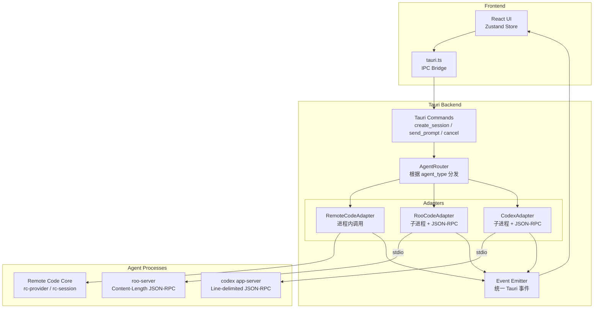

# Multi-Agent Architecture Design

> 将 remote-code-gui 从单一 Agent（remote-code）扩展为支持多 Agent（remote-code、Roo Code、OpenAI Codex）的统一平台。

---

## 1. 研究总结：三个 Agent 的通信协议

### 1.1 Remote Code（当前）

| 维度 | 详情 |
|------|------|
| **架构** | Tauri v2 + React 19，Rust 后端进程内调用 |
| **传输** | 进程内函数调用（`#[tauri::command]`），无子进程 |
| **会话创建** | [`create_session`](apps/remote-code-gui/src-tauri/src/lib.rs:3083) → 校验项目路径 → [`initialize_session_conversation`](apps/remote-code-gui/src-tauri/src/lib.rs:2308) |
| **消息发送** | [`send_prompt`](apps/remote-code-gui/src-tauri/src/lib.rs:3114) → 克隆 RuntimeConfig → 恢复会话上下文 → spawn [`run_gui_prompt`](apps/remote-code-gui/src-tauri/src/lib.rs:2619) |
| **事件模型** | `app.emit()` 发射 Tauri 事件：`streaming_delta`, `tool_start`, `tool_progress`, `tool_result`, `prompt_done`, `subtask_started/progress/completed`, `batch_progress`, `task_snapshot`, `context_usage/overflow/compacted`, `permission_request` |
| **权限系统** | [`GuiRuntimePermissionBroker`](apps/remote-code-gui/src-tauri/src/lib.rs:2491) + [`GuiPermissionFallbackBroker`](apps/remote-code-gui/src-tauri/src/lib.rs:2394)，通过 Tauri 事件与前端交互 |
| **Provider** | rc-provider: Anthropic, OpenAI, MiniMax, DeepSeek, Bedrock, Google 等 |
| **会话存储** | `rc-session` — NDJSON 格式，SQLite state.db |
| **上下文管理** | `rc-compact` — 自动压缩，token 估算，上下文策略 |

### 1.2 Roo Code

| 维度 | 详情 |
|------|------|
| **架构** | `roo-server` crate，JSON-RPC 2.0 Server |
| **传输** | stdio，Content-Length 帧格式（LSP 风格） |
| **入口** | [`Server::serve_stdio()`](C:/Users/Yanzh/Desktop/roo-code-rust/crates/roo-server/src/server.rs:88) |
| **帧格式** | [`StdioTransport`](C:/Users/Yanzh/Desktop/roo-code-rust/crates/roo-server/src/transport.rs:51) — `Content-Length: {n}\r\n\r\n{body}` |
| **Provider 注册** | [`register_providers()`](C:/Users/Yanzh/Desktop/roo-code-rust/crates/roo-server/src/lib.rs:74) — Anthropic, OpenAI, MiniMax, DeepSeek 等 |
| **方法总数** | 100+ JSON-RPC 方法 |

**Roo Code 完整方法列表（按类别）**：

| 类别 | 方法 |
|------|------|
| **生命周期** | `initialize`, `shutdown`, `ping`, `webviewDidLaunch` |
| **任务管理** | `task/start`, `task/cancel`, `task/close`, `task/resume`, `task/sendMessage`, `task/getCommands`, `task/getModes`, `task/getModels`, `task/deleteQueuedMessage`, `task/condense`, `task/clear`, `task/cancelAutoApproval`, `task/getAggregatedCosts`, `task/showWithId` |
| **状态** | `state/get`, `state/setMode`, `systemPrompt/build` |
| **历史** | `history/get`, `history/delete`, `history/deleteMultiple`, `history/export`, `history/shareTask` |
| **交互** | `todo/update`, `askResponse`, `terminalOperation` |
| **检查点** | `checkpoint/diff`, `checkpoint/restore` |
| **搜索** | `promptEnhance`, `searchFiles`, `fileRead`, `gitSearchCommits` |
| **MCP** | `mcp/listServers`, `mcp/restartServer`, `mcp/toggleServer`, `mcp/useTool`, `mcp/accessResource`, `mcp/deleteServer`, `mcp/updateTimeout`, `mcp/refreshAll`, `mcp/toggleToolAlwaysAllow`, `mcp/toggleToolEnabledForPrompt` |
| **设置** | `settings/update`, `settings/saveApiConfig`, `settings/loadApiConfig`, `settings/loadApiConfigById`, `settings/deleteApiConfig`, `settings/listApiConfigs`, `settings/upsertApiConfig`, `settings/renameApiConfig`, `settings/customInstructions`, `settings/updatePrompt`, `settings/copySystemPrompt`, `settings/resetState`, `settings/importSettings`, `settings/exportSettings`, `settings/lockApiConfig`, `settings/toggleApiConfigPin`, `settings/enhancementApiConfigId`, `settings/autoApprovalEnabled`, `settings/debugSetting`, `settings/allowedCommands`, `settings/deniedCommands`, `settings/condensingPrompt`, `settings/setApiConfigPassword`, `settings/hasOpenedModeSelector`, `settings/taskSyncEnabled`, `settings/updateSettings`, `settings/updateVscodeSetting`, `settings/getVscodeSetting` |
| **Skills** | `skills/list`, `skills/create`, `skills/delete`, `skills/move`, `skills/updateModes`, `skill/openFile` |
| **Mode** | `mode/updateCustom`, `mode/deleteCustom`, `mode/export`, `mode/import`, `mode/switch`, `mode/checkRules`, `mode/openSettings`, `mode/setOpenaiCustomModelInfo` |
| **消息** | `message/delete`, `message/edit`, `message/queue`, `message/deleteConfirm`, `message/editConfirm`, `message/editQueued`, `message/removeQueued`, `message/submitEdited` |
| **模型** | `models/flushRouter`, `models/requestRouter`, `models/requestOpenai`, `models/requestOllama`, `models/requestLmstudio`, `models/requestRoo`, `models/requestRooCredit`, `models/requestVscodelm` |
| **Worktree** | `worktree/list`, `worktree/create`, `worktree/delete`, `worktree/switch`, `worktree/getBranches`, `worktree/getDefaults`, `worktree/getIncludeStatus`, `worktree/checkBranchInclude`, `worktree/createInclude`, `worktree/checkoutBranch`, `worktree/browsePath` |
| **TTS** | `tts/play`, `tts/stop`, `tts/enabled`, `tts/speed` |
| **Image** | `image/save`, `image/open` |
| **Mentions** | `mention/open`, `mention/resolve` |
| **Commands** | `command/request`, `command/openFile`, `command/delete`, `command/create` |
| **UI** | `webviewDidLaunch`, `announcementDidShow`, `imagesSelect`, `imagesDragged`, `playSound`, `fileOpen`, `externalOpen`, `openKeyboardShortcuts`, `openMcpSettings`, `openProjectMcpSettings`, `focusPanel`, `tabSwitch`, `insertText`, `markdownPreview` |
| **Cloud** | `cloud/signIn`, `cloud/signOut`, `cloud/manualUrl`, `cloud/buttonClicked`, `cloud/clearSkipModel`, `cloud/switchOrg`, `codex/signIn`, `codex/signOut`, `codex/requestRateLimits` |
| **Codebase Index** | `index/enabled`, `index/requestStatus`, `index/start`, `index/stop`, `index/clear`, `index/toggleWorkspace`, `index/setAutoEnable`, `index/saveSettings`, `index/requestSecretStatus` |
| **Marketplace** | `marketplace/install`, `marketplace/remove`, `marketplace/installWithParams`, `marketplace/fetchData`, `marketplace/filterItems`, `marketplace/buttonClicked`, `marketplace/cancelInstall` |
| **Debug** | `debug/apiHistory`, `debug/uiHistory`, `debug/downloadDiagnostics` |
| **Telemetry** | `telemetry/setSetting` |
| **Tools** | `tools/refreshCustom` |

**Roo Code 核心交互流程**：

```
1. initialize → 返回 capabilities
2. task/start → 开始新任务（包含用户消息）
   → 服务端发送通知：文本流、工具调用、权限请求等
3. task/sendMessage → 发送后续消息
4. task/cancel → 取消当前任务
5. askResponse → 响应权限/询问请求
6. task/close → 关闭任务
```

### 1.3 OpenAI Codex

| 维度 | 详情 |
|------|------|
| **架构** | `codex-rs/app-server`，JSON-RPC Server（v2 协议） |
| **传输** | stdio（行分隔 JSON）或 WebSocket |
| **协议模式** | SQ/EQ（Submission Queue / Event Queue） |
| **沙箱策略** | `SandboxPolicy` 枚举：`DangerFullAccess`, `ReadOnly`, `ExternalSandbox`, `WorkspaceWrite` |
| **审批策略** | `AskForApproval` 枚举：`UnlessTrusted`, `OnFailure`, `OnRequest`, `Granular`, `Never` |

**Codex v2 JSON-RPC 完整方法列表**：

| 方向 | 方法 | 说明 |
|------|------|------|
| **Client → Server** | `initialize` | 初始化连接，发送 clientInfo + capabilities |
| **Client → Server** | `thread/start` | 创建新 Thread（会话） |
| **Client → Server** | `thread/resume` | 恢复已有 Thread |
| **Client → Server** | `thread/fork` | 分叉 Thread |
| **Client → Server** | `thread/archive` | 归档 Thread |
| **Client → Server** | `thread/unarchive` | 取消归档 |
| **Client → Server** | `thread/unsubscribe` | 取消订阅 Thread |
| **Client → Server** | `thread/name/set` | 设置 Thread 名称 |
| **Client → Server** | `thread/metadata/update` | 更新 Thread 元数据 |
| **Client → Server** | `thread/list` | 列出 Threads |
| **Client → Server** | `thread/loaded/list` | 列出已加载的 Threads |
| **Client → Server** | `thread/read` | 读取 Thread 内容 |
| **Client → Server** | `thread/compact/start` | 启动压缩 |
| **Client → Server** | `thread/shellCommand` | 执行 Shell 命令 |
| **Client → Server** | `thread/rollback` | 回滚 Thread |
| **Client → Server** | `turn/start` | 开始新 Turn（发送用户消息） |
| **Client → Server** | `turn/steer` | 中途引导 Turn |
| **Client → Server** | `turn/interrupt` | 中断 Turn |
| **Client → Server** | `review/start` | 启动代码审查 |
| **Client → Server** | `model/list` | 列出可用模型 |
| **Client → Server** | `config/read` | 读取配置 |
| **Client → Server** | `config/value/write` | 写入配置值 |
| **Client → Server** | `account/login/start` | 登录（API Key / ChatGPT / OAuth） |
| **Client → Server** | `account/logout` | 登出 |
| **Client → Server** | `account/read` | 读取账户信息 |
| **Client → Server** | `account/rateLimits/read` | 读取速率限制 |
| **Client → Server** | `skills/list` | 列出 Skills |
| **Client → Server** | `mcpServer/oauth/login` | MCP OAuth 登录 |
| **Client → Server** | `mcpServer/tool/call` | 调用 MCP 工具 |
| **Client → Server** | `fs/readFile`, `fs/writeFile` 等 | 文件系统操作 |

**Codex Server → Client 通知（ServerNotification）**：

| 通知 | 说明 |
|------|------|
| `thread/started` | Thread 已创建 |
| `thread/status/changed` | Thread 状态变更 |
| `thread/archived` / `unarchived` / `closed` | Thread 生命周期 |
| `thread/name/updated` | Thread 名称更新 |
| `thread/tokenUsage/updated` | Token 用量更新 |
| `thread/compacted` | 上下文已压缩 |
| `turn/started` | Turn 开始 |
| `turn/completed` | Turn 完成 |
| `turn/diff/updated` | Turn diff 更新 |
| `turn/plan/updated` | Turn 计划更新 |
| `item/started` | Item 开始（工具调用等） |
| `item/completed` | Item 完成 |
| `item/agentMessage/delta` | Agent 消息增量 |
| `item/commandExecution/outputDelta` | 命令执行输出增量 |
| `item/fileChange/outputDelta` | 文件变更输出增量 |
| `item/mcpToolCall/progress` | MCP 工具调用进度 |
| `item/reasoning/summaryTextDelta` | 推理摘要文本增量 |
| `item/reasoning/textDelta` | 推理文本增量 |
| `item/autoApprovalReview/started` | 自动审批审查开始 |
| `item/autoApprovalReview/completed` | 自动审批审查完成 |
| `hook/started` / `hook/completed` | Hook 生命周期 |
| `model/rerouted` | 模型重路由 |
| `mcpServer/startupStatus/updated` | MCP 启动状态更新 |
| `account/updated` | 账户更新 |
| `account/rateLimits/updated` | 速率限制更新 |
| `error` | 错误通知 |
| `deprecationNotice` | 弃用通知 |

**Codex Server → Client 请求（需要 Client 响应）**：

| 请求 | 说明 | 响应 |
|------|------|------|
| `item/commandExecution/requestApproval` | 请求命令执行审批 | `Accept` / `Deny` / `AcceptForSession` |
| `item/fileChange/requestApproval` | 请求文件变更审批 | `Accept` / `Deny` / `AcceptForSession` |
| `item/tool/requestUserInput` | 请求用户输入 | 用户输入内容 |
| `mcpServer/elicitation/request` | MCP 服务器请求 | 用户决策 |
| `item/permissions/requestApproval` | 权限审批请求 | 授予权限 |
| `item/tool/call` | 动态工具调用请求 | 工具执行结果 |
| `execCommandApproval`（v1 遗留） | 命令审批 | `Approved` / `Denied` |
| `applyPatchApproval`（v1 遗留） | 补丁审批 | `Approved` / `Denied` |

**Codex 初始化流程**：

```
1. Client → Server: initialize { clientInfo, capabilities }
2. Server → Client: InitializeResponse { serverInfo, capabilities }
3. Client → Server: initialized (notification)
4. Client → Server: account/login/start { type: "apiKey", apiKey: "..." }
5. Server → Client: LoginAccountResponse { account }
6. Client → Server: thread/start { cwd, model, approvalPolicy, sandbox }
7. Server → Client: ThreadStartResponse { thread, model, ... }
8. Client → Server: turn/start { threadId, items: [{ type: "text", text: "..." }] }
9. Server → Client: turn/started notification
10. Server → Client: item/agentMessage/delta notifications (streaming)
11. Server → Client: item/commandExecution/requestApproval (if needed)
12. Client → Server: response { decision: "accept" }
13. Server → Client: turn/completed notification
```

---

## 2. 架构设计

### 2.1 核心原则

1. **不动 Agent 核心** — 只构建适配器（Adapter），不修改 Roo/Codex/Remote Code 的核心代码
2. **子进程隔离** — 外部 Agent 以子进程运行，通过 stdio JSON-RPC 通信
3. **Remote Code 保持进程内** — 自有 Agent 保持当前进程内调用，最大化性能
4. **会话绑定 Agent** — 会话创建时选定 Agent 类型，之后不可更改
5. **统一事件模型** — 所有 Agent 的事件翻译为统一的 `UnifiedAgentEvent`
6. **二进制隔离** — Agent 二进制文件存放在 remote-code 自己的路径下，不影响系统安装

### 2.2 系统架构图



### 2.3 新增 Crate：`rc-agent-protocol`

路径：`crates/rc-agent-protocol/`

定义统一的 Agent 交互协议：

```rust
// crates/rc-agent-protocol/src/lib.rs

/// 支持的 Agent 类型
#[derive(Debug, Clone, Serialize, Deserialize, PartialEq, Eq)]
pub enum AgentType {
    RemoteCode,
    RooCode,
    Codex,
}

/// Agent 配置
pub struct AgentConfig {
    pub agent_type: AgentType,
    pub binary_path: PathBuf,
    pub working_dir: PathBuf,
    pub model: Option<String>,
    pub provider: Option<String>,
    pub api_key: Option<String>,
    pub base_url: Option<String>,
    pub sandbox_policy: Option<String>,
    pub approval_policy: Option<String>,
}

/// 统一的 Agent 事件 — 所有 Agent 适配器都翻译为此格式
#[derive(Debug, Clone, Serialize, Deserialize)]
pub enum UnifiedAgentEvent {
    // ── 生命周期 ──
    SessionStarted { session_id: String },
    SessionEnded { session_id: String },
    
    // ── 消息流 ──
    TextDelta { session_id: String, delta: String },
    TextComplete { session_id: String, text: String },
    
    // ── 推理 ──
    ReasoningDelta { session_id: String, delta: String },
    
    // ── 工具调用 ──
    ToolCallBegin { session_id: String, call_id: String, name: String, input: Value },
    ToolCallProgress { session_id: String, call_id: String, message: String },
    ToolCallEnd { session_id: String, call_id: String, output: String, is_error: bool },
    
    // ── 命令执行 ──
    ExecBegin { session_id: String, call_id: String, command: Vec<String>, cwd: String },
    ExecOutputDelta { session_id: String, call_id: String, chunk: String },
    ExecEnd { session_id: String, call_id: String, exit_code: i32, stdout: String, stderr: String },
    
    // ── 文件变更 ──
    PatchBegin { session_id: String, call_id: String, auto_approved: bool },
    PatchEnd { session_id: String, call_id: String, success: bool },
    
    // ── 权限请求 ──
    PermissionRequest { session_id: String, request_id: String, title: String, description: String, input: Value, suggestions: Vec<Value> },
    
    // ── Token 使用 ──
    TokenCount { session_id: String, input_tokens: i64, output_tokens: i64, total_tokens: i64 },
    
    // ── Turn 生命周期 ──
    TurnStarted { session_id: String, turn_id: String },
    TurnComplete { session_id: String, turn_id: String, last_message: Option<String> },
    
    // ── 上下文 ──
    ContextUsage { session_id: String, estimated_tokens: usize, max_tokens: usize, ratio: f64 },
    ContextOverflow { session_id: String },
    ContextCompacted { session_id: String, entries_removed: usize },
    
    // ── 子任务 ──
    SubtaskStarted { session_id: String, task_id: String, parent_task_id: Option<String>, description: String, depth: usize },
    SubtaskProgress { session_id: String, task_id: String, turn: usize, max_turns: usize, summary: String },
    SubtaskCompleted { session_id: String, task_id: String, success: bool, output_preview: String, turns_used: usize },
    
    // ── 错误 ──
    Error { session_id: String, message: String },
}
```

### 2.4 AgentAdapter Trait

```rust
// crates/rc-agent-protocol/src/adapter.rs

#[async_trait]
pub trait AgentAdapter: Send + Sync {
    /// 启动 Agent（子进程或初始化进程内引擎）
    async fn start(&mut self, config: &AgentConfig) -> Result<()>;
    
    /// 发送用户消息
    async fn send_message(&mut self, session_id: &str, message: &str) -> Result<()>;
    
    /// 取消当前操作
    async fn cancel(&mut self, session_id: &str) -> Result<()>;
    
    /// 响应权限请求
    async fn resolve_permission(&mut self, session_id: &str, request_id: &str, decision: bool, feedback: Option<String>) -> Result<()>;
    
    /// 关闭 Agent
    async fn stop(&mut self) -> Result<()>;
    
    /// 检查 Agent 是否存活
    fn is_alive(&self) -> bool;
    
    /// 获取 Agent 类型
    fn agent_type(&self) -> AgentType;
}
```

### 2.5 三个适配器实现

#### 2.5.1 RemoteCodeAdapter（进程内）

```rust
// apps/remote-code-gui/src-tauri/src/adapters/remote_code_adapter.rs

/// 包装现有的 run_gui_prompt 流程
/// 不启动子进程，直接在 Tauri 进程内调用 rc-* crates
/// 事件通过 app.emit() 发射，与当前行为完全一致
struct RemoteCodeAdapter {
    config: RuntimeConfig,
    provider: Arc<dyn RuntimeProvider>,
    session_store: Arc<SessionStore>,
    app: AppHandle,
    // ... 其他现有字段
}
```

**关键**：这是对现有 [`run_gui_prompt`](apps/remote-code-gui/src-tauri/src/lib.rs:2619) 的包装，行为不变。

#### 2.5.2 RooCodeAdapter（子进程）

```rust
// apps/remote-code-gui/src-tauri/src/adapters/roo_code_adapter.rs

struct RooCodeAdapter {
    process: Option<Child>,
    stdin: BufWriter<ChildStdin>,
    stdout: BufReader<ChildStdout>,
    request_id: u64,
}

impl RooCodeAdapter {
    /// 启动 roo-server 子进程
    /// 二进制路径：~/.remote-code/agents/roo-code/bin/roo-server
    fn spawn(binary_path: &Path, config: &AgentConfig) -> Result<Self> {
        let mut child = Command::new(binary_path)
            .stdin(Stdio::piped())
            .stdout(Stdio::piped())
            .stderr(Stdio::piped())
            .env("ROO_API_KEY", config.api_key.as_deref().unwrap_or(""))
            .spawn()?;
        // ...
    }
    
    /// 发送 JSON-RPC 请求（Content-Length 帧格式）
    async fn send_jsonrpc(&mut self, method: &str, params: Value) -> Result<Value> {
        // Content-Length: {n}\r\n\r\n{body}
    }
    
    /// 读取 JSON-RPC 响应/通知
    async fn read_jsonrpc(&mut self) -> Result<Option<Message>> {
        // 解析 Content-Length 头 + body
    }
}

impl AgentAdapter for RooCodeAdapter {
    async fn start(&mut self, config: &AgentConfig) -> Result<()> {
        // 1. spawn roo-server
        // 2. send "initialize" method
        // 3. 启动后台读取循环，将事件翻译为 UnifiedAgentEvent
    }
    
    async fn send_message(&mut self, session_id: &str, message: &str) -> Result<()> {
        // send "task/sendMessage" JSON-RPC method
    }
    
    async fn cancel(&mut self, session_id: &str) -> Result<()> {
        // send "task/cancel" JSON-RPC method
    }
    
    // ...
}
```

**Roo Code 事件映射**：

| Roo JSON-RPC 通知 | → UnifiedAgentEvent |
|---|---|
| `task/sendMessage` 响应中的文本流 | `TextDelta` / `TextComplete` |
| 工具调用开始/结束 | `ToolCallBegin` / `ToolCallEnd` |
| 权限请求 | `PermissionRequest` |
| 任务完成 | `TurnComplete` |

#### 2.5.3 CodexAdapter（子进程）

```rust
// apps/remote-code-gui/src-tauri/src/adapters/codex_adapter.rs

struct CodexAdapter {
    process: Option<Child>,
    stdin: BufWriter<ChildStdin>,
    stdout: BufReader<ChildStdout>,
    submission_id: u64,
}

impl CodexAdapter {
    /// 启动 codex app-server 子进程
    /// 二进制路径：~/.remote-code/agents/codex/bin/codex
    fn spawn(binary_path: &Path, config: &AgentConfig) -> Result<Self> {
        let mut child = Command::new(binary_path)
            .args(["app-server", "--transport", "stdio"])
            .stdin(Stdio::piped())
            .stdout(Stdio::piped())
            .stderr(Stdio::piped())
            .env("OPENAI_API_KEY", config.api_key.as_deref().unwrap_or(""))
            .spawn()?;
        // ...
    }
    
    /// 发送 JSON-RPC 请求（行分隔 JSON）
    async fn send_jsonrpc(&mut self, method: &str, params: Value) -> Result<()> {
        let line = serde_json::to_string(&json!({
            "jsonrpc": "2.0",
            "id": self.next_id(),
            "method": method,
            "params": params,
        }))?;
        self.stdin.write_all(line.as_bytes()).await?;
        self.stdin.write_all(b"\n").await?;
        self.stdin.flush().await?;
        Ok(())
    }
    
    /// 读取行分隔 JSON 响应
    async fn read_response(&mut self) -> Result<Option<Value>> {
        let mut line = String::new();
        let n = self.stdout.read_line(&mut line).await?;
        if n == 0 { return Ok(None); }
        Ok(Some(serde_json::from_str(&line)?))
    }
}

impl AgentAdapter for CodexAdapter {
    async fn start(&mut self, config: &AgentConfig) -> Result<()> {
        // 1. spawn codex app-server --transport stdio
        // 2. 发送 session/create 或 configure
        // 3. 启动后台读取循环，将 EventMsg 翻译为 UnifiedAgentEvent
    }
    
    async fn send_message(&mut self, session_id: &str, message: &str) -> Result<()> {
        // 发送 Op::UserTurn { items, cwd, approval_policy, sandbox_policy, model }
    }
    
    async fn cancel(&mut self, session_id: &str) -> Result<()> {
        // 发送 Op::Interrupt
    }
    
    async fn resolve_permission(&mut self, session_id: &str, request_id: &str, decision: bool, _feedback: Option<String>) -> Result<()> {
        // 发送 Op::ExecApproval { id, decision: Approved/Denied }
    }
    
    // ...
}
```

**Codex 事件映射**：

| Codex EventMsg | → UnifiedAgentEvent |
|---|---|
| `TurnStarted` | `TurnStarted` |
| `TurnComplete` | `TurnComplete` |
| `AgentMessage` | `TextComplete` |
| `AgentMessageDelta` | `TextDelta` |
| `AgentReasoningDelta` | `ReasoningDelta` |
| `ExecCommandBegin` | `ExecBegin` |
| `ExecCommandOutputDelta` | `ExecOutputDelta` |
| `ExecCommandEnd` | `ExecEnd` |
| `ExecApprovalRequest` | `PermissionRequest` |
| `PatchApplyBegin` | `PatchBegin` |
| `PatchApplyEnd` | `PatchEnd` |
| `TokenCount` | `TokenCount` |
| `McpToolCallBegin` | `ToolCallBegin` |
| `McpToolCallEnd` | `ToolCallEnd` |
| `Error` | `Error` |

### 2.6 AgentRouter

```rust
// apps/remote-code-gui/src-tauri/src/agent_router.rs

struct AgentRouter {
    adapters: HashMap<String, Box<dyn AgentAdapter>>,  // session_id → adapter
    agent_binaries: HashMap<AgentType, PathBuf>,        // agent_type → binary path
}

impl AgentRouter {
    /// 创建新会话并绑定 Agent
    async fn create_session(&mut self, agent_type: AgentType, config: &AgentConfig) -> Result<String> {
        let session_id = Uuid::new_v4().to_string();
        let mut adapter = match agent_type {
            AgentType::RemoteCode => Box::new(RemoteCodeAdapter::new(/* ... */)),
            AgentType::RooCode => Box::new(RooCodeAdapter::spawn(&binary_path, config)?),
            AgentType::Codex => Box::new(CodexAdapter::spawn(&binary_path, config)?),
        };
        adapter.start(config).await?;
        self.adapters.insert(session_id.clone(), adapter);
        Ok(session_id)
    }
    
    /// 向指定会话发送消息
    async fn send_message(&mut self, session_id: &str, message: &str) -> Result<()> {
        let adapter = self.adapters.get_mut(session_id).ok_or(...)?;
        adapter.send_message(session_id, message).await
    }
    
    /// 取消指定会话的操作
    async fn cancel(&mut self, session_id: &str) -> Result<()> {
        let adapter = self.adapters.get_mut(session_id).ok_or(...)?;
        adapter.cancel(session_id).await
    }
    
    /// 响应权限请求
    async fn resolve_permission(&mut self, session_id: &str, request_id: &str, decision: bool, feedback: Option<String>) -> Result<()> {
        let adapter = self.adapters.get_mut(session_id).ok_or(...)?;
        adapter.resolve_permission(session_id, request_id, decision, feedback).await
    }
    
    /// 关闭指定会话
    async fn close_session(&mut self, session_id: &str) -> Result<()> {
        if let Some(mut adapter) = self.adapters.remove(session_id) {
            adapter.stop().await?;
        }
        Ok(())
    }
}
```

### 2.7 二进制隔离策略

```
~/.remote-code/
├── agents/
│   ├── remote-code/          # 自有 Agent（不需要独立二进制，进程内调用）
│   │   └── config/
│   ├── roo-code/
│   │   ├── bin/
│   │   │   └── roo-server    # 从 roo-code-rust 编译
│   │   └── config/
│   │       └── providers.json
│   └── codex/
│       ├── bin/
│       │   └── codex          # 从 codex-rs 编译
│       └── config/
│           └── config.toml
└── sessions/                  # 会话数据（已有）
```

**关键规则**：
- Agent 二进制文件从各自的源码编译后复制到 `~/.remote-code/agents/{name}/bin/`
- 每个 Agent 的配置文件存放在各自的 `config/` 目录
- **不使用**系统 PATH 中的 codex/roo-code 二进制
- 环境变量隔离：子进程只传递必要的 API Key，不继承用户的 shell 环境

### 2.8 后台事件循环

```rust
// apps/remote-code-gui/src-tauri/src/agent_event_loop.rs

/// 每个 Agent 子进程有一个后台 tokio task 负责读取事件
async fn agent_event_loop(
    mut event_rx: tokio::sync::mpsc::Receiver<UnifiedAgentEvent>,
    app: AppHandle,
    session_id: String,
) {
    while let Some(event) = event_rx.recv().await {
        match event {
            UnifiedAgentEvent::TextDelta { delta, .. } => {
                let _ = app.emit("streaming_delta", StreamingDeltaDto { session_id: session_id.clone(), delta });
            }
            UnifiedAgentEvent::PermissionRequest { request_id, title, description, input, suggestions, .. } => {
                let _ = app.emit("permission_request", PermissionRequestDto { request_id, title, description, input, suggestions });
            }
            // ... 其他事件映射到现有的 Tauri 事件格式
        }
    }
}
```

---

## 3. GUI 变更

### 3.1 前端类型变更

```typescript
// types.ts 新增

export type AgentType = 'remote-code' | 'roo-code' | 'codex';

export interface SessionSummary {
  id: string;
  title: string;
  cwd: string;
  provider_name: string;
  model: string | null;
  created_at: string;
  updated_at: string;
  archived: boolean;
  agent_type: AgentType;  // 新增
}

export interface AgentInfo {
  type: AgentType;
  display_name: string;
  description: string;
  available: boolean;      // 二进制是否存在
  version: string | null;
  icon: string | null;
}
```

### 3.2 Tauri IPC 变更

```typescript
// tauri.ts 变更

export function createSession(
  title: string | undefined,
  projectPath: string | undefined,
  agentType: AgentType | undefined,   // 新增
): Promise<string> {
  return invoke('create_session', { title, projectPath, agentType });
}

// 新增：列出可用 Agent
export function listAgents(): Promise<AgentInfo[]> {
  return invoke('list_agents');
}

// 新增：安装 Agent 二进制
export function installAgent(agentType: AgentType): Promise<void> {
  return invoke('install_agent', { agentType });
}
```

### 3.3 Rust 后端 Tauri 命令变更

```rust
// lib.rs 变更

#[tauri::command]
async fn create_session(
    state: State<'_, AppState>,
    title: Option<String>,
    project_path: Option<String>,
    agent_type: Option<String>,   // 新增
) -> std::result::Result<String, String> {
    let agent_type = parse_agent_type(agent_type).unwrap_or(AgentType::RemoteCode);
    // ... 通过 AgentRouter 创建会话
}

#[tauri::command]
async fn list_agents(state: State<'_, AppState>) -> std::result::Result<Vec<AgentInfoDto>, String> {
    // 检查每个 Agent 的二进制是否存在
}

#[tauri::command]
async fn install_agent(
    state: State<'_, AppState>,
    agent_type: String,
) -> std::result::Result<(), String> {
    // 编译或下载 Agent 二进制到 ~/.remote-code/agents/{name}/bin/
}
```

### 3.4 UI 组件变更

**新建会话对话框**增加 Agent 选择器：

```
┌─────────────────────────────────────┐
│  新建会话                            │
│                                     │
│  项目: [/path/to/project    ▼]      │
│                                     │
│  Agent:                             │
│  ┌─────────────────────────────┐    │
│  │ ⚡ Remote Code  (推荐)      │    │
│  │ 🦘 Roo Code               │    │
│  │ 🤖 OpenAI Codex            │    │
│  └─────────────────────────────┘    │
│                                     │
│  会话标题: [可选                    ] │
│                                     │
│         [取消]     [创建会话]        │
└─────────────────────────────────────┘
```

**会话列表**显示 Agent 类型图标：

```
⚡ My Project Session        Remote Code
🦘 Roo Session              Roo Code
🤖 Codex Session            OpenAI Codex
```

### 3.5 Zustand Store 变更

```typescript
// useAppStore.ts 变更

interface AppState {
  // ... 现有字段
  agentType: AgentType;                    // 新增：当前选择的 Agent 类型
  availableAgents: AgentInfo[];            // 新增：可用 Agent 列表
  
  // ... 现有方法
  createSession: (title?: string, projectPath?: string, agentType?: AgentType) => Promise<void>;  // 修改
  loadAgents: () => Promise<void>;         // 新增
  installAgent: (agentType: AgentType) => Promise<void>;  // 新增
}
```

---

## 4. 会话数据存储

### 4.1 会话元数据扩展

在现有会话存储中增加 `agent_type` 字段：

```rust
// SessionSummary 扩展
struct SessionSummary {
    id: Uuid,
    title: String,
    cwd: PathBuf,
    provider_name: String,
    model: Option<String>,
    created_at: String,
    updated_at: String,
    archived: bool,
    agent_type: AgentType,   // 新增
}
```

### 4.2 会话数据隔离

- Remote Code 会话：使用现有的 `rc-session` 存储（NDJSON 格式）
- Roo Code 会话：由 `roo-server` 内部管理，GUI 只缓存对话显示数据
- Codex 会话：由 `codex app-server` 内部管理（rollout 文件），GUI 只缓存对话显示数据

**关键**：GUI 统一存储对话的显示数据（`ConversationEntryDto`），无论底层 Agent 是什么。

---

## 5. 权限处理流程

### 5.1 Remote Code（进程内）

保持现有流程：`GuiRuntimePermissionBroker` → Tauri 事件 → 前端弹窗 → `resolve_permission_request`

### 5.2 Roo Code（子进程）

```
Roo Server → JSON-RPC 通知（权限请求）
    → RooCodeAdapter 翻译为 UnifiedAgentEvent::PermissionRequest
    → agent_event_loop 发射 Tauri 事件
    → 前端弹窗
    → 用户操作 → Tauri command resolve_permission
    → AgentRouter → RooCodeAdapter.resolve_permission()
    → 发送 JSON-RPC 响应给 Roo Server
```

### 5.3 Codex（子进程）

```
Codex Server → EventMsg::ExecApprovalRequest / ApplyPatchApprovalRequest
    → CodexAdapter 翻译为 UnifiedAgentEvent::PermissionRequest
    → agent_event_loop 发射 Tauri 事件
    → 前端弹窗
    → 用户操作 → Tauri command resolve_permission
    → AgentRouter → CodexAdapter.resolve_permission()
    → 发送 Op::ExecApproval { decision: Approved/Denied }
```

---

## 6. 错误恢复与健康检查

### 6.1 子进程健康检查

```rust
/// 定期检查子进程是否存活
async fn health_check_loop(adapter: &dyn AgentAdapter, session_id: &str, app: &AppHandle) {
    let mut interval = tokio::time::interval(Duration::from_secs(30));
    loop {
        interval.tick().await;
        if !adapter.is_alive() {
            let _ = app.emit("agent_error", json!({
                "session_id": session_id,
                "message": "Agent 进程意外退出"
            }));
            break;
        }
    }
}
```

### 6.2 子进程重启策略

- 子进程崩溃时，通知前端并标记会话为 `disconnected`
- 用户可以选择重新连接（重启子进程并恢复上下文）
- 不自动重启，避免数据丢失

---

## 7. 实施计划

### Phase 1：基础设施

1. 创建 `crates/rc-agent-protocol/` crate
   - 定义 `AgentType`, `AgentConfig`, `UnifiedAgentEvent`
   - 定义 `AgentAdapter` trait
2. 在 `AppState` 中添加 `AgentRouter`
3. 修改 `create_session` 命令接受 `agent_type` 参数
4. 修改 `SessionSummary` DTO 添加 `agent_type` 字段

### Phase 2：Remote Code 适配器

5. 实现 `RemoteCodeAdapter`（包装现有 `run_gui_prompt` 流程）
6. 将现有 `send_prompt` 调用路径改为通过 `AgentRouter`
7. 确保所有现有功能正常工作（回归测试）

### Phase 3：Roo Code 适配器

8. 实现 `RooCodeAdapter`
   - 子进程管理
   - Content-Length 帧格式的 JSON-RPC 通信
   - 事件翻译
9. 编写 `roo-server` 二进制编译/安装脚本
10. 集成测试

### Phase 4：Codex 适配器

11. 实现 `CodexAdapter`
    - 子进程管理
    - 行分隔 JSON-RPC 通信
    - EventMsg → UnifiedAgentEvent 翻译
12. 编写 `codex` 二进制编译/安装脚本
13. 集成测试

### Phase 5：GUI 更新

14. 前端添加 Agent 类型选择器组件
15. 更新 Zustand Store 和 tauri.ts
16. 会话列表显示 Agent 类型图标
17. Agent 管理页面（安装/卸载/更新）

### Phase 6：测试与优化

18. 端到端测试（每个 Agent 类型的完整流程）
19. 性能测试（子进程启动时间、事件延迟）
20. 错误恢复测试（子进程崩溃、网络中断）
21. 文档更新

---

## 8. 风险与缓解

| 风险 | 影响 | 缓解措施 |
|------|------|----------|
| Roo/Codex 协议变更 | 适配器失效 | 版本锁定 + 协议版本检测 |
| 子进程启动慢 | 用户体验差 | 预热池 + 异步启动 |
| 权限请求翻译不完整 | 功能缺失 | 逐个对照协议文档，确保覆盖 |
| 内存泄漏（子进程） | 长时间运行不稳定 | 健康检查 + 超时自动关闭 |
| Codex app-server 不支持 stdio | 无法使用 | 检查文档确认支持，否则用 WebSocket |
| Roo Server 事件格式不确定 | 翻译错误 | 先写集成测试验证事件格式 |

---

## 9. 文件结构总览

```
crates/
├── rc-agent-protocol/           # 新增：统一 Agent 协议
│   ├── Cargo.toml
│   └── src/
│       ├── lib.rs               # AgentType, AgentConfig, UnifiedAgentEvent
│       └── adapter.rs           # AgentAdapter trait

apps/remote-code-gui/
├── src-tauri/
│   └── src/
│       ├── lib.rs               # 修改：添加 agent_type 参数
│       ├── agent_router.rs      # 新增：Agent 路由器
│       ├── agent_event_loop.rs  # 新增：后台事件循环
│       └── adapters/
│           ├── mod.rs
│           ├── remote_code.rs   # 新增：Remote Code 适配器
│           ├── roo_code.rs      # 新增：Roo Code 适配器
│           └── codex.rs         # 新增：Codex 适配器
├── src/
│   ├── lib/
│   │   ├── types.ts             # 修改：添加 AgentType, AgentInfo
│   │   └── tauri.ts             # 修改：添加 agent 参数
│   ├── stores/
│   │   └── useAppStore.ts       # 修改：添加 agent 状态
│   └── components/
│       └── AgentSelector.tsx    # 新增：Agent 选择器组件
```

---

## 10. Codex v2 协议详细事件映射

### 10.1 Codex ServerNotification → UnifiedAgentEvent 完整映射

| Codex ServerNotification | UnifiedAgentEvent | 备注 |
|---|---|---|
| `turn/started` | `TurnStarted` | 包含 turn_id |
| `turn/completed` | `TurnComplete` | 包含 last_agent_message |
| `item/agentMessage/delta` | `TextDelta` | 流式文本增量 |
| `item/started` (AgentMessage 类型) | `TextComplete` | 完整消息 |
| `item/started` (ExecCommand 类型) | `ExecBegin` | 命令开始执行 |
| `item/commandExecution/outputDelta` | `ExecOutputDelta` | 命令输出增量 |
| `item/completed` (ExecCommand 类型) | `ExecEnd` | 命令执行完成 |
| `item/started` (FileChange 类型) | `PatchBegin` | 文件变更开始 |
| `item/fileChange/outputDelta` | `ToolCallProgress` | 文件变更输出 |
| `item/completed` (FileChange 类型) | `PatchEnd` | 文件变更完成 |
| `item/started` (McpToolCall 类型) | `ToolCallBegin` | MCP 工具调用开始 |
| `item/mcpToolCall/progress` | `ToolCallProgress` | MCP 工具调用进度 |
| `item/completed` (McpToolCall 类型) | `ToolCallEnd` | MCP 工具调用完成 |
| `item/reasoning/summaryTextDelta` | `ReasoningDelta` | 推理摘要增量 |
| `item/reasoning/textDelta` | `ReasoningDelta` | 推理文本增量 |
| `thread/tokenUsage/updated` | `TokenCount` | Token 用量更新 |
| `thread/compacted` | `ContextCompacted` | 上下文已压缩 |
| `model/rerouted` | — (日志记录) | 模型重路由通知 |
| `error` | `Error` | 错误通知 |
| `deprecationNotice` | — (日志记录) | 弃用通知 |

### 10.2 Codex ServerRequest → 权限处理映射

| Codex ServerRequest | UnifiedAgentEvent | 用户响应 |
|---|---|---|
| `item/commandExecution/requestApproval` | `PermissionRequest` | `Accept` / `Deny` / `AcceptForSession` |
| `item/fileChange/requestApproval` | `PermissionRequest` | `Accept` / `Deny` / `AcceptForSession` |
| `item/permissions/requestApproval` | `PermissionRequest` | 授予权限 |
| `item/tool/requestUserInput` | `PermissionRequest` | 用户输入 |
| `mcpServer/elicitation/request` | `PermissionRequest` | 接受/拒绝 |

### 10.3 Codex 适配器核心 JSON-RPC 交互序列

```
┌──────────┐                          ┌──────────────────┐
│ GUI      │                          │ codex app-server  │
│ (Client) │                          │ (Server)          │
└────┬─────┘                          └────────┬─────────┘
     │                                         │
     │  initialize { clientInfo }              │
     │────────────────────────────────────────>│
     │                                         │
     │  InitializeResponse { capabilities }    │
     │<────────────────────────────────────────│
     │                                         │
     │  initialized (notification)             │
     │────────────────────────────────────────>│
     │                                         │
     │  account/login/start { apiKey }         │
     │────────────────────────────────────────>│
     │                                         │
     │  LoginAccountResponse { account }       │
     │<────────────────────────────────────────│
     │                                         │
     │  thread/start { cwd, model, sandbox }   │
     │────────────────────────────────────────>│
     │                                         │
     │  ThreadStartResponse { thread }         │
     │<────────────────────────────────────────│
     │                                         │
     │  turn/started (notification)            │
     │<────────────────────────────────────────│
     │                                         │
     │  turn/start { threadId, items }         │
     │────────────────────────────────────────>│
     │                                         │
     │  item/agentMessage/delta (notification) │
     │<────────────────────────────────────────│
     │  item/agentMessage/delta (notification) │
     │<────────────────────────────────────────│
     │                                         │
     │  item/commandExecution/requestApproval  │
     │<────────────────────────────────────────│
     │                                         │
     │  response { decision: accept }          │
     │────────────────────────────────────────>│
     │                                         │
     │  turn/completed (notification)          │
     │<────────────────────────────────────────│
```

---

## 11. Roo Code 适配器核心交互序列

### 11.1 Roo Code 核心方法映射

| GUI 操作 | Roo JSON-RPC 方法 | 参数 |
|---|---|---|
| 初始化 | `initialize` | `{ capabilities }` |
| 新建任务 | `task/start` | `{ message, mode, model? }` |
| 发送消息 | `task/sendMessage` | `{ message }` |
| 取消任务 | `task/cancel` | `{}` |
| 关闭任务 | `task/close` | `{}` |
| 响应询问 | `askResponse` | `{ response, askId }` |
| 切换模式 | `state/setMode` | `{ mode }` |
| 获取模式列表 | `task/getModes` | `{}` |
| 获取模型列表 | `task/getModels` | `{}` |

### 11.2 Roo Code 适配器 JSON-RPC 交互序列

```
┌──────────┐                          ┌──────────────────┐
│ GUI      │                          │ roo-server        │
│ (Client) │                          │ (Server)          │
└────┬─────┘                          └────────┬─────────┘
     │                                         │
     │  initialize { capabilities }            │
     │────────────────────────────────────────>│
     │                                         │
     │  Response { result: { ... } }           │
     │<────────────────────────────────────────│
     │                                         │
     │  task/start { message, mode }           │
     │────────────────────────────────────────>│
     │                                         │
     │  Response { result: { taskId } }        │
     │<────────────────────────────────────────│
     │                                         │
     │  Notification: 文本流/工具调用/权限请求   │
     │<────────────────────────────────────────│
     │  Notification: ...                      │
     │<────────────────────────────────────────│
     │                                         │
     │  askResponse { response, askId }        │
     │────────────────────────────────────────>│
     │                                         │
     │  task/sendMessage { message }           │
     │────────────────────────────────────────>│
     │                                         │
     │  Notification: 文本流/工具调用           │
     │<────────────────────────────────────────│
     │                                         │
     │  task/cancel {}                         │
     │────────────────────────────────────────>│
     │                                         │
     │  task/close {}                          │
     │────────────────────────────────────────>│
```

---

## 12. 二进制构建与安装流程

### 12.1 Agent 二进制构建

**Roo Code Server 构建**：

```bash
# 在 roo-code-rust 项目根目录
cd C:/Users/Yanzh/Desktop/roo-code-rust
cargo build --release -p roo-server

# 复制到 remote-code 的 agent 路径
mkdir -p ~/.remote-code/agents/roo-code/bin
cp target/release/roo-server ~/.remote-code/agents/roo-code/bin/
```

**Codex App-Server 构建**：

```bash
# 在 codex-rs 项目根目录
cd C:/Users/Yanzh/Desktop/codex-rs
cargo build --release -p codex-app-server

# 复制到 remote-code 的 agent 路径
mkdir -p ~/.remote-code/agents/codex/bin
cp target/release/codex-app-server ~/.remote-code/agents/codex/bin/
```

### 12.2 Agent 安装 Tauri 命令

```rust
#[tauri::command]
async fn install_agent(
    state: State<'_, AppState>,
    agent_type: String,
) -> std::result::Result<(), String> {
    let agent_type = parse_agent_type(&agent_type)?;
    let agents_dir = state.runtime.lock().await
        .config.paths.profile_dir.join("agents");
    
    match agent_type {
        AgentType::RemoteCode => Ok(()), // 不需要安装
        AgentType::RooCode => {
            // 1. 检查 roo-code-rust 源码是否存在
            // 2. cargo build --release -p roo-server
            // 3. 复制二进制到 agents/roo-code/bin/
            // 4. 验证二进制可执行
        }
        AgentType::Codex => {
            // 1. 检查 codex-rs 源码是否存在
            // 2. cargo build --release -p codex-app-server
            // 3. 复制二进制到 agents/codex/bin/
            // 4. 验证二进制可执行
        }
    }
}
```

### 12.3 Agent 版本管理

```rust
struct AgentBinaryInfo {
    agent_type: AgentType,
    binary_path: PathBuf,
    version: String,       // 从 --version 输出获取
    build_date: String,    // 从文件修改时间获取
    source_path: PathBuf,  // 源码路径
}

impl AgentBinaryInfo {
    fn check_available(&self) -> bool {
        self.binary_path.exists() && self.binary_path.is_file()
    }
    
    async fn get_version(&self) -> Result<String> {
        let output = Command::new(&self.binary_path)
            .arg("--version")
            .output().await?;
        Ok(String::from_utf8_lossy(&output.stdout).trim().to_string())
    }
}
```

---

## 13. 安全考虑

### 13.1 API Key 隔离

- Remote Code 的 API Key 存储在 OS keyring（已有机制）
- Roo Code 的 API Key 通过环境变量传递给子进程：`ROO_API_KEY`
- Codex 的 API Key 通过 JSON-RPC `account/login/start` 方法传递
- **不**在命令行参数中传递 API Key
- 子进程终止后，API Key 从内存中清除

### 13.2 子进程沙箱

- 子进程以当前用户权限运行
- 工作目录限制为用户选择的项目路径
- Codex 自带沙箱机制（`SandboxPolicy`）
- Roo Code 的权限通过 `askResponse` 由 GUI 用户控制
- 子进程不继承不必要的 shell 环境变量

### 13.3 二进制完整性

- Agent 二进制编译后记录 SHA256 哈希
- 每次启动前验证二进制哈希
- 如果哈希不匹配，提示用户重新构建

---

## 14. 性能考虑

### 14.1 子进程启动时间

| Agent | 预计启动时间 | 优化策略 |
|-------|-------------|---------|
| Remote Code | 0ms（进程内） | 无需优化 |
| Roo Code | ~500ms-2s | 延迟启动：首次 send_message 时才启动 |
| Codex | ~500ms-2s | 延迟启动 + 预热池 |

### 14.2 事件延迟

| Agent | 事件延迟 | 原因 |
|-------|---------|------|
| Remote Code | <1ms | 进程内直接调用 |
| Roo Code | ~1-5ms | stdio 管道 + Content-Length 解析 |
| Codex | ~1-5ms | stdio 管道 + 行解析 |

### 14.3 内存使用

| Agent | 额外内存 | 原因 |
|-------|---------|------|
| Remote Code | 0 | 共享进程内存 |
| Roo Code | ~50-200MB | 独立进程 + LLM 上下文 |
| Codex | ~50-200MB | 独立进程 + LLM 上下文 |

---

## 15. 测试策略

### 15.1 单元测试

- `rc-agent-protocol`：测试 `UnifiedAgentEvent` 序列化/反序列化
- `CodexAdapter`：使用 `MemoryTransport` 模拟 Codex 协议
- `RooCodeAdapter`：使用 `MemoryTransport` 模拟 Roo 协议
- `AgentRouter`：测试路由分发逻辑

### 15.2 集成测试

- **Remote Code 适配器**：验证与现有 `run_gui_prompt` 流程完全一致
- **Roo Code 适配器**：启动真实 `roo-server` 子进程，发送消息并验证事件
- **Codex 适配器**：启动真实 `codex app-server` 子进程，发送消息并验证事件
- **权限流程**：验证每个 Agent 的权限请求/响应循环

### 15.3 端到端测试

- GUI 创建会话 → 选择 Agent → 发送消息 → 接收响应 → 关闭会话
- 切换不同 Agent 类型 → 验证 UI 正确显示
- 子进程崩溃 → 验证错误恢复
- 网络中断 → 验证重连

### 15.4 回归测试

- 确保所有现有 Remote Code 功能在引入适配器层后不受影响
- 现有的 860+ 测试全部通过
- 新增适配器不影响 `cargo check` / `cargo clippy` 的零警告状态

---

## 16. 现有会话迁移

### 16.1 迁移策略

- 所有现有会话默认标记为 `agent_type: "remote-code"`
- 数据库迁移：在 `sessions` 表添加 `agent_type` 列，默认值为 `"remote-code"`
- NDJSON 会话文件：在元数据中添加 `agent_type` 字段
- **向后兼容**：如果 `agent_type` 字段缺失，默认为 `"remote-code"`

### 16.2 会话恢复

- Remote Code 会话：使用现有的 `restore_session_context` 机制
- Roo Code 会话：不支持跨会话恢复（Roo Code 没有持久化会话的概念）
- Codex 会话：使用 Codex 的 `thread/resume` 方法恢复

---

## 17. 未来扩展

### 17.1 新 Agent 接入流程

1. 在 `AgentType` 枚举中添加新变体
2. 实现 `AgentAdapter` trait
3. 在 `AgentRouter` 中注册新适配器
4. 在前端 `AgentSelector` 中添加新选项
5. 编写集成测试

### 17.2 潜在的新 Agent

- **Claude Code**（如果 Anthropic 发布 stdio server）
- **Cursor Agent**
- **Aider**
- **自定义 Agent**（用户自己实现的 JSON-RPC server）

### 17.3 Agent 插件系统

未来可以考虑将 Agent 适配器做成插件：
- 每个 Agent 适配器是一个独立的 crate
- 通过配置文件注册新 Agent
- 动态加载适配器（feature flag 或 dyn loading）
