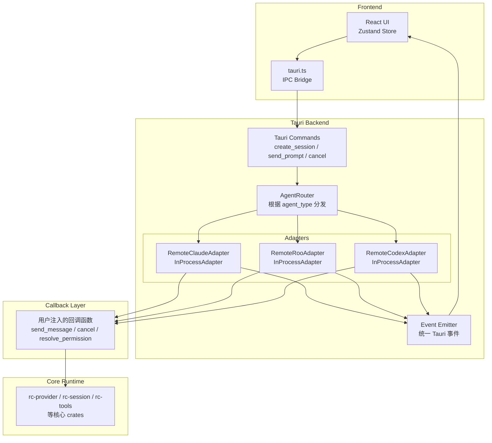

# Multi-Agent Architecture Design

> 将 remote-code-gui 从单一 Agent（remote-code）扩展为支持多 Agent（remote-code、Roo Code、OpenAI Codex）的统一平台。
>
> **架构更新**: 所有三个 Agent 现在统一使用进程内回调模式，共享同一个 `InProcessAdapter` 实现。

---

## 1. 架构概述

### 1.1 核心设计原则

1. **统一回调模式** — 所有三个 Agent（Remote Code、Roo Code、Codex）使用相同的 `InProcessAdapter` 实现
2. **进程内执行** — 不启动子进程，直接在 Tauri 进程内通过回调函数调用 rc-* crates
3. **会话绑定 Agent** — 会话创建时选定 Agent 类型，之后不可更改
4. **统一事件模型** — 所有 Agent 的事件通过 `UnifiedAgentEvent` 标准化
5. **零外部依赖** — 不需要独立的 Agent 二进制文件

### 1.2 系统架构图



---

## 2. 核心组件

### 2.1 InProcessAdapter

所有三个 Agent 共享同一个适配器实现：

```rust
// crates/claude/rc-agent-protocol/src/adapters/in_process.rs

pub struct InProcessAdapter {
    pub(crate) info: AgentInfo,
    pub(crate) status: AgentStatus,
    pub(crate) agent_type: AgentType,
    pub(crate) on_send_message: Option<SendMessageFn>,
    pub(crate) on_cancel: Option<CancelFn>,
    pub(crate) on_resolve_permission: Option<ResolvePermissionFn>,
}

impl InProcessAdapter {
    /// 创建 Remote Claude 适配器
    #[must_use]
    pub fn new_claude() -> Self { ... }
    
    /// 创建 Remote Roo 适配器
    #[must_use]
    pub fn new_roo() -> Self { ... }
    
    /// 创建 Remote Codex 适配器
    #[must_use]
    pub fn new_codex() -> Self { ... }
    
    /// 注入 send_message 回调
    #[must_use]
    pub fn with_send_message<F>(mut self, f: F) -> Self { ... }
    
    /// 注入 cancel 回调
    #[must_use]
    pub fn with_cancel<F>(mut self, f: F) -> Self { ... }
    
    /// 注入 resolve_permission 回调
    #[must_use]
    pub fn with_resolve_permission<F>(mut self, f: F) -> Self { ... }
}
```

### 2.2 三个 Agent 类型别名

每个 Agent 类型是 `InProcessAdapter` 的类型别名：

```rust
// crates/claude/rc-agent-protocol/src/adapters/remote_claude.rs
pub type RemoteClaudeAdapter = InProcessAdapter;

// crates/claude/rc-agent-protocol/src/adapters/remote_roo.rs
pub type RemoteRooAdapter = InProcessAdapter;

// crates/claude/rc-agent-protocol/src/adapters/remote_codex.rs
pub type RemoteCodexAdapter = InProcessAdapter;
```

### 2.3 AgentAdapter Trait

```rust
// crates/claude/rc-agent-protocol/src/adapter.rs

#[async_trait]
pub trait AgentAdapter: Send + Sync {
    async fn start(&mut self, config: &AgentConfig) -> Result<()>;
    async fn send_message(&mut self, session_id: &str, message: &str) -> Result<mpsc::Receiver<UnifiedAgentEvent>>;
    async fn cancel(&mut self, session_id: &str) -> Result<()>;
    async fn resolve_permission(&mut self, session_id: &str, request_id: &str, decision: PermissionDecision) -> Result<()>;
    async fn stop(&mut self) -> Result<()>;
    fn is_alive(&self) -> bool;
    fn info(&self) -> &AgentInfo;
    fn agent_type(&self) -> AgentType;
}
```

### 2.4 统一的 Agent 事件

```rust
// crates/claude/rc-agent-protocol/src/events.rs

#[derive(Debug, Clone, Serialize, Deserialize)]
pub enum UnifiedAgentEvent {
    // 生命周期
    Started { session_id: String },
    Completed { session_id: String, result: AgentResult },
    
    // 消息流
    MessageDelta { session_id: String, delta: String },
    
    // 工具调用
    ToolCallStarted { session_id: String, call_id: String, name: String, input: Value },
    ToolCallProgress { session_id: String, call_id: String, message: String },
    ToolCallCompleted { session_id: String, call_id: String, output: String, is_error: bool },
    
    // 上下文管理
    ContextUsage { session_id: String, estimated_tokens: usize, max_tokens: usize, ratio: f64 },
    ContextOverflow { session_id: String },
    ContextCompacted { session_id: String, entries_removed: usize },
    
    // 子任务
    SubtaskStarted { session_id: String, task_id: String, description: String },
    SubtaskProgress { session_id: String, task_id: String, progress: String },
    SubtaskCompleted { session_id: String, task_id: String, success: bool },
    
    // 错误
    Error { session_id: String, message: String },
}
```

---

## 3. 回调注入模式

### 3.1 使用示例

```rust
// 在 GUI 后端注入回调

let adapter = RemoteClaudeAdapter::new_claude()
    .with_send_message(|session_id, message| {
        // 调用 rc-query-engine 或其他核心逻辑
        // 返回 UnifiedAgentEvent 列表
        Ok(vec![
            UnifiedAgentEvent::MessageDelta { 
                session_id: session_id.to_string(), 
                delta: "Processing...".to_string() 
            },
        ])
    })
    .with_cancel(|session_id| {
        // 取消当前操作
        Ok(())
    })
    .with_resolve_permission(|session_id, request_id, decision| {
        // 处理权限决策
        Ok(())
    });
```

### 3.2 回调签名

| 回调 | 签名 | 说明 |
|------|------|------|
| `send_message` | `Fn(&str, &str) -> Result<Vec<UnifiedAgentEvent>>` | 接收 session_id 和消息，返回事件列表 |
| `cancel` | `Fn(&str) -> Result<()>` | 取消指定会话的操作 |
| `resolve_permission` | `Fn(&str, &str, PermissionDecision) -> Result<()>` | 处理权限决策 |

---

## 4. AgentRouter

```rust
// crates/claude/rc-agent-protocol/src/router.rs

pub struct AgentRouter {
    adapters: HashMap<String, Box<dyn AgentAdapter>>,
}

impl AgentRouter {
    pub fn new() -> Self { ... }
    
    /// 创建适配器实例
    pub fn create_adapter(config: &AgentConfig) -> Result<Box<dyn AgentAdapter>> {
        match config.agent_type {
            AgentType::RemoteClaude => Ok(Box::new(RemoteClaudeAdapter::new_claude())),
            AgentType::RemoteRoo => Ok(Box::new(RemoteRooAdapter::new_roo())),
            AgentType::RemoteCodex => Ok(Box::new(RemoteCodexAdapter::new_codex())),
        }
    }
    
    pub async fn send_message(&mut self, session_id: &str, message: &str) -> Result<mpsc::Receiver<UnifiedAgentEvent>> { ... }
    pub async fn cancel(&mut self, session_id: &str) -> Result<()> { ... }
    pub async fn resolve_permission(&mut self, session_id: &str, request_id: &str, decision: PermissionDecision) -> Result<()> { ... }
    pub async fn close_session(&mut self, session_id: &str) -> Result<()> { ... }
}
```

---

## 5. GUI 集成

### 5.1 前端类型

```typescript
// apps/remote-code-gui/src/lib/types.ts

export type AgentType = 'remote-code' | 'roo-code' | 'codex';

export interface SessionSummary {
  id: string;
  title: string;
  cwd: string;
  provider_name: string;
  model: string | null;
  created_at: string;
  updated_at: string;
  archived: boolean;
  agent_type: AgentType;
}

export interface AgentInfo {
  type: AgentType;
  display_name: string;
  description: string;
  installed: boolean;
  icon: string | null;
}
```

### 5.2 Tauri 命令

```rust
// apps/remote-code-gui/src-tauri/src/lib.rs

#[tauri::command]
async fn create_session(
    state: State<'_, AppState>,
    title: Option<String>,
    project_path: Option<String>,
    agent_type: Option<String>,
) -> Result<String, String> {
    let agent_type = parse_agent_type(agent_type).unwrap_or(AgentType::RemoteCode);
    // ... 创建会话
}

#[tauri::command]
async fn list_agents(state: State<'_, AppState>) -> Result<Vec<AgentInfoDto>, String> {
    // 返回可用 Agent 列表
}
```

### 5.3 UI 组件

**Agent 选择器**:

```
┌─────────────────────────────────────┐
│  新建会话                            │
│                                     │
│  项目: [/path/to/project    ▼]      │
│                                     │
│  Agent:                             │
│  ┌─────────────────────────────┐    │
│  │ ⚡ Remote Code  (默认)      │    │
│  │ 🦘 Roo Code                 │    │
│  │ 🤖 OpenAI Codex             │    │
│  └─────────────────────────────┘    │
│                                     │
│  会话标题: [可选                    ] │
│                                     │
│         [取消]     [创建会话]        │
└─────────────────────────────────────┘
```

---

## 6. 事件流

### 6.1 完整流程

```
1. 用户在前端创建会话，选择 Agent 类型
2. GUI 调用 create_session Tauri 命令
3. 后端创建对应类型的适配器，注入回调函数
4. 用户发送消息 → send_prompt 命令
5. 回调函数执行核心逻辑（rc-query-engine 等）
6. 返回 UnifiedAgentEvent 列表
7. 事件通过 mpsc channel 流式发送给前端
8. 前端渲染事件（文本增量、工具调用、权限请求等）
```

### 6.2 事件映射

| UnifiedAgentEvent | Tauri 事件 | 前端处理 |
|-------------------|------------|----------|
| `MessageDelta` | `streaming_delta` | 追加文本到消息 |
| `ToolCallStarted` | `tool_start` | 显示工具调用开始 |
| `ToolCallProgress` | `tool_progress` | 更新工具进度 |
| `ToolCallCompleted` | `tool_result` | 显示工具结果 |
| `ContextUsage` | `context-usage` | 更新 token 使用 |
| `SubtaskStarted` | `subtask-started` | 显示子任务 |
| `Error` | `error` | 显示错误消息 |

---

## 7. 权限处理

所有 Agent 使用相同的权限流程：

```
1. 工具执行前检查权限
2. 如果需要审批，发射 PermissionRequest 事件
3. 前端显示审批弹窗
4. 用户选择允许/拒绝
5. 调用 resolve_permission 命令
6. 回调函数处理决策
7. 继续或中止工具执行
```

---

## 8. 健康检查与重启

### 8.1 健康检查

```rust
// crates/claude/rc-agent-protocol/src/health.rs

pub struct HealthChecker {
    // 健康状态追踪
}

impl HealthChecker {
    pub fn check_alive(&mut self, adapter: &dyn AgentAdapter) -> HealthStatus { ... }
    pub fn is_healthy(&self) -> bool { ... }
}
```

### 8.2 重启策略

```rust
// crates/claude/rc-agent-protocol/src/restart.rs

pub struct RestartTracker {
    max_restarts: usize,
    backoff_ms: u64,
}

impl RestartTracker {
    pub fn request_restart(&mut self) -> bool { ... }
    pub fn get_backoff_ms(&self) -> u64 { ... }
}
```

---

## 9. 文件结构

```
crates/
├── rc-agent-protocol/
│   ├── Cargo.toml
│   └── src/
│       ├── lib.rs                    # 导出核心类型
│       ├── adapter.rs                # AgentAdapter trait
│       ├── events.rs                 # UnifiedAgentEvent
│       ├── types.rs                  # AgentType, AgentConfig, AgentInfo
│       ├── error.rs                  # 错误类型
│       ├── permission.rs             # 权限相关类型
│       ├── health.rs                 # 健康检查
│       ├── restart.rs                # 重启策略
│       ├── router.rs                 # AgentRouter
│       ├── jsonrpc.rs                # JSON-RPC 工具（如需）
│       └── adapters/
│           ├── mod.rs
│           ├── in_process.rs         # 统一的 InProcessAdapter 实现
│           ├── remote_claude.rs      # RemoteClaudeAdapter 类型别名
│           ├── remote_roo.rs         # RemoteRooAdapter 类型别名
│           └── remote_codex.rs       # RemoteCodexAdapter 类型别名

apps/remote-code-gui/
├── src-tauri/
│   └── src/
│       ├── lib.rs                    # Tauri 命令（已移除 AgentRouter 相关代码）
│       └── query_engine_gui.rs       # GUI 查询引擎
└── src/
    ├── lib/
    │   ├── types.ts                  # 前端类型定义
    │   └── tauri.ts                  # Tauri IPC
    └── components/
        └── AgentSelector.tsx         # Agent 选择器组件
```

---

## 10. 测试策略

### 10.1 单元测试

- `rc-agent-protocol` crate 有 58 个测试
- 测试适配器创建、回调注入、事件序列化等

### 10.2 集成测试

- 验证回调注入模式
- 测试事件流完整性
- 验证权限流程

### 10.3 回归测试

- 确保所有现有功能正常工作
- 860+ 测试全部通过
- Clippy 零警告

---

## 11. 性能考虑

| 指标 | 值 | 说明 |
|------|---|------|
| 启动时间 | 0ms | 无需启动子进程 |
| 事件延迟 | <1ms | 进程内直接调用 |
| 额外内存 | 0 | 共享进程内存 |
| CPU 开销 | 最低 | 无 IPC 开销 |

---

## 12. 未来扩展

### 12.1 新增 Agent 类型

1. 在 `AgentType` 枚举中添加新变体
2. 在 `InProcessAdapter` 中添加工厂函数（如 `new_cursor()`）
3. 在 `AgentRouter` 中注册
4. 在前端添加选项

### 12.2 插件系统

未来可以考虑将回调逻辑做成插件：
- 每个 Agent 的回调逻辑作为独立模块
- 通过配置文件注册
- 动态加载

---

## 13. 变更历史

| 日期 | 变更 | 说明 |
|------|------|------|
| 2026-04-28 | 统一为进程内回调模式 | 删除子进程架构，三个 Agent 共享 InProcessAdapter |
| 2026-04-28 | 删除 2128 行代码 | 移除 AgentRouter、健康检查、重启追踪器等 |
| 2026-04-28 | 简化架构 | 不再需要独立 Agent 二进制文件 |

---

> **注意**: 本文档已更新以反映当前架构。旧的子进程架构文档已过时。
