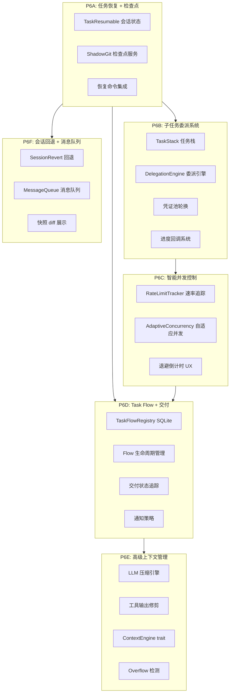

# Phase 6: Competitive Supremacy — 全面超越竞品实施计划

> 生成日期：2026-04-11
> 基于深度分析：hermes-agent, opencode, openclaw, Roo-Code
> 目标：在所有方面超越上述4个项目 + 之前分析的15个项目

---

## 一、竞品核心优势总结

### 1.1 各项目最强特性

| 项目 | 最强特性 | 我们当前状态 |
|------|---------|-------------|
| **Roo-Code** | 任务恢复 + 子任务栈 + 智能并发控制 | ❌ 无恢复，子任务基础 |
| **hermes-agent** | 子代理委派 + Shadow Git 检查点 | ❌ 无检查点，委派简单 |
| **opencode** | 会话回退 + LLM压缩 + 快照系统 | ❌ 无回退，压缩为规则型 |
| **openclaw** | Task Flow + Context Engine 插件 + 交付追踪 | ❌ 无Flow，上下文硬编码 |

### 1.2 我们独有的优势（需保持和强化）

- **Rust 原生性能**：启动 ~50ms，内存 ~20MB
- **分布式架构**：Control Plane + Runner 远程执行
- **故障转移**：多 Provider 自动切换
- **15 crate 模块化**：清晰的架构边界
- **8 种压缩策略**：比竞品更丰富（但缺少 LLM 压缩）

---

## 二、功能差距分析

### 2.1 任务恢复系统 — Roo-Code 核心特性

**Roo-Code 实现**（`Task.ts` ~4700行）：
```
resumeTaskFromHistory() 流程：
1. 加载保存的 API 对话消息
2. 移除之前的恢复伪影
3. 检测中断的工具调用 → 填充 "Task was interrupted" 占位结果
4. 处理压缩摘要
5. 询问用户确认恢复
6. 调用 initiateTaskLoop() 继续执行
```

**我们当前状态**：
- ✅ 有 [`SessionStore`](crates/rc-session/src/lib.rs:1) SQLite + NDJSON 持久化
- ✅ 有 `resume` CLI 命令（但只是加载历史，不恢复执行状态）
- ❌ 不保存中断时的执行状态（pending tool calls）
- ❌ 不填充中断工具结果
- ❌ 不恢复对话循环

### 2.2 子任务/委派系统 — Roo-Code + hermes-agent

**hermes-agent 实现**（`delegate_tool.py`）：
```
- ThreadPoolExecutor 并行执行
- MAX_CONCURRENT_CHILDREN = 3
- MAX_DEPTH = 2（parent→child→grandchild 被拒绝）
- DELEGATE_BLOCKED_TOOLS: delegate_task, clarify, memory, send_message, execute_code
- 凭证池共享/轮换处理速率限制
- 进度回调中继到父级显示
```

**Roo-Code 实现**（`Task.ts`）：
```
- startSubtask() → delegateParentAndOpenChild()
- 父任务暂停，子任务运行
- resumeAfterDelegation() 子任务完成后恢复父任务
- LIFO 任务栈管理嵌套任务
- 子任务获得隔离上下文 + 聚焦系统提示
```

**我们当前状态**：
- ✅ 有 [`agent_tool`](crates/rc-tools/src/agent.rs:1) 基础子代理（5轮循环）
- ✅ 有 [`SubAgentCompletion`](crates/rc-core/src/lib.rs:515) trait
- ✅ 有 [`AgentScheduler`](crates/rc-agents/src/lib.rs:1) 多代理调度器
- ❌ 无深度限制
- ❌ 无阻止工具继承
- ❌ 无并行执行
- ❌ 无凭证池轮换
- ❌ 无任务栈
- ❌ 无进度回调

### 2.3 智能并发控制 — Roo-Code 独有

**Roo-Code 实现**：
```
maybeWaitForProviderRateLimit():
- 检测 provider 是否繁忙
- 繁忙时将子任务从并行切换为串行
- 指数退避 + 倒计时 UX
- 避免 retry-failure 死循环
```

**我们当前状态**：
- ✅ 有 [`compute_retry_delay()`](crates/rc-provider/src/lib.rs:542) 基础退避
- ✅ 有 [`classify_provider_error()`](crates/rc-provider/src/lib.rs:1167) 错误分类
- ❌ 无速率限制感知
- ❌ 无自适应并发
- ❌ 无倒计时 UX

### 2.4 检查点/快照系统 — hermes-agent + opencode

**hermes-agent 实现**（`checkpoint_manager.py`）：
```
- Shadow git 仓库: ~/.hermes/checkpoints/{sha256(dir)[:16]}/
- GIT_DIR + GIT_WORK_TREE 分离（不污染用户项目）
- 文件变更前自动快照
- 回滚到任意检查点
- 每目录每轮去重
- 最多50个快照/目录
```

**opencode 实现**（`revert.ts`）：
```
- Snapshot 服务 + Patch 跟踪
- revert() 回退到特定消息/part
- unrevert() 撤销回退
- cleanup() 清理回退后的消息
- diff 计算和展示
```

**我们当前状态**：
- ✅ 有 [`git.rs`](crates/rc-tools/src/git.rs) 基础 git 工具
- ❌ 无 Shadow Git 检查点
- ❌ 无自动快照
- ❌ 无回滚功能
- ❌ 无 diff 查看

### 2.5 会话回退 — opencode 独有

**opencode 实现**（`revert.ts`）：
```
revert() 流程：
1. 找到目标消息
2. 收集该消息之后的所有 patches
3. 通过 Snapshot 服务回退文件变更
4. 计算 diff
5. 更新会话状态
```

**我们当前状态**：
- ❌ 无回退功能
- ❌ 无快照服务

### 2.6 Task Flow 系统 — openclaw 独有

**openclaw 实现**（`task-executor.ts` + `task-flow-registry.types.ts`）：
```
- TaskFlow: managed/task_mirrored 同步模式
- Flow 状态: queued/running/waiting/blocked/succeeded/failed/cancelled/lost
- Task 交付状态追踪: pending/delivered/session_queued/failed
- Flow 取消 → 取消所有子任务 → 清理
- 重试被阻塞的 Flow
- SQLite 持久化
- 通知策略: done_only/state_changes/silent
```

**我们当前状态**：
- ✅ 有 [`BackgroundTask`](crates/rc-tools/src/tasks.rs:18) 简单内存任务
- ❌ 无 Flow 概念
- ❌ 无持久化（内存 HashMap）
- ❌ 无交付追踪
- ❌ 无取消/重试

### 2.7 LLM 压缩 — opencode 独有

**opencode 实现**（`compaction.ts`）：
```
- 使用 LLM 生成结构化摘要
- 模板: Goal / Instructions / Discoveries / Accomplished / Files
- prune(): 移除旧工具输出释放上下文
- overflow 检测: token 数接近模型限制时触发
- 自动压缩 + continue 提示
```

**我们当前状态**：
- ✅ 有 [`ContextWindowManager`](crates/rc-provider/src/context.rs:119) 8种策略
- ✅ 有 `auto_compact` / `compact_on_error` / `sliding_window_compact`
- ❌ 无 LLM 生成摘要
- ❌ 无工具输出修剪
- ❌ 无 overflow 检测

### 2.8 Context Engine 插件 — openclaw 独有

**openclaw 实现**（`context-engine/types.ts`）：
```
ContextEngine trait:
- bootstrap() / ingest() / assemble() / compact() / maintain()
- prepareSubagentSpawn() + onSubagentEnded()
- Prompt cache 观测
- Transcript rewrite 维护
```

**我们当前状态**：
- ❌ 上下文管理硬编码在 `ContextWindowManager`
- ❌ 无插件接口
- ❌ 无子代理上下文准备

### 2.9 消息队列 — Roo-Code 独有

**Roo-Code 实现**：
```
MessageQueueService:
- 工具执行期间排队用户消息
- 工具完成/压缩后处理排队的消息
- 防止消息丢失
```

**我们当前状态**：
- ❌ 无消息队列
- ❌ 工具执行期间用户输入被忽略

---

## 三、Phase 6 实施路线图

### 架构总览



---

### P6A: 任务恢复 + 检查点系统

**目标**：实现 Roo-Code 的恢复任务 + hermes-agent 的 Shadow Git 检查点

#### P6A-1: 可恢复会话状态

在 [`rc-session`](crates/rc-session/src/lib.rs) 中扩展会话持久化：

```rust
// 新增: rc-session/src/resumable.rs
pub struct ResumableState {
    /// 最后一个 assistant 消息的 ID
    pub last_assistant_msg_id: Option<String>,
    /// 待处理的工具调用（中断时尚未返回结果的）
    pub pending_tool_calls: Vec<PendingToolCall>,
    /// 压缩摘要（如果有的话）
    pub condensation_summary: Option<String>,
    /// 恢复次数
    pub resume_count: u32,
    /// 任务是否完成
    pub task_completed: bool,
}

pub struct PendingToolCall {
    pub call_id: String,
    pub tool_name: String,
    pub tool_input: serde_json::Value,
}
```

**关键实现点**：
1. 每次工具调用前保存 `pending_tool_calls` 到会话存储
2. 工具调用完成后从 `pending_tool_calls` 中移除
3. 恢复时检测未完成的工具调用，填充占位结果
4. 在 [`run_prompt()`](apps/remote-code/src/conversation.rs:287) 中添加恢复路径

#### P6A-2: Shadow Git 检查点服务

新建 `crates/rc-checkpoint/` crate：

```rust
// rc-checkpoint/src/lib.rs
pub struct CheckpointService {
    /// Shadow git 仓库根目录: ~/.remote-code/checkpoints/{hash}/
    shadow_root: PathBuf,
    /// 工作目录
    work_dir: PathBuf,
    /// 最大快照数
    max_snapshots: usize,
}

impl CheckpointService {
    /// 创建检查点（文件变更前自动调用）
    pub fn save_checkpoint(&self, label: &str) -> Result<CheckpointId>;
    
    /// 列出所有检查点
    pub fn list_checkpoints(&self) -> Result<Vec<CheckpointInfo>>;
    
    /// 回滚到指定检查点
    pub fn restore(&self, id: CheckpointId) -> Result<()>;
    
    /// 计算当前状态与检查点的 diff
    pub fn diff(&self, id: CheckpointId) -> Result<String>;
    
    /// 清理旧检查点
    pub fn prune(&self) -> Result<usize>;
}
```

**关键实现点**：
1. Shadow Git: `GIT_DIR` + `GIT_WORK_TREE` 环境变量分离
2. 检查点目录: `~/.remote-code/checkpoints/{sha256(workspace)[:16]}/`
3. 在 [`execute_tool_call()`](crates/rc-tools/src/lib.rs:234) 中，文件变更工具前自动保存检查点
4. 每 turn 开始时重置去重标记
5. 最多50个快照/目录

#### P6A-3: 恢复命令集成

在 CLI 和 TUI 中添加恢复支持：

- `remote-code resume <session-id>` — 从上次中断处恢复
- TUI 中添加 `/resume` 斜杠命令
- 恢复流程：加载会话 → 检测中断点 → 填充占位结果 → 继续循环

---

### P6B: 子任务委派系统

**目标**：超越 hermes-agent 的委派 + Roo-Code 的子任务栈

#### P6B-1: 任务栈管理

在 [`rc-core`](crates/rc-core/src/lib.rs) 中新增：

```rust
// rc-core/src/task_stack.rs
pub struct TaskStack {
    tasks: Vec<TaskFrame>,
}

pub struct TaskFrame {
    pub task_id: String,
    pub conversation: Vec<ConversationEntry>,
    pub pending_tool_calls: Vec<ToolCall>,
    pub depth: u32,
    pub parent_task_id: Option<String>,
    pub state: TaskFrameState,
}

pub enum TaskFrameState {
    Running,
    PausedForChild,
    Completed,
    Failed(String),
}
```

**关键实现点**：
1. LIFO 栈结构，支持嵌套子任务
2. 父任务暂停等待子任务完成
3. 子任务完成后恢复父任务
4. 最大深度限制（默认3层）

#### P6B-2: 委派引擎

增强 [`agent_tool`](crates/rc-tools/src/agent.rs)：

```rust
// rc-tools/src/delegate.rs
pub struct DelegationConfig {
    /// 最大并发子代理数
    pub max_concurrent: usize,
    /// 最大深度
    pub max_depth: u32,
    /// 子代理被阻止的工具列表
    pub blocked_tools: Vec<String>,
    /// 每个子代理最大轮次
    pub max_turns_per_child: u32,
    /// 超时秒数
    pub timeout_secs: u64,
}

pub struct DelegationEngine {
    config: DelegationConfig,
    credential_pool: CredentialPool,
}

impl DelegationEngine {
    /// 单个子任务委派
    pub async fn delegate_single(&self, task: &str, context: &DelegationContext) -> Result<DelegationResult>;
    
    /// 批量并行委派
    pub async fn delegate_batch(&self, tasks: &[String], context: &DelegationContext) -> Result<Vec<DelegationResult>>;
    
    /// 构建子代理系统提示
    fn build_child_prompt(&self, task: &str, context: &DelegationContext) -> String;
}
```

**关键实现点**：
1. `blocked_tools`: `["agent", "delegate", "send_message"]` — 子代理不能再委派
2. `tokio::task::JoinSet` 并行执行（比 Python ThreadPoolExecutor 更高效）
3. 每个子代理获得隔离的对话上下文
4. 凭证池轮换避免速率限制
5. 进度回调通过 [`UiEvent`](crates/rc-ui-bridge/src/lib.rs:58) 发送到前端

#### P6B-3: 凭证池管理

```rust
// rc-provider/src/credential_pool.rs
pub struct CredentialPool {
    credentials: Vec<CredentialEntry>,
    current_index: AtomicUsize,
}

pub struct CredentialEntry {
    pub api_key: String,
    pub provider: String,
    pub model: Option<String>,
    pub rate_limit_remaining: AtomicU64,
    pub rate_limit_reset_at: Mutex<Instant>,
}
```

---

### P6C: 智能并发控制

**目标**：超越 Roo-Code 的速率限制感知调度

#### P6C-1: 速率限制追踪器

```rust
// rc-provider/src/rate_limiter.rs
pub struct RateLimitTracker {
    /// 每个 provider 的速率限制状态
    provider_states: DashMap<String, ProviderRateState>,
}

pub struct ProviderRateState {
    /// 是否当前受限
    pub is_limited: bool,
    /// 限制重置时间
    pub reset_at: Option<Instant>,
    /// 连续失败次数
    pub consecutive_failures: u32,
    /// 最后一次 429 错误时间
    pub last_429_at: Option<Instant>,
}
```

#### P6C-2: 自适应并发控制器

```rust
// rc-agents/src/concurrency.rs
pub struct AdaptiveConcurrency {
    /// 当前最大并发数
    current_max: AtomicU32,
    /// 配置的最大并发数
    configured_max: u32,
    /// 速率限制追踪器
    rate_tracker: Arc<RateLimitTracker>,
}

impl AdaptiveConcurrency {
    /// 获取当前允许的并发数
    /// - provider 空闲时: configured_max
    /// - provider 繁忙时: 1（串行）
    pub fn current_concurrency(&self) -> u32;
    
    /// 报告请求成功
    pub fn report_success(&self);
    
    /// 报告速率限制（429）
    pub fn report_rate_limited(&self, retry_after: Option<Duration>);
    
    /// 报告其他错误
    pub fn report_error(&self);
}
```

#### P6C-3: 退避倒计时 UX

在 TUI 中显示退避状态：
```
⏳ Provider rate limited, retrying in 5s...
⏳ Provider rate limited, retrying in 4s...
⏳ Provider rate limited, retrying in 3s...
```

---

### P6D: Task Flow 系统

**目标**：超越 openclaw 的 Task Flow + 交付追踪

#### P6D-1: TaskFlowRegistry — SQLite 持久化

新建 `crates/rc-flow/` crate：

```rust
// rc-flow/src/lib.rs
pub struct TaskFlowRegistry {
    db: Connection,
}

pub struct TaskFlow {
    pub flow_id: String,
    pub sync_mode: FlowSyncMode,
    pub owner_key: String,
    pub status: FlowStatus,
    pub goal: String,
    pub current_step: Option<String>,
    pub notify_policy: NotifyPolicy,
    pub created_at: DateTime<Utc>,
    pub updated_at: DateTime<Utc>,
}

pub enum FlowSyncMode {
    /// 任务镜像模式 — 任务状态自动同步到 flow
    TaskMirrored,
    /// 管理模式 — flow 管理子任务的生命周期
    Managed,
}

pub enum FlowStatus {
    Queued, Running, Waiting, Blocked,
    Succeeded, Failed, Cancelled, Lost,
}
```

#### P6D-2: Flow 生命周期管理

```rust
impl TaskFlowRegistry {
    /// 创建 flow 并关联第一个任务
    pub fn create_flow(&self, goal: &str, owner: &str) -> Result<TaskFlow>;
    
    /// 在 flow 中运行新任务
    pub fn run_task_in_flow(&self, flow_id: &str, task: TaskSpec) -> Result<TaskRecord>;
    
    /// 取消 flow（级联取消所有子任务）
    pub async fn cancel_flow(&self, flow_id: &str) -> Result<CancelResult>;
    
    /// 重试被阻塞的 flow
    pub fn retry_blocked_flow(&self, flow_id: &str) -> Result<RetryResult>;
    
    /// 获取 flow 的任务摘要
    pub fn flow_summary(&self, flow_id: &str) -> Result<FlowSummary>;
}
```

#### P6D-3: 交付状态追踪

```rust
pub enum DeliveryStatus {
    Pending,
    Delivered,
    SessionQueued,
    Failed,
    NotApplicable,
}

pub enum NotifyPolicy {
    DoneOnly,
    StateChanges,
    Silent,
}
```

---

### P6E: 高级上下文管理

**目标**：超越 opencode 的 LLM 压缩 + openclaw 的 Context Engine 插件

#### P6E-1: LLM 压缩引擎

在 [`context.rs`](crates/rc-provider/src/context.rs) 中新增：

```rust
impl ContextWindowManager {
    /// LLM 驱动的智能压缩
    /// 使用较小/便宜的模型生成结构化摘要
    pub async fn llm_compact(
        &self,
        conversation: &[ConversationEntry],
        client: &ProviderClient,
        provider: &ProviderConfig,
    ) -> Result<Vec<ConversationEntry>> {
        // 1. 提取需要压缩的历史消息
        // 2. 构建结构化摘要提示（Goal/Instructions/Discoveries/Accomplished/Files）
        // 3. 调用 LLM 生成摘要
        // 4. 替换历史消息为摘要
        // 5. 保留最近的 N 轮对话
    }
    
    /// 工具输出修剪 — 移除旧的工具输出释放上下文
    pub fn prune_tool_outputs(
        &self,
        conversation: &[ConversationEntry],
        protect_recent_tokens: u64,
    ) -> Vec<ConversationEntry>;
}
```

#### P6E-2: Overflow 检测

```rust
pub fn detect_overflow(
    tokens: &UsageSummary,
    model_info: &ModelInfo,
    reserved: u64,
) -> bool {
    let total = tokens.input_tokens + tokens.output_tokens;
    let usable = model_info.context_window.saturating_sub(reserved);
    total >= usable
}
```

#### P6E-3: ContextEngine trait

```rust
// rc-core/src/context_engine.rs
pub trait ContextEngine: Send + Sync {
    /// 引擎信息
    fn info(&self) -> ContextEngineInfo;
    
    /// 初始化会话上下文
    fn bootstrap(&self, session_id: &str) -> Result<BootstrapResult>;
    
    /// 摄入消息
    fn ingest(&self, session_id: &str, message: &ConversationEntry) -> Result<()>;
    
    /// 组装模型上下文
    fn assemble(&self, session_id: &str, budget: u64) -> Result<Vec<ConversationEntry>>;
    
    /// 压缩上下文
    fn compact(&self, session_id: &str, budget: u64) -> Result<CompactResult>;
    
    /// 维护（可选）
    fn maintain(&self, session_id: &str) -> Result<MaintainResult> { Ok(Default::default()) }
    
    /// 子代理生成准备（可选）
    fn prepare_subagent(&self, parent: &str, child: &str) -> Result<Option<SubagentPrep>> { Ok(None) }
}
```

---

### P6F: 会话回退 + 消息队列

#### P6F-1: SessionRevert

```rust
// rc-session/src/revert.rs
pub struct SessionRevert {
    checkpoint: Arc<CheckpointService>,
    store: Arc<SessionStore>,
}

impl SessionRevert {
    /// 回退到指定消息 — 撤销该消息之后的所有文件变更和对话
    pub async fn revert_to(&self, session_id: &str, message_id: &str) -> Result<RevertResult>;
    
    /// 撤销回退
    pub async fn unrevert(&self, session_id: &str) -> Result<RevertResult>;
    
    /// 清理回退后的消息
    pub async fn cleanup_after_revert(&self, session_id: &str) -> Result<()>;
}
```

#### P6F-2: MessageQueue

```rust
// rc-core/src/message_queue.rs
pub struct MessageQueue {
    queue: VecDeque<QueuedMessage>,
}

pub struct QueuedMessage {
    pub content: String,
    pub attachments: Vec<Attachment>,
    pub queued_at: Instant,
}

impl MessageQueue {
    /// 排队用户消息（工具执行期间调用）
    pub fn enqueue(&mut self, content: String, attachments: Vec<Attachment>);
    
    /// 取出所有排队的消息（工具完成/压缩后调用）
    pub fn drain(&mut self) -> Vec<QueuedMessage>;
    
    /// 是否有待处理的消息
    pub fn has_pending(&self) -> bool;
}
```

---

## 四、实施优先级

### 优先级排序原则
1. **用户可见价值**：直接改善用户体验的功能优先
2. **依赖关系**：被其他功能依赖的基础设施优先
3. **竞品差距**：与竞品差距最大的领域优先
4. **实现复杂度**：在同等价值下，更简单的优先

### 实施顺序

| 阶段 | 功能 | 依赖 | 新建/修改 Crate |
|------|------|------|----------------|
| **P6A** | 任务恢复 + 检查点 | 无 | 新建 `rc-checkpoint`，修改 `rc-session`、`rc-tools`、`conversation.rs` |
| **P6B** | 子任务委派系统 | P6A | 修改 `rc-tools/agent.rs`、`rc-core`、`rc-provider` |
| **P6C** | 智能并发控制 | P6B | 修改 `rc-provider`、`rc-agents`、`rc-tui` |
| **P6D** | Task Flow 系统 | P6B | 新建 `rc-flow`，修改 `rc-tools/tasks.rs` |
| **P6E** | 高级上下文管理 | P6D | 修改 `rc-provider/context.rs`、`rc-core` |
| **P6F** | 会话回退 + 消息队列 | P6A | 修改 `rc-session`、`rc-core`、`rc-tui` |

### 每个 P6 子阶段的详细 TODO

#### P6A: 任务恢复 + 检查点

- [ ] P6A-1: 新建 `crates/rc-checkpoint/` crate
  - [ ] 实现 `CheckpointService` 结构体
  - [ ] 实现 Shadow Git 初始化（`GIT_DIR` + `GIT_WORK_TREE`）
  - [ ] 实现 `save_checkpoint()` — `git add -A && git commit`
  - [ ] 实现 `list_checkpoints()` — `git log --oneline`
  - [ ] 实现 `restore()` — `git checkout`
  - [ ] 实现 `diff()` — `git diff`
  - [ ] 实现 `prune()` — 清理旧快照
  - [ ] 单元测试
- [ ] P6A-2: 扩展 `rc-session` 支持可恢复状态
  - [ ] 新增 `ResumableState` 结构体
  - [ ] 新增 `PendingToolCall` 结构体
  - [ ] 修改 `SessionStore` 保存/加载 `ResumableState`
  - [ ] 在 NDJSON 中记录工具调用状态变更事件
  - [ ] 单元测试
- [ ] P6A-3: 修改 `rc-tools` 集成检查点
  - [ ] 在文件变更工具前调用 `checkpoint.save_checkpoint()`
  - [ ] 工具执行前后更新 `ResumableState.pending_tool_calls`
  - [ ] 集成测试
- [ ] P6A-4: 实现恢复流程
  - [ ] 新增 `resume_session()` 函数
  - [ ] 加载会话 → 检测中断 → 填充占位结果 → 继续循环
  - [ ] 修改 CLI `resume` 命令使用新恢复逻辑
  - [ ] TUI 添加 `/resume` 斜杠命令
  - [ ] 集成测试

#### P6B: 子任务委派系统

- [ ] P6B-1: 新增任务栈
  - [ ] 在 `rc-core` 新增 `TaskStack` 和 `TaskFrame`
  - [ ] 实现 push/pop/pause/resume 操作
  - [ ] 单元测试
- [ ] P6B-2: 实现委派引擎
  - [ ] 新增 `DelegationConfig` 和 `DelegationEngine`
  - [ ] 实现 `delegate_single()` — 单任务委派
  - [ ] 实现 `delegate_batch()` — `JoinSet` 并行执行
  - [ ] 实现 `build_child_prompt()` — 隔离上下文 + 聚焦提示
  - [ ] 实现阻止工具过滤
  - [ ] 深度限制检查
  - [ ] 单元测试
- [ ] P6B-3: 凭证池管理
  - [ ] 新增 `CredentialPool` 轮换逻辑
  - [ ] 支持多 API key 轮换
  - [ ] 单元测试
- [ ] P6B-4: 进度回调
  - [ ] 定义 `DelegationProgress` 事件类型
  - [ ] 通过 `UiEvent` 发送进度到前端
  - [ ] TUI 渲染子任务进度
  - [ ] 集成测试

#### P6C: 智能并发控制

- [ ] P6C-1: 速率限制追踪
  - [ ] 新增 `RateLimitTracker`
  - [ ] 从 API 响应头提取速率限制信息
  - [ ] 追踪连续失败次数
  - [ ] 单元测试
- [ ] P6C-2: 自适应并发
  - [ ] 新增 `AdaptiveConcurrency` 控制器
  - [ ] provider 空闲 → 并行，provider 繁忙 → 串行
  - [ ] 渐进恢复：串行 → 2并发 → 3并发 → ...
  - [ ] 单元测试
- [ ] P6C-3: 退避倒计时 UX
  - [ ] TUI 显示退避倒计时
  - [ ] `UiEvent::RateLimitWait` 事件
  - [ ] 集成测试

#### P6D: Task Flow 系统

- [ ] P6D-1: 新建 `crates/rc-flow/` crate
  - [ ] SQLite schema: flows 表 + tasks 表 + events 表
  - [ ] `TaskFlowRegistry` CRUD 操作
  - [ ] `TaskRecord` 完整类型定义
  - [ ] 单元测试
- [ ] P6D-2: Flow 生命周期
  - [ ] 创建 flow + 关联任务
  - [ ] `run_task_in_flow()` 管理模式
  - [ ] `cancel_flow()` 级联取消
  - [ ] `retry_blocked_flow()` 重试
  - [ ] `flow_summary()` 摘要
  - [ ] 单元测试
- [ ] P6D-3: 交付追踪
  - [ ] `DeliveryStatus` 状态机
  - [ ] `NotifyPolicy` 策略实现
  - [ ] 自动交付检查
  - [ ] 单元测试
- [ ] P6D-4: 替换现有 `tasks.rs`
  - [ ] 迁移 `BackgroundTask` 到 `TaskRecord`
  - [ ] 从内存 HashMap 迁移到 SQLite
  - [ ] 集成测试

#### P6E: 高级上下文管理

- [ ] P6E-1: LLM 压缩
  - [ ] 结构化摘要提示模板
  - [ ] `llm_compact()` 实现
  - [ ] 摘要后验证
  - [ ] 单元测试
- [ ] P6E-2: 工具输出修剪
  - [ ] `prune_tool_outputs()` 实现
  - [ ] 保护最近 N tokens 的工具输出
  - [ ] 单元测试
- [ ] P6E-3: Overflow 检测
  - [ ] `detect_overflow()` 实现
  - [ ] 自动触发压缩
  - [ ] 单元测试
- [ ] P6E-4: ContextEngine trait
  - [ ] 定义 trait 接口
  - [ ] 默认实现（使用现有 `ContextWindowManager`）
  - [ ] 插件注册机制
  - [ ] 单元测试

#### P6F: 会话回退 + 消息队列

- [ ] P6F-1: SessionRevert
  - [ ] `revert_to()` 实现
  - [ ] `unrevert()` 实现
  - [ ] `cleanup_after_revert()` 实现
  - [ ] TUI `/revert` 命令
  - [ ] 单元测试
- [ ] P6F-2: MessageQueue
  - [ ] `MessageQueue` 实现
  - [ ] TUI 输入处理集成
  - [ ] 工具完成后处理排队消息
  - [ ] 单元测试
- [ ] P6F-3: Diff 展示
  - [ ] TUI diff 渲染
  - [ ] 颜色高亮
  - [ ] 集成测试

---

## 五、新建 Crate 结构

```
crates/
├── rc-checkpoint/          # P6A: Shadow Git 检查点服务
│   ├── Cargo.toml
│   └── src/
│       └── lib.rs          # CheckpointService
├── rc-flow/                # P6D: Task Flow 系统
│   ├── Cargo.toml
│   └── src/
│       └── lib.rs          # TaskFlowRegistry + TaskRecord
└── (现有 crate 修改)
    ├── rc-core/            # +TaskStack, +ContextEngine trait, +MessageQueue
    ├── rc-session/         # +ResumableState, +SessionRevert
    ├── rc-provider/        # +RateLimitTracker, +CredentialPool, +LLM compact
    ├── rc-tools/           # +DelegationEngine, 增强agent.rs
    ├── rc-agents/          # +AdaptiveConcurrency
    └── rc-tui/             # +恢复/回退/进度 UX
```

---

## 六、超越竞品的独特优势

实施 Phase 6 后，remote-code-rust 将在以下方面超越所有竞品：

| 维度 | Roo-Code | hermes-agent | opencode | openclaw | **RCR (Phase 6)** |
|------|----------|-------------|----------|----------|-------------------|
| 任务恢复 | ✅ | ❌ | ❌ | ❌ | ✅ + 检查点回滚 |
| 子任务委派 | ✅ LIFO栈 | ✅ 并行+深度 | ❌ | ✅ Flow | ✅ 栈+并行+Flow |
| 并发控制 | ✅ 感知 | ❌ | ❌ | ❌ | ✅ 自适应 |
| 检查点 | ✅ git | ✅ shadow git | ✅ snapshot | ❌ | ✅ shadow git + diff |
| 会话回退 | ❌ | ❌ | ✅ | ❌ | ✅ + 检查点集成 |
| Task Flow | ❌ | ❌ | ❌ | ✅ SQLite | ✅ + 交付追踪 |
| LLM 压缩 | ❌ | ❌ | ✅ | ❌ | ✅ + 8种规则压缩 |
| Context Engine | ❌ | ❌ | ❌ | ✅ 插件 | ✅ trait + 插件 |
| 消息队列 | ✅ | ❌ | ❌ | ❌ | ✅ |
| 分布式架构 | ❌ | ❌ | ❌ | ❌ | ✅ 独有 |
| 故障转移 | ❌ | ❌ | ❌ | ❌ | ✅ 独有 |
| Rust 性能 | N/A | N/A | N/A | N/A | ✅ 独有 |

---

## 七、测试策略

每个 P6 子阶段都要求：
1. **单元测试**：每个新结构体和函数
2. **集成测试**：跨 crate 交互
3. **端到端测试**：完整的恢复/委派/回退流程
4. **回归测试**：确保现有 348+ 测试不被破坏

---

## 八、风险和缓解

| 风险 | 影响 | 缓解措施 |
|------|------|---------|
| Shadow Git 在 Windows 上可能有问题 | 高 | 提前在 Windows 上测试 git 操作 |
| LLM 压缩增加 API 成本 | 中 | 使用最便宜模型，仅在 overflow 时触发 |
| 子任务并行增加复杂度 | 中 | 渐进实现：先单任务，再并行 |
| SQLite Flow 性能 | 低 | 使用 WAL 模式，批量操作 |

---

## 九、定义完成标准

Phase 6 完成当：
- [ ] 所有 P6A~P6F 子阶段完成
- [ ] 所有新测试通过
- [ ] 现有 348+ 测试不被破坏
- [ ] `cargo clippy` 无警告
- [ ] 任务恢复可在 TUI 中演示
- [ ] 子任务委派可在 TUI 中演示
- [ ] 检查点保存/回滚可在 TUI 中演示
- [ ] ROADMAP.md 更新
