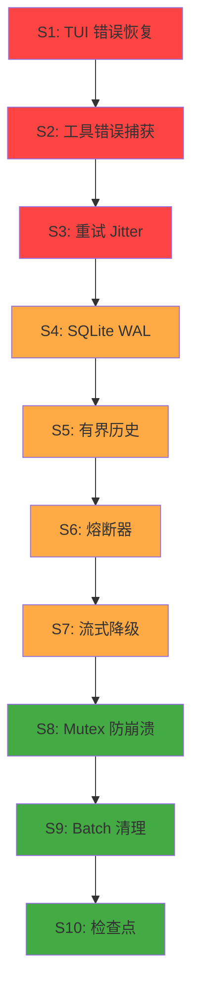

# 稳定性加固计划 — Stability Hardening Plan

> 目标：实现万无一失的超长时间稳定运行，即使持续数周也能保持最高质量的 CODING。

## 审计发现总览

经过对核心代码路径的全面审查，识别出 **12 个稳定性风险点**，按严重程度分为三级：

| 级别 | 数量 | 描述 |
|------|------|------|
| **P0 — 必须修复（会话崩溃）** | 3 | 单次瞬态错误导致整个会话终止 |
| **P1 — 应当修复（性能退化）** | 4 | 长时间运行后性能退化或资源耗尽 |
| **P2 — 建议修复（鲁棒性）** | 3 | 极端情况下的防护措施 |

---

## P0 — 必须修复：会话崩溃风险

### S1: TUI 主循环错误恢复

**文件**: `crates/rc-tui/src/lib.rs` (run_tui_app, ~line 366)

**问题**: TUI 主循环中调用 `run_conversation_turn` 时使用 `?` 传播错误。任何瞬态错误（网络抖动、provider 超时、rate limit）都会导致 **整个 TUI 应用崩溃**，用户丢失当前会话状态。

**当前代码模式**:
```rust
// 没有错误恢复 — 任何错误直接退出
run_conversation_turn(...).await?;  // ← 崩溃点
```

**修复方案**: 用 `match` 包裹，错误时打印友好信息并继续循环：

```rust
match run_conversation_turn(...).await {
    Ok(()) => {},
    Err(e) => {
        let err_str = format!("{e:#}");
        print_line(&format!("  ⚠ Error: {err_str}"));
        print_line("  Session preserved. Type to continue.");
        // 可选：根据错误类型决定是否需要特殊处理
        if is_fatal_error(&e) {
            print_line("  Fatal error, attempting provider recovery...");
            // 尝试恢复 provider 连接
        }
    }
}
```

**影响**: 这是**最高优先级**的修复。没有它，一次网络抖动就能终止数小时的工作会话。

---

### S2: conversation.rs 工具执行错误捕获

**文件**: `apps/remote-code/src/conversation.rs` (run_prompt, ~line 436)

**问题**: `execute_tool_call` 的错误通过 `?` 直接传播，导致整个 prompt run 中止。对比 TUI 模式（lib.rs:717-731）已经正确捕获了工具错误并转为 error tool result。

**当前代码**:
```rust
let tool_result = execute_tool_call(&effective_tool_call, &tool_context, broker).await?;
// ↑ 工具执行失败 → 整个 run_prompt 崩溃
```

**TUI 的正确模式**:
```rust
let tool_result = match execute_tool_call(tool_call, &tool_context, broker).await {
    Ok(result) => result,
    Err(error) => {
        rc_core::ToolResult {
            content: format!("Tool execution error: {error}"),
            is_error: true,
        }
    }
};
```

**修复方案**: 将 TUI 的错误捕获模式复制到 conversation.rs。

---

### S3: Provider 重试添加 Jitter

**文件**: `crates/rc-provider/src/lib.rs` (compute_retry_delay, ~line 543)

**问题**: 重试延迟使用纯指数退避，没有 jitter。在 batch delegation 场景下，多个并发请求同时失败后会同时重试，造成 **惊群效应**（thundering herd），加剧 provider 的负载。

**当前代码**:
```rust
fn compute_retry_delay(provider: &ProviderConfig, attempt: u32, retry_after: Option<Duration>) -> Duration {
    let multiplier = 2u64.saturating_pow(attempt.min(16));
    let delay_ms = provider.retry_initial_backoff_ms
        .saturating_mul(multiplier)
        .min(provider.retry_max_backoff_ms);
    Duration::from_millis(delay_ms.max(1))
}
```

**修复方案**: 添加随机 jitter（±25%）：

```rust
fn compute_retry_delay(provider: &ProviderConfig, attempt: u32, retry_after: Option<Duration>) -> Duration {
    if let Some(retry_after) = retry_after {
        return retry_after;
    }
    let multiplier = 2u64.saturating_pow(attempt.min(16));
    let base_ms = provider.retry_initial_backoff_ms
        .saturating_mul(multiplier)
        .min(provider.retry_max_backoff_ms)
        .max(1);
    // Add ±25% jitter to avoid thundering herd
    let jitter = if base_ms > 4 {
        let range = base_ms / 4;
        // Use a simple pseudo-random based on thread-local counter
        let offset = (base_ms / 7).wrapping_mul(attempt as u64 + 1) % (2 * range);
        base_ms - range + offset
    } else {
        base_ms
    };
    Duration::from_millis(jitter)
}
```

---

## P1 — 应当修复：性能退化风险

### S4: 会话存储连接池 + WAL 模式

**文件**: `crates/rc-session/src/lib.rs` (connection, ~line 387)

**问题**: 每次数据库操作都打开新的 SQLite 连接。长时间运行中：
- 连接开销累积（每次 open/close 约 1-5ms）
- 没有启用 WAL 模式，写操作可能互相阻塞
- 没有连接池，并发写入可能失败

**修复方案**:
1. 在 `SessionStore` 中持有持久连接（`Connection` 字段）
2. 初始化时启用 WAL 模式：`PRAGMA journal_mode=WAL;`
3. 添加 `PRAGMA synchronous=NORMAL;` 提升写入性能
4. 添加 `PRAGMA busy_timeout=5000;` 避免并发写入失败

```rust
pub struct SessionStore {
    paths: AppPaths,
    conn: Mutex<Connection>,  // 持久连接
}

impl SessionStore {
    pub fn open(paths: AppPaths) -> Result<Self> {
        paths.ensure_exists()?;
        let conn = Connection::open(&paths.state_db_path)?;
        conn.execute_batch("PRAGMA journal_mode=WAL; PRAGMA synchronous=NORMAL; PRAGMA busy_timeout=5000;")?;
        let store = Self { paths, conn: Mutex::new(conn) };
        store.init_schema()?;
        Ok(store)
    }
}
```

---

### S5: 有界输入历史

**文件**: `crates/rc-tui/src/lib.rs` (~line 179)

**问题**: `input_history: Vec<String>` 无限增长。长时间运行中，如果用户输入大量命令，内存会持续增长。

**修复方案**: 添加上限（如 1000 条），超出时淘汰最旧的：

```rust
const MAX_INPUT_HISTORY: usize = 1000;

// 在提交输入后：
input_history.push(input.clone());
if input_history.len() > MAX_INPUT_HISTORY {
    input_history.remove(0);
}
```

---

### S6: Provider 熔断器

**文件**: 新文件 `crates/rc-provider/src/circuit_breaker.rs`

**问题**: 没有 circuit breaker 模式。如果 provider 持续故障，每次请求都要走完整个 retry 循环（可能 10+ 秒）才失败。长时间运行中，provider 故障期间会浪费大量时间。

**修复方案**: 实现 Circuit Breaker 三态机：

```
CLOSED → (连续 N 次失败) → OPEN → (冷却时间后) → HALF_OPEN → (成功) → CLOSED
                                                        ↓ (失败)
                                                      OPEN
```

```rust
pub struct CircuitBreaker {
    state: Mutex<CircuitState>,
    failure_threshold: u32,
    recovery_timeout: Duration,
}

enum CircuitState {
    Closed { failure_count: u32 },
    Open { opened_at: Instant },
    HalfOpen,
}
```

在 `ProviderClient::complete` 和 `complete_streaming` 中，请求前检查 circuit breaker 状态。

---

### S7: 流式中断恢复

**文件**: `crates/rc-provider/src/streaming.rs` (~line 143, 332)

**问题**: SSE 流一旦开始，中途断连没有重试机制。长时间运行中，网络不稳定时流式响应容易中断。

**修复方案**: 这是最复杂的修复。两种策略：

**策略 A — 简单方案（推荐）**: 流式中断时自动降级为非流式请求：
```rust
// 流式失败 → 自动降级为 complete()
match self.complete_streaming_openai(...).await {
    Ok(response) => Ok(response),
    Err(streaming_error) => {
        tracing::warn!("Streaming failed, falling back to non-streaming: {streaming_error}");
        self.complete(provider, conversation).await
    }
}
```

**策略 B — 完整方案**: 使用 Anthropic 的 `retry-after` + 请求 ID 实现流式重连（复杂度高，暂不推荐）。

---

## P2 — 建议修复：鲁棒性增强

### S8: Failover Mutex 防崩溃

**文件**: `crates/rc-provider/src/failover.rs`

**问题**: 所有 mutex 访问使用 `.expect("lock poisoned")`，任何线程 panic 会导致后续所有操作也 panic。

**修复方案**: 使用 `unwrap_or_else(|e| e.into_inner())` 恢复 poisoned mutex：
```rust
*self.active_index.lock().unwrap_or_else(|e| e.into_inner()) = index;
```

---

### S9: Delegate Batch 资源清理

**文件**: `crates/rc-tools/src/delegate.rs` (delegate_batch)

**问题**: `JoinSet` 中的任务在超时或取消时没有显式清理。

**修复方案**: 使用 `CancellationToken` 或 `JoinSet::abort_all()` 确保清理：
```rust
// 在超时或错误路径中：
join_set.abort_all();
while join_set.join_next().await.is_some() {}  // 等待所有任务完成
```

---

### S10: 会话定期检查点

**文件**: `crates/rc-tui/src/lib.rs` 或新模块

**问题**: 会话数据仅在操作时持久化。如果进程崩溃，最后几条消息可能丢失（NDJSON append 不是原子操作）。

**修复方案**: 每隔 N 轮对话自动创建检查点：
- 定期 flush NDJSON 文件
- 可选：定期创建会话快照副本

---

## 实施优先级



## 风险矩阵

| ID | 风险 | 触发概率 | 影响程度 | 修复复杂度 |
|----|------|----------|----------|------------|
| S1 | TUI 崩溃 | 高（每次网络抖动） | 致命（会话丢失） | 低 |
| S2 | run_prompt 崩溃 | 中（工具失败时） | 高（prompt 中止） | 低 |
| S3 | 惊群效应 | 中（batch 场景） | 中（延迟增加） | 低 |
| S4 | SQLite 性能 | 低（长会话累积） | 中（响应变慢） | 中 |
| S5 | 内存增长 | 低（极长会话） | 低（历史过大） | 低 |
| S6 | 无熔断 | 中（provider 故障） | 中（浪费时间） | 中 |
| S7 | 流式中断 | 中（网络不稳定） | 中（响应丢失） | 中 |
| S8 | Mutex 崩溃 | 低（线程 panic） | 高（后续全崩） | 低 |
| S9 | 资源泄漏 | 低（极端场景） | 低（临时泄漏） | 低 |
| S10 | 数据丢失 | 低（进程崩溃） | 中（最后几条） | 低 |

## 预期成果

完成所有修复后：
- **P0 修复**: 任何瞬态错误不再导致会话终止，系统可无限期运行
- **P1 修复**: 长时间运行性能不退化，资源使用稳定
- **P2 修复**: 极端情况下系统仍能优雅降级而非崩溃
